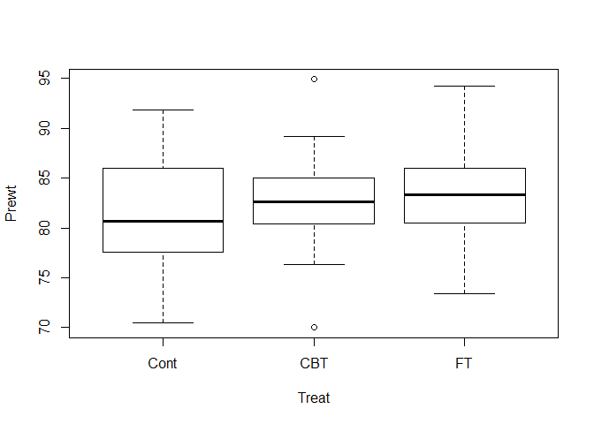
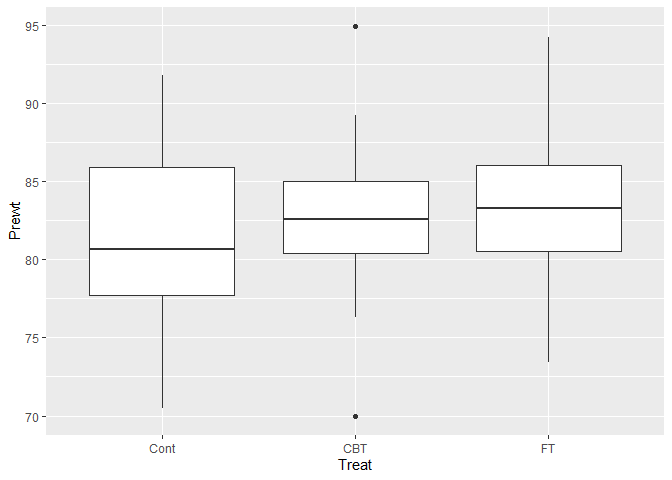
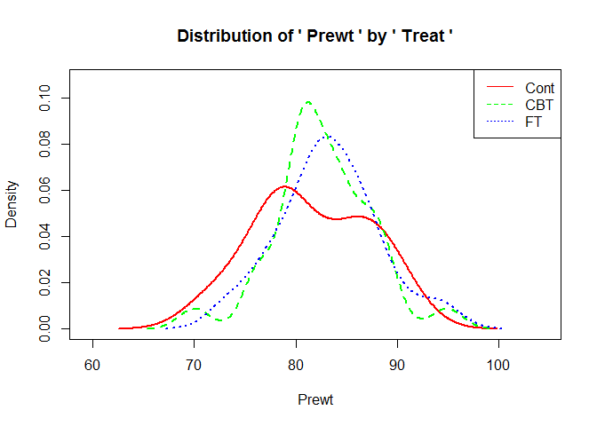
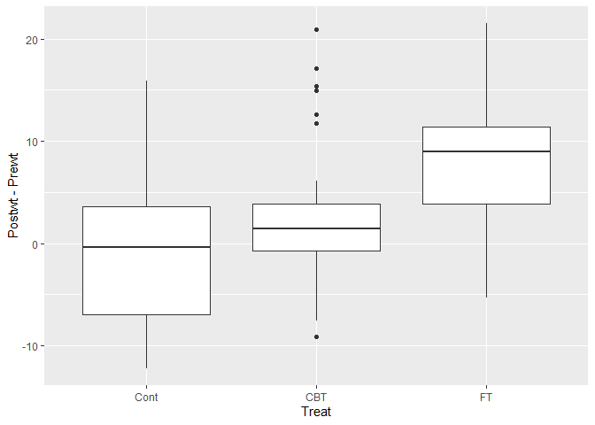
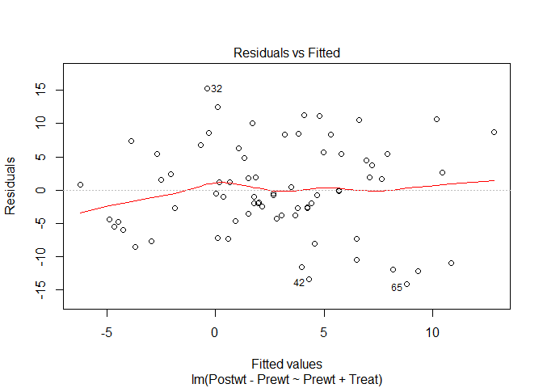
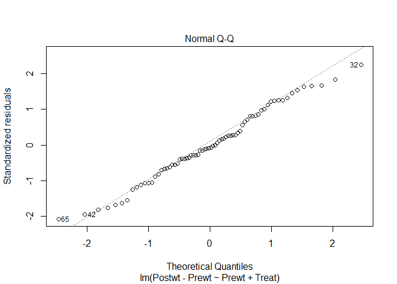
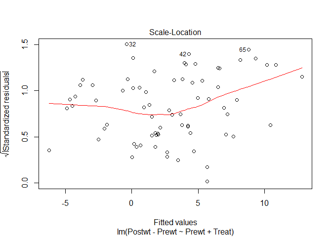
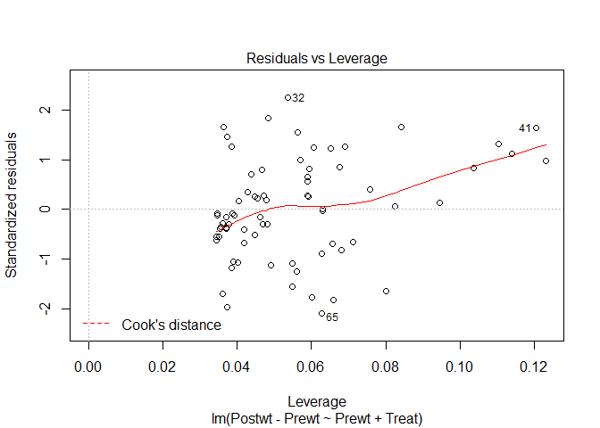
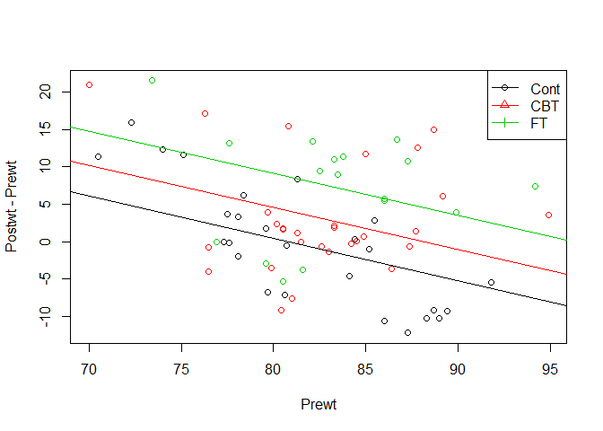

ANCOVA
================

``` r
anorexia <- read.table("anorexia.txt",sep=",", header=TRUE)
head(anorexia)
```

    ##   X Treat Prewt Postwt
    ## 1 1  Cont  80.7   80.2
    ## 2 2  Cont  89.4   80.1
    ## 3 3  Cont  91.8   86.4
    ## 4 4  Cont  74.0   86.3
    ## 5 5  Cont  78.1   76.1
    ## 6 6  Cont  88.3   78.1

``` r
str(anorexia)
```

    ## 'data.frame':    72 obs. of  4 variables:
    ##  $ X     : int  1 2 3 4 5 6 7 8 9 10 ...
    ##  $ Treat : Factor w/ 3 levels "CBT","Cont","FT": 2 2 2 2 2 2 2 2 2 2 ...
    ##  $ Prewt : num  80.7 89.4 91.8 74 78.1 88.3 87.3 75.1 80.6 78.4 ...
    ##  $ Postwt: num  80.2 80.1 86.4 86.3 76.1 78.1 75.1 86.7 73.5 84.6 ...

``` r
summary(anorexia)
```

    ##        X          Treat        Prewt           Postwt      
    ##  Min.   : 1.00   CBT :29   Min.   :70.00   Min.   : 71.30  
    ##  1st Qu.:18.75   Cont:26   1st Qu.:79.60   1st Qu.: 79.33  
    ##  Median :36.50   FT  :17   Median :82.30   Median : 84.05  
    ##  Mean   :36.50             Mean   :82.41   Mean   : 85.17  
    ##  3rd Qu.:54.25             3rd Qu.:86.00   3rd Qu.: 91.55  
    ##  Max.   :72.00             Max.   :94.90   Max.   :103.60

``` r
anorexia$Treat <- relevel(anorexia$Treat, ref="Cont")
```

``` r
boxplot(Prewt~Treat, anorexia)
```



``` r
library(ggplot2)
```

    ## Warning: package 'ggplot2' was built under R version 3.6.3

``` r
ggplot(anorexia, aes(x=Treat, y=Prewt)) +
  scale_x_discrete(limits=c("Cont","CBT","FT")) +
  geom_boxplot()
```



``` r
library(moonBook)
densityplot(Prewt~Treat, data=anorexia)
```



``` r
ggplot(anorexia, aes(x=Treat, y=Postwt - Prewt)) +
  scale_x_discrete(limits=c("Cont","CBT","FT")) +
  geom_boxplot()
```



``` r
out <- lm(Postwt-Prewt ~ Treat, anorexia)
summary(out)
```

    ## 
    ## Call:
    ## lm(formula = Postwt - Prewt ~ Treat, data = anorexia)
    ## 
    ## Residuals:
    ##     Min      1Q  Median      3Q     Max 
    ## -12.565  -4.543  -1.007   3.846  17.893 
    ## 
    ## Coefficients:
    ##             Estimate Std. Error t value Pr(>|t|)   
    ## (Intercept)   -0.450      1.476  -0.305   0.7614   
    ## TreatCBT       3.457      2.033   1.700   0.0936 . 
    ## TreatFT        7.715      2.348   3.285   0.0016 **
    ## ---
    ## Signif. codes:  0 '***' 0.001 '**' 0.01 '*' 0.05 '.' 0.1 ' ' 1
    ## 
    ## Residual standard error: 7.528 on 69 degrees of freedom
    ## Multiple R-squared:  0.1358, Adjusted R-squared:  0.1108 
    ## F-statistic: 5.422 on 2 and 69 DF,  p-value: 0.006499

``` r
#ANCOVA : analysis among objects of same Prewt
out1 <- lm(Postwt-Prewt ~ Prewt + Treat, anorexia)
anova(out1)
```

    ## Analysis of Variance Table
    ## 
    ## Response: Postwt - Prewt
    ##           Df Sum Sq Mean Sq F value    Pr(>F)    
    ## Prewt      1  447.9  447.85  9.1970 0.0034297 ** 
    ## Treat      2  766.3  383.14  7.8681 0.0008438 ***
    ## Residuals 68 3311.3   48.70                      
    ## ---
    ## Signif. codes:  0 '***' 0.001 '**' 0.01 '*' 0.05 '.' 0.1 ' ' 1

Prewt 보정했을 때 Treat 변수가 설명해주는 y 의 변동성에 대한 F-test
===================================================================

p-value &lt; 0.05 --&gt; Treat 3개 그룹 평균 차이가 유의하다
============================================================

``` r
summary(out1)
```

    ## 
    ## Call:
    ## lm(formula = Postwt - Prewt ~ Prewt + Treat, data = anorexia)
    ## 
    ## Residuals:
    ##      Min       1Q   Median       3Q      Max 
    ## -14.1083  -4.2773  -0.5484   5.4838  15.2922 
    ## 
    ## Coefficients:
    ##             Estimate Std. Error t value Pr(>|t|)    
    ## (Intercept)  45.6740    13.2167   3.456 0.000950 ***
    ## Prewt        -0.5655     0.1612  -3.509 0.000803 ***
    ## TreatCBT      4.0971     1.8935   2.164 0.033999 *  
    ## TreatFT       8.6601     2.1931   3.949 0.000189 ***
    ## ---
    ## Signif. codes:  0 '***' 0.001 '**' 0.01 '*' 0.05 '.' 0.1 ' ' 1
    ## 
    ## Residual standard error: 6.978 on 68 degrees of freedom
    ## Multiple R-squared:  0.2683, Adjusted R-squared:  0.236 
    ## F-statistic: 8.311 on 3 and 68 DF,  p-value: 8.725e-05

Postwt-Prewt change goes smaller as Prewt goes bigger (Negative correlation)
============================================================================

``` r
plot(out1)
```



``` r
# Test for difference of means of each categories --> Dunnett Method
library(multcomp)
```

    ## Warning: package 'multcomp' was built under R version 3.6.3

    ## Loading required package: mvtnorm

    ## Warning: package 'mvtnorm' was built under R version 3.6.2

    ## Loading required package: survival

    ## Warning: package 'survival' was built under R version 3.6.3

    ## Loading required package: TH.data

    ## Loading required package: MASS

    ## 
    ## Attaching package: 'MASS'

    ## The following object is masked _by_ '.GlobalEnv':
    ## 
    ##     anorexia

    ## 
    ## Attaching package: 'TH.data'

    ## The following object is masked from 'package:MASS':
    ## 
    ##     geyser

``` r
dunnet <- glht(out1, linfct=mcp(Treat="Dunnett"))
summary(dunnet)
```

    ## 
    ##   Simultaneous Tests for General Linear Hypotheses
    ## 
    ## Multiple Comparisons of Means: Dunnett Contrasts
    ## 
    ## 
    ## Fit: lm(formula = Postwt - Prewt ~ Prewt + Treat, data = anorexia)
    ## 
    ## Linear Hypotheses:
    ##                 Estimate Std. Error t value Pr(>|t|)    
    ## CBT - Cont == 0    4.097      1.893   2.164 0.062939 .  
    ## FT - Cont == 0     8.660      2.193   3.949 0.000373 ***
    ## ---
    ## Signif. codes:  0 '***' 0.001 '**' 0.01 '*' 0.05 '.' 0.1 ' ' 1
    ## (Adjusted p values reported -- single-step method)

CBT 보다는 FT 가 더 유의미한 차이 보여준다
==========================================

y = 45.674 - 0.565 \* prewt + 4.097 \* CBT + 8.660 \* FT
========================================================

--- control : y = 45.674 - 0.565 \* prewt
=========================================

--- CBT : y = 45.674 + 4.097 - 0.565 \* prewt
=============================================

Prewt가 평균이었던 사람에 대해 CBT는 control 그룹보다 4.097만큼 더 몸무게 변화를 주었다.
========================================================================================

--- FT : y = 45.674 + 8.660 - 0.565 \* prewt
============================================

Prewt가 평균이었던 사람에 대해 FT는 control 그룹보다 8.66만큼 더 몸무게 변화를 주었다.
======================================================================================

``` r
index <- as.numeric(anorexia$Treat)
plot(Postwt-Prewt ~ Prewt, anorexia, col=index)
legend("topright", levels(anorexia$Treat), col=1:3, pch=1:3, lty=1)
abline(45.674, -0.565, col=1)
abline(45.674 + 4.097, -0.565, col=2)
abline(45.674 + 8.660, -0.565, col=3)
```


