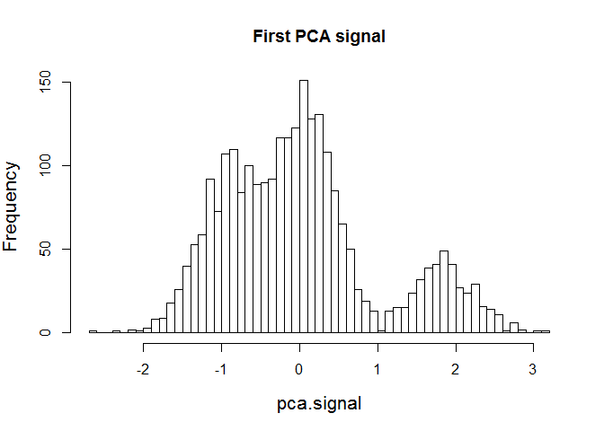
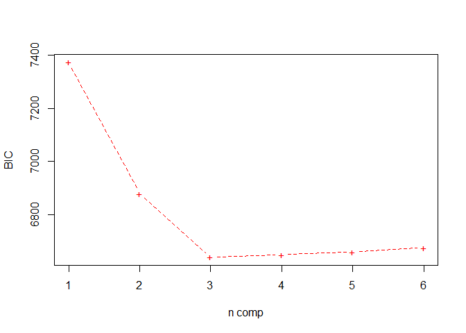
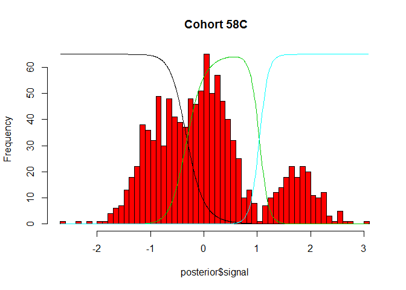
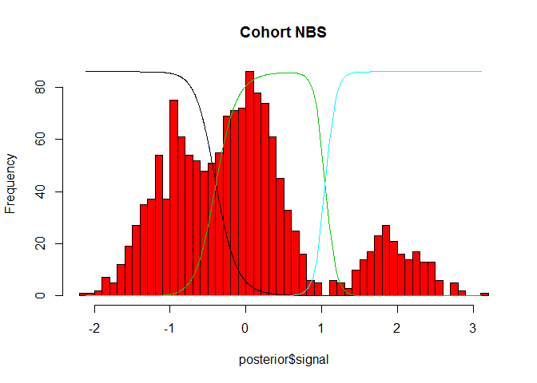
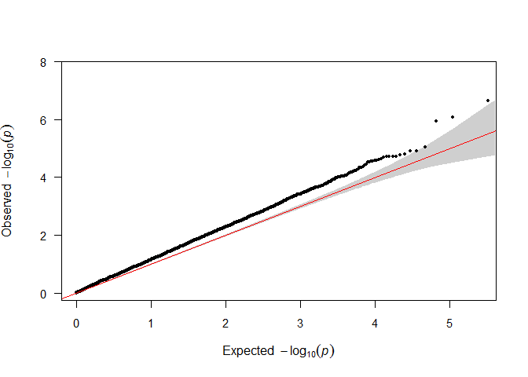
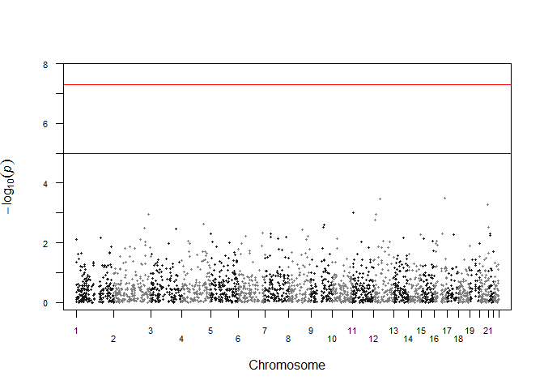

Untitled
================

1.  데이터 둘러보기

``` r
library(BiocManager)
```

    ## Warning: package 'BiocManager' was built under R version 3.6.2

    ## Bioconductor version 3.10 (BiocManager 1.30.10), ?BiocManager::install for help

``` r
BiocManager::install("CNVtools")
```

    ## Bioconductor version 3.10 (BiocManager 1.30.10), R 3.6.1 (2019-07-05)

    ## Installing package(s) 'CNVtools'

    ## package 'CNVtools' successfully unpacked and MD5 sums checked

    ## Warning: cannot remove prior installation of package 'CNVtools'

    ## Warning in file.copy(savedcopy, lib, recursive = TRUE): C:\Users\Choi Sung
    ## Wook\Documents\R\win-library\3.6\00LOCK\CNVtools\libs\x64\CNVtools.dll를 C:
    ## \Users\Choi Sung Wook\Documents\R\win-library\3.6\CNVtools\libs\x64\CNVtools.dll
    ## 로 복사하는데 문제가 발생했습니다: Permission denied

    ## Warning: restored 'CNVtools'

    ## 
    ## The downloaded binary packages are in
    ##  C:\Users\Choi Sung Wook\AppData\Local\Temp\Rtmpecwp3g\downloaded_packages

    ## Installation path not writeable, unable to update packages: boot, class,
    ##   foreign, KernSmooth, lattice, MASS, Matrix, mgcv, nnet

    ## Old packages: 'isoband', 'lme4', 'mclust', 'nlme', 'reshape2', 'survival',
    ##   'yaml'

``` r
library(CNVtools)
```

    ## Loading required package: survival

    ## Warning: package 'survival' was built under R version 3.6.3

``` r
## Data Preparation
data(A112)
raw.signal <- as.matrix(A112[ , -c(1,2)])
dimnames(raw.signal)[[1]] <- A112$subject
pca.signal <- apply.pca(raw.signal)
## The histogram of the first PCA signal.
hist(pca.signal, breaks=50, main='First PCA signal' , cex.lab =1.3)
```



1.  군집수의 선택

``` r
batches <- factor(A112$cohort)
sample <- factor(A112$subject)
set.seed(0)
results<- CNVtest.select.model(signal=pca.signal, batch=batches, sample = sample , n.H0 = 3 , method='BIC' )
```

    ## Fitting model  1

    ##   Iteration 1

    ##   Iteration 2

    ##   Iteration 3

    ## Fitting model  2

    ##   Iteration 1

    ##   Iteration 2

    ##   Iteration 3

    ## Fitting model  3

    ##   Iteration 1

    ##   Iteration 2

    ##   Iteration 3

    ## Fitting model  4

    ##   Iteration 1

    ##   Iteration 2

    ##   Iteration 3

    ## Fitting model  5

    ##   Iteration 1

    ##   Iteration 2

    ##   Iteration 3

    ## Fitting model  6

    ##   Iteration 1

    ##   Iteration 2

    ##   Iteration 3

``` r
ncomp <- results$selected
plot(results$BIC, xlab='n comp', ylab='BIC', type='b', lty=2, col='red', pch = '+')
```



1.  군집분석

``` r
ncomp <- 3
batches <- factor(A112$cohort)
sample <- factor(A112$subject)
fit.pca <- CNVtest.binary(signal = pca.signal, sample = sample , batch = batches,
ncomp = ncomp, n.H0=3)
```

    ## Attempting to cluster the data with 2593 individuals and 3 components

    ## Iteration 1 under H0

    ## Iteration 2 under H0

    ## Iteration 3 under H0

``` r
cnv.plot(fit.pca$posterior.H0, batch = '58C' , main = ' Cohort 58C', breaks = 50,
col='red' )
```



``` r
cnv.plot(fit.pca$posterior.H0, batch = 'NBS' , main = 'Cohort NBS', breaks = 50,
col= 'red' )
```



1.  유전연관분석

``` r
ncomp <- 3
trait <- ifelse(A112$cohort =='58C' , 0 , 1)
fit.pca <- CNVtest.binary(signal = pca.signal, sample = sample, batch = batches, disease.status = trait, ncomp = 3 , n.H0=3, n.H1=3, model.disease= "~cn")
```

    ## Attempting to cluster the data with 2593 individuals and 3 components

    ## Iteration 1 under H0

    ## Iteration 2 under H0

    ## Iteration 3 under H0

    ## Iteration 1 under H1

    ## Iteration 2 under H1

    ## Iteration 3 under H1

``` r
LR.statistic <- 2*(fit.pca$model.H0$lnL - fit.pca$model.H1$lnL)
print (LR.statistic)
```

    ## [1] -3.112631

``` r
pchisq(LR.statistic, df=1, lower=F)
```

    ## [1] 1

``` r
## LR.statistic follow the chi-square distribution with one degree of freedom.
```

1.  결과 정리

``` r
setwd("C:/Users/Choi Sung Wook/Desktop/고급바이오정보학_4강_실습보강자료")
source("qqman.r")
results0 <- read.table("plink.assoc.txt", header=TRUE) 

x<- sample(1:dim(results0)[1], 3000)
```

``` r
## qqplot
qq(results0$P)
```



``` r
## manhattan plot
manhattan (results0[x,])
```


