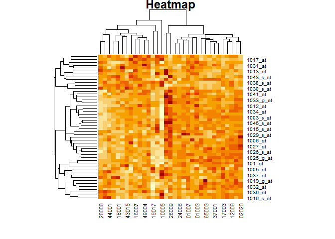
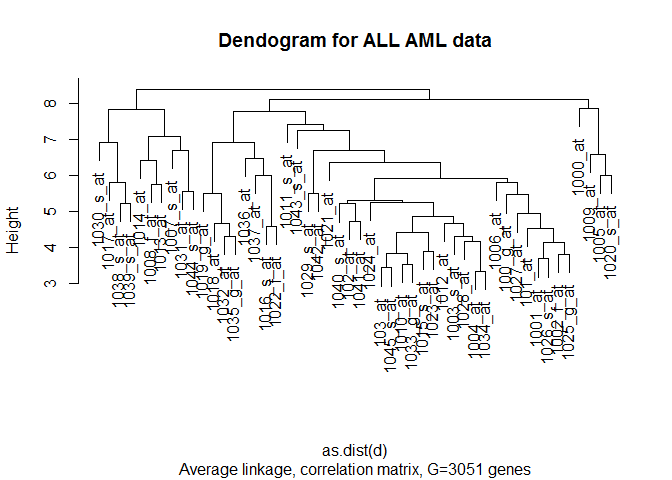
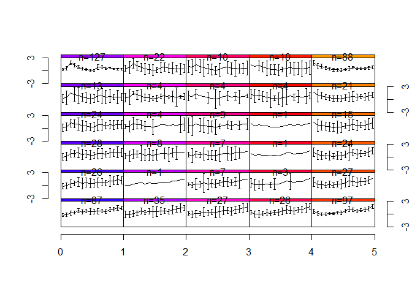

Bioconductor
================

``` r
if (!requireNamespace("BiocManager",quietly=TRUE)) install.packages("BiocManager",repos="https://cran.yu.ac.kr")
BiocManager::install(c("ALL","hgu95av2","annotate","samr","som","golubEsets"))
```

    ## Bioconductor version 3.10 (BiocManager 1.30.10), R 3.6.1 (2019-07-05)

    ## Installing package(s) 'ALL', 'hgu95av2', 'annotate', 'samr', 'som',
    ##   'golubEsets'

    ## package 'annotate' successfully unpacked and MD5 sums checked
    ## package 'samr' successfully unpacked and MD5 sums checked
    ## package 'som' successfully unpacked and MD5 sums checked
    ## 
    ## The downloaded binary packages are in
    ##  C:\Users\Choi Sung Wook\AppData\Local\Temp\RtmpmIf9GW\downloaded_packages

    ## installing the source packages 'ALL', 'hgu95av2', 'golubEsets'

    ## Installation path not writeable, unable to update packages: boot, class,
    ##   foreign, KernSmooth, lattice, MASS, Matrix, mgcv, nnet

    ## Old packages: 'isoband', 'lme4', 'mclust', 'nlme', 'reshape2', 'survival',
    ##   'yaml'

``` r
library(BiocManager)
```

    ## Warning: package 'BiocManager' was built under R version 3.6.2

    ## Bioconductor version 3.10 (BiocManager 1.30.10), ?BiocManager::install for help

``` r
library(ALL)
```

    ## Loading required package: Biobase

    ## Loading required package: BiocGenerics

    ## Loading required package: parallel

    ## 
    ## Attaching package: 'BiocGenerics'

    ## The following objects are masked from 'package:parallel':
    ## 
    ##     clusterApply, clusterApplyLB, clusterCall, clusterEvalQ,
    ##     clusterExport, clusterMap, parApply, parCapply, parLapply,
    ##     parLapplyLB, parRapply, parSapply, parSapplyLB

    ## The following objects are masked from 'package:stats':
    ## 
    ##     IQR, mad, sd, var, xtabs

    ## The following objects are masked from 'package:base':
    ## 
    ##     anyDuplicated, append, as.data.frame, basename, cbind, colnames,
    ##     dirname, do.call, duplicated, eval, evalq, Filter, Find, get, grep,
    ##     grepl, intersect, is.unsorted, lapply, Map, mapply, match, mget,
    ##     order, paste, pmax, pmax.int, pmin, pmin.int, Position, rank,
    ##     rbind, Reduce, rownames, sapply, setdiff, sort, table, tapply,
    ##     union, unique, unsplit, which, which.max, which.min

    ## Welcome to Bioconductor
    ## 
    ##     Vignettes contain introductory material; view with
    ##     'browseVignettes()'. To cite Bioconductor, see
    ##     'citation("Biobase")', and for packages 'citation("pkgname")'.

``` r
data(ALL)
```

``` r
show(ALL)
```

    ## ExpressionSet (storageMode: lockedEnvironment)
    ## assayData: 12625 features, 128 samples 
    ##   element names: exprs 
    ## protocolData: none
    ## phenoData
    ##   sampleNames: 01005 01010 ... LAL4 (128 total)
    ##   varLabels: cod diagnosis ... date last seen (21 total)
    ##   varMetadata: labelDescription
    ## featureData: none
    ## experimentData: use 'experimentData(object)'
    ##   pubMedIds: 14684422 16243790 
    ## Annotation: hgu95av2

``` r
dat = exprs(ALL)
```

``` r
dim(dat)
```

    ## [1] 12625   128

``` r
f.name = featureNames(ALL)
head(f.name)
```

    ## [1] "1000_at"   "1001_at"   "1002_f_at" "1003_s_at" "1004_at"   "1005_at"

``` r
s.name = sampleNames(ALL)
head(s.name)
```

    ## [1] "01005" "01010" "03002" "04006" "04007" "04008"

``` r
mat = phenoData(ALL)
mat
```

    ## An object of class 'AnnotatedDataFrame'
    ##   sampleNames: 01005 01010 ... LAL4 (128 total)
    ##   varLabels: cod diagnosis ... date last seen (21 total)
    ##   varMetadata: labelDescription

``` r
cl = c(rep(0,95), rep(1,33))
cl
```

    ##   [1] 0 0 0 0 0 0 0 0 0 0 0 0 0 0 0 0 0 0 0 0 0 0 0 0 0 0 0 0 0 0 0 0 0 0 0 0 0
    ##  [38] 0 0 0 0 0 0 0 0 0 0 0 0 0 0 0 0 0 0 0 0 0 0 0 0 0 0 0 0 0 0 0 0 0 0 0 0 0
    ##  [75] 0 0 0 0 0 0 0 0 0 0 0 0 0 0 0 0 0 0 0 0 0 1 1 1 1 1 1 1 1 1 1 1 1 1 1 1 1
    ## [112] 1 1 1 1 1 1 1 1 1 1 1 1 1 1 1 1 1

``` r
BiocManager::install("multtest")
```

    ## Bioconductor version 3.10 (BiocManager 1.30.10), R 3.6.1 (2019-07-05)

    ## Installing package(s) 'multtest'

    ## package 'multtest' successfully unpacked and MD5 sums checked
    ## 
    ## The downloaded binary packages are in
    ##  C:\Users\Choi Sung Wook\AppData\Local\Temp\RtmpmIf9GW\downloaded_packages

    ## Installation path not writeable, unable to update packages: boot, class,
    ##   foreign, KernSmooth, lattice, MASS, Matrix, mgcv, nnet

    ## Old packages: 'isoband', 'lme4', 'mclust', 'nlme', 'reshape2', 'survival',
    ##   'yaml'

``` r
library(multtest)
```

``` r
resT = mt.maxT(dat, classlabel=cl, B=1000)
```

    ## b=10 b=20    b=30    b=40    b=50    b=60    b=70    b=80    b=90    b=100   
    ## b=110    b=120   b=130   b=140   b=150   b=160   b=170   b=180   b=190   b=200   
    ## b=210    b=220   b=230   b=240   b=250   b=260   b=270   b=280   b=290   b=300   
    ## b=310    b=320   b=330   b=340   b=350   b=360   b=370   b=380   b=390   b=400   
    ## b=410    b=420   b=430   b=440   b=450   b=460   b=470   b=480   b=490   b=500   
    ## b=510    b=520   b=530   b=540   b=550   b=560   b=570   b=580   b=590   b=600   
    ## b=610    b=620   b=630   b=640   b=650   b=660   b=670   b=680   b=690   b=700   
    ## b=710    b=720   b=730   b=740   b=750   b=760   b=770   b=780   b=790   b=800   
    ## b=810    b=820   b=830   b=840   b=850   b=860   b=870   b=880   b=890   b=900   
    ## b=910    b=920   b=930   b=940   b=950   b=960   b=970   b=980   b=990   b=1000  

``` r
head(resT)
```

    ##          index  teststat  rawp  adjp
    ## 38319_at  8399  34.42177 0.001 0.001
    ## 38242_at  8321 -22.32723 0.001 0.001
    ## 37988_at  8064 -22.26362 0.001 0.001
    ## 39389_at  9478 -21.92778 0.001 0.001
    ## 37344_at  7414 -20.75682 0.001 0.001
    ## 38147_at  8225  20.71285 0.001 0.001

``` r
x = dat[1:50, 96:128]
standardize <- function(x){
  (x - mean(x,na.rm=T))/sqrt(var(x,na.rm=T))}
```

``` r
x = t(apply(x, 1, standardize))
heatmap(x, main="Heatmap")
```



``` r
library(MVA)
```

    ## Warning: package 'MVA' was built under R version 3.6.3

    ## Loading required package: HSAUR2

    ## Warning: package 'HSAUR2' was built under R version 3.6.3

    ## Loading required package: tools

``` r
d <- dist(x)
hclust(d, method="complete", members=NULL)
```

    ## 
    ## Call:
    ## hclust(d = d, method = "complete", members = NULL)
    ## 
    ## Cluster method   : complete 
    ## Distance         : euclidean 
    ## Number of objects: 50

``` r
hcl <- hclust(as.dist(d), method="average")
```

``` r
plot(hcl, main="Dendogram for ALL AML data", sub="Average linkage, correlation matrix, G=3051 genes")
```



``` r
library(som)
```

    ## 
    ## Attaching package: 'som'

    ## The following object is masked from 'package:BiocGenerics':
    ## 
    ##     normalize

``` r
data(yeast)
yeast <- yeast[,-c(1,11)]
```

``` r
yeast.f <- filtering(yeast)
yeast.f.n <- normalize(yeast.f)
```

``` r
foo1 <- som(yeast.f.n, xdim=5, ydim=6)
plot(foo1)
```


