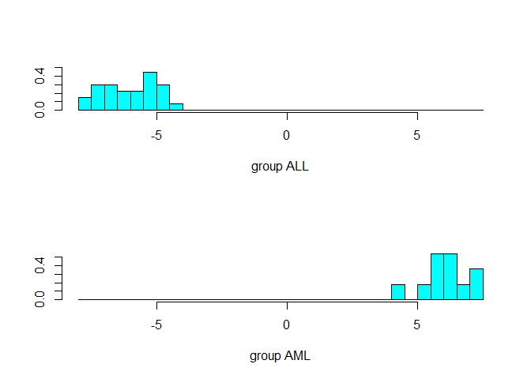
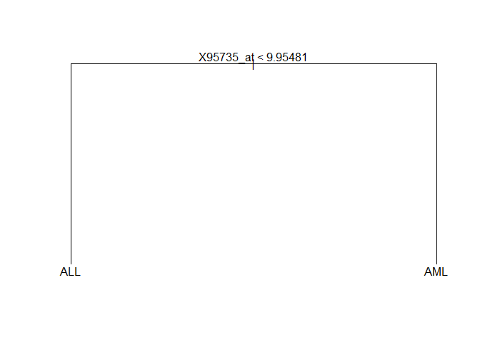

Advanced 3 - Classification & Clustering
================

``` r
library(Biobase)
```

    ## Loading required package: BiocGenerics

    ## Loading required package: parallel

    ## 
    ## Attaching package: 'BiocGenerics'

    ## The following objects are masked from 'package:parallel':
    ## 
    ##     clusterApply, clusterApplyLB, clusterCall, clusterEvalQ,
    ##     clusterExport, clusterMap, parApply, parCapply, parLapply,
    ##     parLapplyLB, parRapply, parSapply, parSapplyLB

    ## The following objects are masked from 'package:stats':
    ## 
    ##     IQR, mad, sd, var, xtabs

    ## The following objects are masked from 'package:base':
    ## 
    ##     anyDuplicated, append, as.data.frame, basename, cbind, colnames,
    ##     dirname, do.call, duplicated, eval, evalq, Filter, Find, get, grep,
    ##     grepl, intersect, is.unsorted, lapply, Map, mapply, match, mget,
    ##     order, paste, pmax, pmax.int, pmin, pmin.int, Position, rank,
    ##     rbind, Reduce, rownames, sapply, setdiff, sort, table, tapply,
    ##     union, unique, unsplit, which, which.max, which.min

    ## Welcome to Bioconductor
    ## 
    ##     Vignettes contain introductory material; view with
    ##     'browseVignettes()'. To cite Bioconductor, see
    ##     'citation("Biobase")', and for packages 'citation("pkgname")'.

``` r
library(annotate)
```

    ## Loading required package: AnnotationDbi

    ## Loading required package: stats4

    ## Loading required package: IRanges

    ## Warning: package 'IRanges' was built under R version 3.6.2

    ## Loading required package: S4Vectors

    ## Warning: package 'S4Vectors' was built under R version 3.6.3

    ## 
    ## Attaching package: 'S4Vectors'

    ## The following object is masked from 'package:base':
    ## 
    ##     expand.grid

    ## 
    ## Attaching package: 'IRanges'

    ## The following object is masked from 'package:grDevices':
    ## 
    ##     windows

    ## Loading required package: XML

    ## Warning: package 'XML' was built under R version 3.6.2

``` r
library(golubEsets)
```

``` r
BiocManager::install("genefilter")
```

    ## Bioconductor version 3.10 (BiocManager 1.30.10), R 3.6.1 (2019-07-05)

    ## Installing package(s) 'genefilter'

    ## package 'genefilter' successfully unpacked and MD5 sums checked
    ## 
    ## The downloaded binary packages are in
    ##  C:\Users\Choi Sung Wook\AppData\Local\Temp\RtmpUtjx13\downloaded_packages

    ## Installation path not writeable, unable to update packages: boot, class,
    ##   foreign, KernSmooth, lattice, MASS, Matrix, mgcv, nnet

    ## Old packages: 'isoband', 'lme4', 'mclust', 'nlme', 'reshape2', 'survival',
    ##   'yaml'

``` r
library(genefilter)
```

``` r
library(BiocManager)
```

    ## Warning: package 'BiocManager' was built under R version 3.6.2

    ## Bioconductor version 3.10 (BiocManager 1.30.10), ?BiocManager::install for help

``` r
GolubTrans <-function(eSet) { 
  X<-exprs(eSet);
  X[X<100]<-100;
  X[X>16000]<-16000;
  X <- log2(X);
  exprs(eSet) <- X;
  eSet; }
```

``` r
library(Biobase)
```

``` r
BiocManager::install("OutlierD")
```

    ## Bioconductor version 3.10 (BiocManager 1.30.10), R 3.6.1 (2019-07-05)

    ## Installing package(s) 'OutlierD'

    ## package 'OutlierD' successfully unpacked and MD5 sums checked
    ## 
    ## The downloaded binary packages are in
    ##  C:\Users\Choi Sung Wook\AppData\Local\Temp\RtmpUtjx13\downloaded_packages

    ## Installation path not writeable, unable to update packages: boot, class,
    ##   foreign, KernSmooth, lattice, MASS, Matrix, mgcv, nnet

    ## Old packages: 'isoband', 'lme4', 'mclust', 'nlme', 'reshape2', 'survival',
    ##   'yaml'

``` r
library(OutlierD)
```

    ## Loading required package: quantreg

    ## Warning: package 'quantreg' was built under R version 3.6.3

    ## Loading required package: SparseM

    ## Warning: package 'SparseM' was built under R version 3.6.2

    ## 
    ## Attaching package: 'SparseM'

    ## The following object is masked from 'package:base':
    ## 
    ##     backsolve

``` r
library(MVA)
```

    ## Warning: package 'MVA' was built under R version 3.6.3

    ## Loading required package: HSAUR2

    ## Warning: package 'HSAUR2' was built under R version 3.6.3

    ## Loading required package: tools

    ## 
    ## Attaching package: 'tools'

    ## The following object is masked from 'package:XML':
    ## 
    ##     toHTML

``` r
data(Golub_Train)
data(Golub_Test)
data(Golub_Merge)
```

GolubTrans 를 이용하여 자료를 여과하고 변환

``` r
gTrn <- GolubTrans(Golub_Train)
gTest <- GolubTrans(Golub_Test)
gMerge <- GolubTrans(Golub_Merge)
```

쓸모없는 유전자는 강제로 FALSE 화

``` r
mmfilt <- function(r=5, d=500, na.rm=TRUE){
  function(x){
    minval <- min(2^x, na.rm=na.rm)
    maxval <- max(2^x, na.rm=na.rm)
    (maxval/minval > r) && (maxval-minval>d)
  }
}
```

``` r
mmfun <- mmfilt()
ffun <- filterfun(mmfun)
sub <- genefilter(gTrn,ffun)
sub[c(2401,3398,4168)] <- FALSE
sum(sub)
```

    ## [1] 3051

``` r
gTrnS <- gTrn[sub,]
gTestS <- gTest[sub,]
gMergeS <- gMerge[sub,]
sub[c(2401,3398,4168)] <- FALSE
sum(sub)
```

    ## [1] 3051

``` r
Ytr <- Golub_Train$ALL.AML
Ytest <- Golub_Test$ALL.AML
Ymerge <- Golub_Merge$ALL.AML
```

Feature selection

``` r
af <- Anova(c(rep(1,27),rep(2,11)), .00001)
# single argument function으로 변환
anovasub <- sub[sub==TRUE]
#for( i in 1 : sum(anovasub) )
#anovasub[i] <- af(exprs(gTrnS)[i,])
anovasub<-apply(exprs(gTrnS),1,af) 
# gene 별로 분산분석후 유의한 gene을 TRUE로. sum(anovasub)
```

``` r
sum(anovasub)
```

    ## [1] 68

``` r
gTrA <- gTrnS[anovasub, ]
gTeA <- gTestS[anovasub, ]
gMeA <- gMergeS[anovasub, ]
whBad1 <- (apply(exprs(gTrA), 1, mad) == 0)
whBad2 <- (apply(exprs(gTeA), 1, mad) == 0)
whBad <- whBad1 | whBad2
sum(whBad)
```

    ## [1] 11

``` r
gTrA <- gTrA[!whBad, ]
gTeA <- gTeA[!whBad, ]
gMeA <- gMeA[!whBad, ]
```

``` r
star <- function(x) (x - median(x))/mad(x)
TrExprs <- t(apply(exprs(gTrA), 1, star))
TeExprs <- t(apply(exprs(gTeA), 1, star))
MeExprs <- t(apply(exprs(gMeA), 1, star))
```

위 데이터를 에용해서 LDA, K-NN, SVM 해보자

``` r
library(MASS)
```

    ## 
    ## Attaching package: 'MASS'

    ## The following object is masked from 'package:genefilter':
    ## 
    ##     area

    ## The following object is masked from 'package:AnnotationDbi':
    ## 
    ##     select

``` r
gTr.lda <- lda(t(TrExprs), Ytr)
```

    ## Warning in lda.default(x, grouping, ...): variables are collinear

``` r
plot(gTr.lda)
```



``` r
preds.lda <- predict(gTr.lda, t(TeExprs))
table(preds.lda$class, Ytest)
```

    ##      Ytest
    ##       ALL AML
    ##   ALL  19  12
    ##   AML   1   2

``` r
library(class)
knn3 <- knn(t(TrExprs), t(TeExprs), factor(Ytr), k=3)
table(knn3, Ytest)
```

    ##      Ytest
    ## knn3  ALL AML
    ##   ALL  17   6
    ##   AML   3   8

``` r
knn5.cvpreds <- knn.cv(t(MeExprs), factor(Ymerge), k=5)
table(knn5.cvpreds, Ymerge)
```

    ##             Ymerge
    ## knn5.cvpreds ALL AML
    ##          ALL  43   4
    ##          AML   4  21

``` r
library(e1071)
```

    ## Warning: package 'e1071' was built under R version 3.6.2

``` r
svm1 <- svm(t(exprs(gTrA)), Golub_Train$ALL,
          type="C-classification", kernel="linear")
```

``` r
trpred <- predict(svm1,t(exprs(gTrA)))
sum(trpred != Golub_Train$ALL)
```

    ## [1] 0

``` r
table(trpred, Golub_Train$ALL)
```

    ##       
    ## trpred ALL AML
    ##    ALL  27   0
    ##    AML   0  11

``` r
trcv <- svm(t(exprs(gMeA)), Golub_Merge$ALL, type="C-classification", kernel="linear", cross=10)
summary(trcv)
```

    ## 
    ## Call:
    ## svm.default(x = t(exprs(gMeA)), y = Golub_Merge$ALL, type = "C-classification", 
    ##     kernel = "linear", cross = 10)
    ## 
    ## 
    ## Parameters:
    ##    SVM-Type:  C-classification 
    ##  SVM-Kernel:  linear 
    ##        cost:  1 
    ## 
    ## Number of Support Vectors:  14
    ## 
    ##  ( 9 5 )
    ## 
    ## 
    ## Number of Classes:  2 
    ## 
    ## Levels: 
    ##  ALL AML
    ## 
    ## 10-fold cross-validation on training data:
    ## 
    ## Total Accuracy: 98.61111 
    ## Single Accuracies:
    ##  100 100 85.71429 100 100 100 100 100 100 100

``` r
tepred <- predict(svm1, t(exprs(gTeA)))
sum(tepred != Golub_Test$ALL)
```

    ## [1] 2

``` r
table(tepred, Golub_Test$ALL)
```

    ##       
    ## tepred ALL AML
    ##    ALL  20   2
    ##    AML   0  12

``` r
library(tree)
ngTrA <- data.frame(t(exprs(gTrA)), Ytr )
ngTeA <- data.frame(t(exprs(gTeA)), Ytest )
ngTrA.tree <- tree(Ytr~., data=ngTrA)
ngTrA.tree
```

    ## node), split, n, deviance, yval, (yprob)
    ##       * denotes terminal node
    ## 
    ## 1) root 38 45.73 ALL ( 0.7105 0.2895 )  
    ##   2) X95735_at < 9.95481 27  0.00 ALL ( 1.0000 0.0000 ) *
    ##   3) X95735_at > 9.95481 11  0.00 AML ( 0.0000 1.0000 ) *

``` r
summary(ngTrA.tree)
```

    ## 
    ## Classification tree:
    ## tree(formula = Ytr ~ ., data = ngTrA)
    ## Variables actually used in tree construction:
    ## [1] "X95735_at"
    ## Number of terminal nodes:  2 
    ## Residual mean deviance:  0 = 0 / 36 
    ## Misclassification error rate: 0 = 0 / 38

``` r
plot(ngTrA.tree)
text(ngTrA.tree)
```



``` r
tepred <- predict(ngTrA.tree, ngTeA)
tepred <-tepred[,1]; tepred[tepred==1] <-"ALL"
tepred[tepred==0] <-"AML"
sum(tepred != Ytest)
```

    ## [1] 3

``` r
table(tepred, Ytest)
```

    ##       Ytest
    ## tepred ALL AML
    ##    ALL  18   1
    ##    AML   2  13
