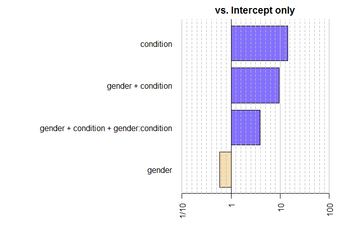

Bayes Factor
================

``` r
library(BayesFactor)
```

    ## Loading required package: coda

    ## Loading required package: Matrix

    ## ************
    ## Welcome to BayesFactor 0.9.12-4.2. If you have questions, please contact Richard Morey (richarddmorey@gmail.com).
    ## 
    ## Type BFManual() to open the manual.
    ## ************

``` r
library(tidyverse)
```

    ## -- Attaching packages ------------------------------------- tidyverse 1.3.0 --

    ## √ ggplot2 3.3.2     √ purrr   0.3.4
    ## √ tibble  3.0.3     √ dplyr   1.0.1
    ## √ tidyr   1.1.1     √ stringr 1.4.0
    ## √ readr   1.3.1     √ forcats 0.5.0

    ## -- Conflicts ---------------------------------------- tidyverse_conflicts() --
    ## x tidyr::expand() masks Matrix::expand()
    ## x dplyr::filter() masks stats::filter()
    ## x dplyr::lag()    masks stats::lag()
    ## x tidyr::pack()   masks Matrix::pack()
    ## x tidyr::unpack() masks Matrix::unpack()

``` r
df <- read.csv("bf_data.csv")
head(df)
```

    ##   participant age gender    condition choice    rt  pre post
    ## 1           1  22      m experimental  0.462 697.3 4.65 3.61
    ## 2           2  24      f      control  0.924 177.8 4.14 5.32
    ## 3           3  24      f experimental  0.738 277.4 4.12 4.00
    ## 4           4  19      m      control  0.477 347.7 5.25 4.47
    ## 5           5  19      f experimental  0.665 622.9 5.39 5.00
    ## 6           6  22      f experimental  0.565 232.7 4.93 3.63

``` r
df$condition <- factor(df$condition, levels=c("control","experimental"))
df$gender <- factor(df$gender, levels=c("m","f","o"))
str(df)
```

    ## 'data.frame':    50 obs. of  8 variables:
    ##  $ participant: int  1 2 3 4 5 6 7 8 9 10 ...
    ##  $ age        : int  22 24 24 19 19 22 14 14 17 18 ...
    ##  $ gender     : Factor w/ 3 levels "m","f","o": 1 2 2 1 2 2 2 2 2 2 ...
    ##  $ condition  : Factor w/ 2 levels "control","experimental": 2 1 2 1 2 2 1 2 1 2 ...
    ##  $ choice     : num  0.462 0.924 0.738 0.477 0.665 0.565 0.487 0.735 0.813 0.264 ...
    ##  $ rt         : num  697 178 277 348 623 ...
    ##  $ pre        : num  4.65 4.14 4.12 5.25 5.39 4.93 4.08 6.16 4.54 4.05 ...
    ##  $ post       : num  3.61 5.32 4 4.47 5 3.63 4.36 7.6 6.13 2.5 ...

``` r
# Test about "choice"
# H0 : mean = 0.5 vs H1 : mean != 0.5
```

``` r
ggplot(df, aes(x="", y=choice)) +
  geom_point(col="grey70") +
  stat_summary(fun.data="mean_cl_normal") +
  geom_hline(yintercept=0.5) +
  labs(x=NULL, y="Choice") +
  theme_bw()
```


``` r
freq_onesample <- t.test(df$choic, mu=0.5)
freq_onesample
```

    ## 
    ##  One Sample t-test
    ## 
    ## data:  df$choic
    ## t = 6.8234, df = 49, p-value = 1.246e-08
    ## alternative hypothesis: true mean is not equal to 0.5
    ## 95 percent confidence interval:
    ##  0.6331534 0.7443266
    ## sample estimates:
    ## mean of x 
    ##   0.68874

``` r
bayes_onesample <- ttestBF(df$choice, mu=0.5)
bayes_onesample
```

    ## Bayes factor analysis
    ## --------------
    ## [1] Alt., r=0.707 : 1021239 ±0%
    ## 
    ## Against denominator:
    ##   Null, mu = 0.5 
    ## ---
    ## Bayes factor type: BFoneSample, JZS

``` r
# Bayes factor= 1021239 : data support H1 10^6 times than H0
# r controls the scale of the prior distribution
 # (0.707 is a standard value)
```

``` r
ggplot(df, aes(x=condition, y=choice)) +
  geom_point(col="grey70") +
  stat_summary(fun.data = "mean_cl_normal") +
  labs(x="Condition", y="Choice") +
  theme_bw()
```


``` r
freq_independ <- t.test(choice~condition, data=df)
freq_independ
```

    ## 
    ##  Welch Two Sample t-test
    ## 
    ## data:  choice by condition
    ## t = 3.1747, df = 47.923, p-value = 0.002621
    ## alternative hypothesis: true difference in means is not equal to 0
    ## 95 percent confidence interval:
    ##  0.05914698 0.26349302
    ## sample estimates:
    ##      mean in group control mean in group experimental 
    ##                    0.76940                    0.60808

``` r
bayes_independ <- ttestBF(formula=choice~condition, data=df)
bayes_independ
```

    ## Bayes factor analysis
    ## --------------
    ## [1] Alt., r=0.707 : 14.0967 ±0%
    ## 
    ## Against denominator:
    ##   Null, mu1-mu2 = 0 
    ## ---
    ## Bayes factor type: BFindepSample, JZS

``` r
prepost <- gather(select(df, participant, condition, pre, post),
            key="pre_post", value="rating", -participant, -condition) %>%
            mutate(participant = as.factor(participant),
                   pre_post = as.factor(pre_post))

prepost$pre_post <- factor(prepost$pre_post, levels=c("pre","post"))
```

``` r
ggplot(prepost, aes(x=pre_post, y=rating)) +
  geom_line(aes(group=participant), col="grey70", size=0.25) +
  stat_summary(fun.data="mean_cl_normal", size=0.25) +
  labs(x="Timing", y="Choice") +
  theme_bw()
```


``` r
freq_paired <- t.test(df$pre, df$post, paired=TRUE)
freq_paired
```

    ## 
    ##  Paired t-test
    ## 
    ## data:  df$pre and df$post
    ## t = -2.4037, df = 49, p-value = 0.02006
    ## alternative hypothesis: true difference in means is not equal to 0
    ## 95 percent confidence interval:
    ##  -1.7750789 -0.1585211
    ## sample estimates:
    ## mean of the differences 
    ##                 -0.9668

``` r
bayes_paired <- ttestBF(df$pre, df$post, paired=TRUE)
bayes_paired
```

    ## Bayes factor analysis
    ## --------------
    ## [1] Alt., r=0.707 : 2.07768 ±0%
    ## 
    ## Against denominator:
    ##   Null, mu = 0 
    ## ---
    ## Bayes factor type: BFoneSample, JZS

``` r
ggplot(df, aes(x=condition, y=choice)) +
  facet_wrap(~gender) +
  geom_point(col="grey70") +
  stat_summary(fun.data="mean_cl_normal") +
  labs(x="Condition", y="Choice") +
  theme_bw()
```

    ## Warning: Removed 2 rows containing missing values (geom_segment).


``` r
freq_aov <- summary(aov(choice~condition*gender, data=df))
freq_aov
```

    ##                  Df Sum Sq Mean Sq F value  Pr(>F)   
    ## condition         1 0.3253  0.3253  10.144 0.00266 **
    ## gender            2 0.1024  0.0512   1.596 0.21423   
    ## condition:gender  2 0.0359  0.0179   0.559 0.57580   
    ## Residuals        44 1.4110  0.0321                   
    ## ---
    ## Signif. codes:  0 '***' 0.001 '**' 0.01 '*' 0.05 '.' 0.1 ' ' 1

``` r
bayes_aov <- anovaBF(choice~condition*gender, data=df)
bayes_aov
```

    ## Bayes factor analysis
    ## --------------
    ## [1] gender                                : 0.5824818 ±0.02%
    ## [2] condition                             : 14.0967   ±0%
    ## [3] gender + condition                    : 9.520775  ±0.89%
    ## [4] gender + condition + gender:condition : 3.89615   ±1.28%
    ## 
    ## Against denominator:
    ##   Intercept only 
    ## ---
    ## Bayes factor type: BFlinearModel, JZS

``` r
# The highest Bayes factor is 14.1 for the model with condition, so we have strong evidence for our hypothesis that choice proportions are different in the experimental and control groups
```

``` r
plot(bayes_aov)
```



``` r
bayes_aov[2]/bayes_aov[3:4]
```

    ##            denominator
    ## numerator   gender + condition gender + condition + gender:condition
    ##   condition           1.480625                              3.618111

``` r
# Though the condition only model has the highest Bayes factor, we do not have evidence that it is better than the next best model (condition and gender)—but we have moderate evidence that it is better than the model with the interaction
```

``` r
# Repeated measure ANOVA
ggplot(prepost, aes(x=pre_post, y=rating)) +
  facet_wrap(~condition) +
  geom_line(aes(group=participant), col="grey70", size=0.25) +
  stat_summary(fun.data="mean_cl_normal", size=0.25) +
  labs(x="Timing", y="Choice") +
  theme_bw()
```


``` r
freq_rm <- summary(aov(rating~condition*pre_post + 
                         Error(participant/(condition*pre_post)),
                       data=prepost)) # frequentist mixed effects ANOVA
```

    ## Warning in aov(rating ~ condition * pre_post + Error(participant/(condition * :
    ## Error() model is singular

``` r
freq_rm
```

    ## 
    ## Error: participant
    ##           Df Sum Sq Mean Sq F value Pr(>F)
    ## condition  1   0.02   0.019   0.005  0.944
    ## Residuals 48 182.64   3.805               
    ## 
    ## Error: participant:pre_post
    ##                    Df Sum Sq Mean Sq F value Pr(>F)  
    ## pre_post            1  23.37   23.37   6.102 0.0171 *
    ## condition:pre_post  1  14.35   14.35   3.747 0.0588 .
    ## Residuals          48 183.83    3.83                 
    ## ---
    ## Signif. codes:  0 '***' 0.001 '**' 0.01 '*' 0.05 '.' 0.1 ' ' 1

``` r
bayes_rm <- anovaBF(rating~condition*pre_post + participant,
                    data=prepost, whichRandom="participant")
bayes_rm
```

    ## Bayes factor analysis
    ## --------------
    ## [1] condition + participant                                 : 0.2443175 ±0.76%
    ## [2] pre_post + participant                                  : 4.513134  ±0.79%
    ## [3] condition + pre_post + participant                      : 1.132416  ±1.77%
    ## [4] condition + pre_post + condition:pre_post + participant : 2.094675  ±3.19%
    ## 
    ## Against denominator:
    ##   rating ~ participant 
    ## ---
    ## Bayes factor type: BFlinearModel, JZS

``` r
plot(bayes_rm)
```


``` r
# The highest Bayes factor is 4.6 for the model with condition [2], so we have moderate evidence for our hypothesis that ratings are different before and after the intervention
```

``` r
# Correlation
ggplot(df, aes(x=rt, y=choice)) +
  geom_point() +
  geom_smooth(method="lm") +
  labs(x="Reaction time", y="Choic proportion") +
  theme_bw()
```

    ## `geom_smooth()` using formula 'y ~ x'


``` r
freq_cor <- cor.test(df$rt, df$choice)
freq_cor
```

    ## 
    ##  Pearson's product-moment correlation
    ## 
    ## data:  df$rt and df$choice
    ## t = -2.5483, df = 48, p-value = 0.01408
    ## alternative hypothesis: true correlation is not equal to 0
    ## 95 percent confidence interval:
    ##  -0.56888731 -0.07396064
    ## sample estimates:
    ##        cor 
    ## -0.3452018

``` r
bayes_cor <- correlationBF(df$rt, df$choice)
bayes_cor
```

    ## Bayes factor analysis
    ## --------------
    ## [1] Alt., r=0.333 : 4.82018 ±0%
    ## 
    ## Against denominator:
    ##   Null, rho = 0 
    ## ---
    ## Bayes factor type: BFcorrelation, Jeffreys-beta*

``` r
# The Bayes factor is 4.8, suggesting moderate evidence for a correlation
```

``` r
# Linear regression

ggplot(df, aes(x=rt, y=choice)) +
  geom_point(size=4) +
  geom_smooth(method="lm", size=2) +
  labs(x="Reaction time", y="Choice proportion") +
  theme_bw(base_size=30)
```

    ## `geom_smooth()` using formula 'y ~ x'


``` r
ggplot(df, aes(x=age, y=choice)) +
  geom_point(size=4) +
  geom_smooth(method="lm", size=2) +
  labs(x="Age", y="Choice proportion") +
  theme_bw(base_size=30)
```

    ## `geom_smooth()` using formula 'y ~ x'


``` r
freq_lm <- summary(lm(choice~rt+age, data=df))
freq_lm
```

    ## 
    ## Call:
    ## lm(formula = choice ~ rt + age, data = df)
    ## 
    ## Residuals:
    ##      Min       1Q   Median       3Q      Max 
    ## -0.35968 -0.15543  0.01536  0.15909  0.32444 
    ## 
    ## Coefficients:
    ##               Estimate Std. Error t value Pr(>|t|)    
    ## (Intercept)  0.9200280  0.1376773   6.682 2.48e-08 ***
    ## rt          -0.0003645  0.0001602  -2.275   0.0275 *  
    ## age         -0.0042119  0.0063613  -0.662   0.5111    
    ## ---
    ## Signif. codes:  0 '***' 0.001 '**' 0.01 '*' 0.05 '.' 0.1 ' ' 1
    ## 
    ## Residual standard error: 0.1866 on 47 degrees of freedom
    ## Multiple R-squared:  0.1273, Adjusted R-squared:  0.09017 
    ## F-statistic: 3.428 on 2 and 47 DF,  p-value: 0.04076

``` r
# Reaction time predicts choice with a p-value of p=0.028, but age does not predict choice.
```

``` r
bayes_lm <- regressionBF(choice~rt+age, data=df)
bayes_lm
```

    ## Bayes factor analysis
    ## --------------
    ## [1] rt       : 3.707926  ±0%
    ## [2] age      : 0.5313747 ±0%
    ## [3] rt + age : 1.496802  ±0.01%
    ## 
    ## Against denominator:
    ##   Intercept only 
    ## ---
    ## Bayes factor type: BFlinearModel, JZS

``` r
# Converting frequentist statistics to bayes factors
t.test(df$choice, mu=0.5)
```

    ## 
    ##  One Sample t-test
    ## 
    ## data:  df$choice
    ## t = 6.8234, df = 49, p-value = 1.246e-08
    ## alternative hypothesis: true mean is not equal to 0.5
    ## 95 percent confidence interval:
    ##  0.6331534 0.7443266
    ## sample estimates:
    ## mean of x 
    ##   0.68874

``` r
ttest.tstat(t=6.8234, n1=50, simple=TRUE)
```

    ##     B10 
    ## 1021377

``` r
summary(aov(choice~condition, data=df))
```

    ##             Df Sum Sq Mean Sq F value  Pr(>F)   
    ## condition    1 0.3253  0.3253   10.08 0.00262 **
    ## Residuals   48 1.5492  0.0323                   
    ## ---
    ## Signif. codes:  0 '***' 0.001 '**' 0.01 '*' 0.05 '.' 0.1 ' ' 1

``` r
oneWayAOV.Fstat(F=10.08, N=25, J=2, simple=TRUE)
```

    ##      B10 
    ## 14.10317

``` r
summary(lm(choice~rt, data=df))
```

    ## 
    ## Call:
    ## lm(formula = choice ~ rt, data = df)
    ## 
    ## Residuals:
    ##      Min       1Q   Median       3Q      Max 
    ## -0.33855 -0.15583  0.01664  0.15168  0.35441 
    ## 
    ## Coefficients:
    ##               Estimate Std. Error t value Pr(>|t|)    
    ## (Intercept)  0.8397330  0.0647990  12.959   <2e-16 ***
    ## rt          -0.0003920  0.0001538  -2.548   0.0141 *  
    ## ---
    ## Signif. codes:  0 '***' 0.001 '**' 0.01 '*' 0.05 '.' 0.1 ' ' 1
    ## 
    ## Residual standard error: 0.1855 on 48 degrees of freedom
    ## Multiple R-squared:  0.1192, Adjusted R-squared:  0.1008 
    ## F-statistic: 6.494 on 1 and 48 DF,  p-value: 0.01408

``` r
linearReg.R2stat(N=50, p=1, R2=0.0164, simple=TRUE)
```

    ##       B10 
    ## 0.3924225
