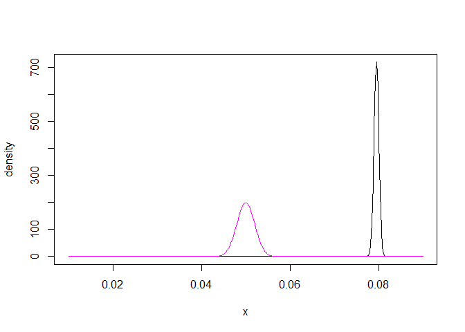
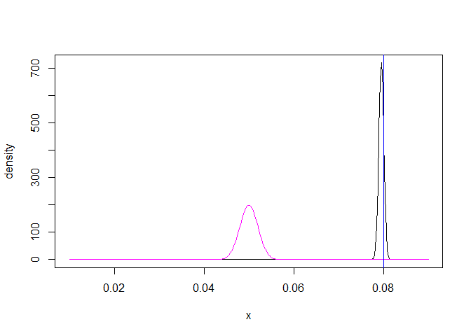
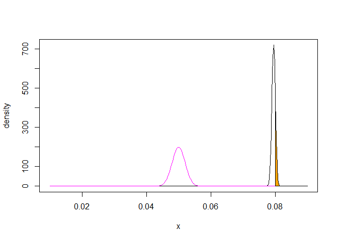
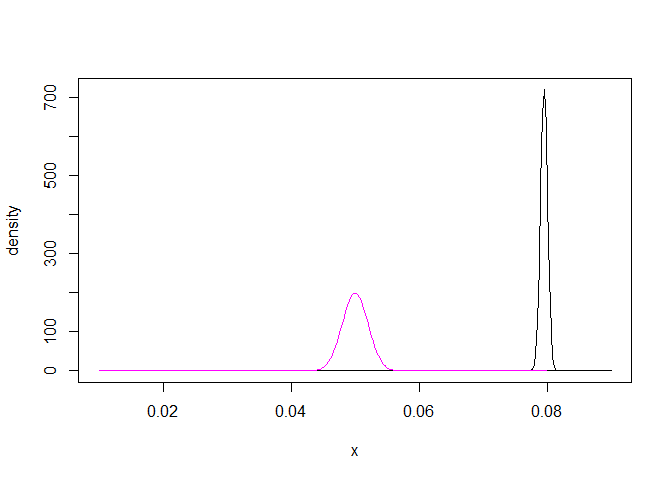

Bayes - homework 1
================

``` r
# (a)
# Y ~ N(mu,sig2)
# prior ~ N(mu0, sig2/m)
# posterior of n samples =
#  Normal distribution with
#   mu1 = (mu0*m/sig2 + mean(y)*n/sig2) / (m/sig2 + n/sig2)
#   tau21 = 1 / (m/sig2 + n/sig2)
```

``` r
m <- 25
n <- 300
mu0 <- 0.05
sig2 <- 0.0001

mean_y <- 0.082
```

``` r
# (b)
tau20 <- sig2/25
tau21 = 1 / (1/tau20 + n/sig2)
mu1 = (mu0/tau20 + mean_y*n/sig2) / (1/tau20 + n/sig2)

x <- seq(from = mu0 - 20*sqrt(tau20),
         to = mu0 + 20*sqrt(tau20),
         length.out=300)
y0 <- dnorm(x, mu0, sqrt(tau20))
y1 <- dnorm(x, mu1, sqrt(tau21))

plot(x, y1, type="l", ylab="density")
lines(x, y0, col="magenta")
```



``` r
# (c)
plot(x, y1, type="l", ylab="density")
lines(x, y0, col="magenta")
abline(v=0.08, col="blue")
```



``` r
# (c)
plot(x, y1, type="l", ylab="density")
lines(x, y0, col="magenta")

polygon(c( x[x>0.08], max(x), 0.08 ),
        c( y1[x>0.08], 0, 0 ),
        col="orange")
```



``` r
# (c)
plot(x, y1, type="l", ylab="density")
lines(x, y0, col="magenta")

polygon(c( x[x>0.08], max(x), 0.08 ),
        c( y0[x>0.08], 0, 0 ),
        col="skyblue")
```



``` r
# (c)
1 - pnorm(0.08, mu1, sqrt(tau21))
```

    ## [1] 0.2026903

``` r
1 - pnorm(0.08, mu0, sqrt(tau20))
```

    ## [1] 0
