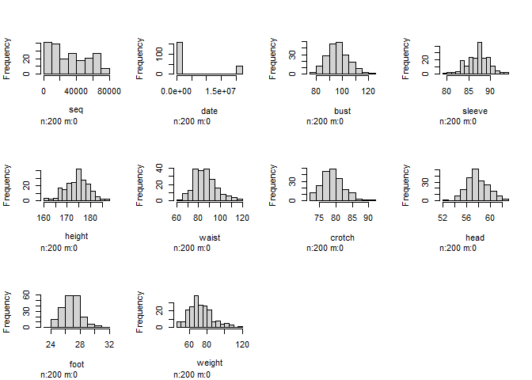
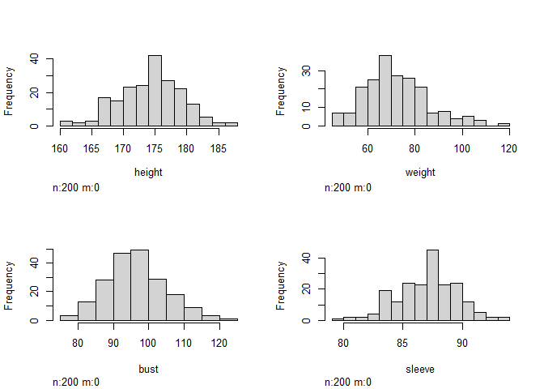
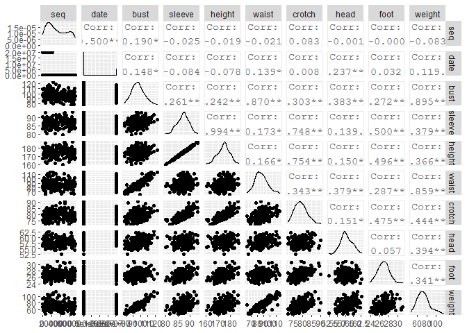
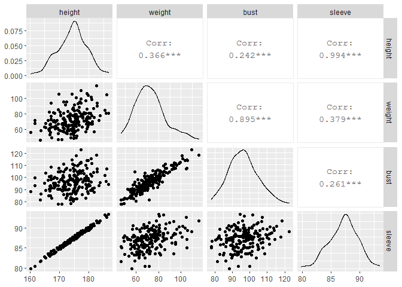
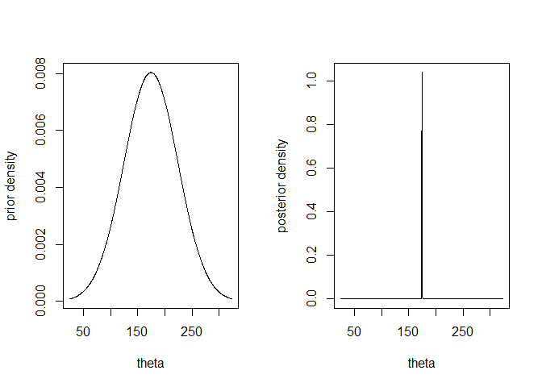
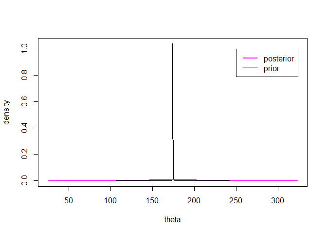
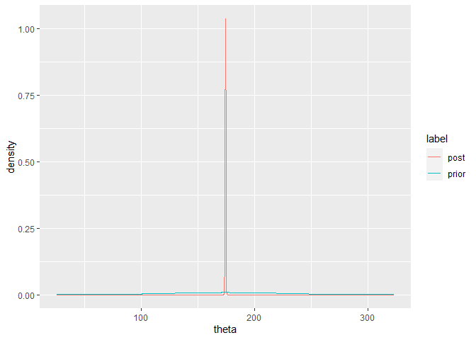

Bayes modelling for normal and binomial distribution
================

``` r
army <- read.csv("army-physical.csv", header=T, sep=",")
head(army)
```

    ##     seq     date  bust sleeve height waist crotch head foot weight
    ## 1 52094     2014  91.8   88.5  177.8  84.1   83.9 57.8 27.2   78.8
    ## 2 57714     2014  94.7   86.3  171.9  89.2   78.6 58.6 26.8   71.9
    ## 3 10741 20140224 114.0   89.4  179.3 109.8   84.8 60.8 29.9  105.9
    ## 4  8843     2013 105.7   88.1  177.0  94.4   77.9 57.6 28.0   81.1
    ## 5 19853 20140414 100.6   87.5  175.7  92.6   76.4 58.1 27.8   78.8
    ## 6 42241     2013 104.2   88.6  176.5  98.1   81.7 60.4 26.7   83.8

``` r
str(army)
```

    ## 'data.frame':    200 obs. of  10 variables:
    ##  $ seq   : int  52094 57714 10741 8843 19853 42241 46561 40117 64329 26347 ...
    ##  $ date  : int  2014 2014 20140224 2013 20140414 2013 2013 2013 2014 2013 ...
    ##  $ bust  : num  91.8 94.7 114 105.7 100.6 ...
    ##  $ sleeve: num  88.5 86.3 89.4 88.1 87.5 88.6 83.4 90.6 85 86.6 ...
    ##  $ height: num  178 172 179 177 176 ...
    ##  $ waist : num  84.1 89.2 109.8 94.4 92.6 ...
    ##  $ crotch: num  83.9 78.6 84.8 77.9 76.4 81.7 73.8 85.1 74.5 76.6 ...
    ##  $ head  : num  57.8 58.6 60.8 57.6 58.1 60.4 56.7 60 56.7 54.3 ...
    ##  $ foot  : num  27.2 26.8 29.9 28 27.8 26.7 30.8 27.1 26.5 27.9 ...
    ##  $ weight: num  78.8 71.9 105.9 81.1 78.8 ...

``` r
library(dplyr)
```

    ## 
    ## Attaching package: 'dplyr'

    ## The following objects are masked from 'package:stats':
    ## 
    ##     filter, lag

    ## The following objects are masked from 'package:base':
    ## 
    ##     intersect, setdiff, setequal, union

``` r
library(ggplot2)
library(Hmisc)
```

    ## Loading required package: lattice

    ## Loading required package: survival

    ## Loading required package: Formula

    ## 
    ## Attaching package: 'Hmisc'

    ## The following objects are masked from 'package:dplyr':
    ## 
    ##     src, summarize

    ## The following objects are masked from 'package:base':
    ## 
    ##     format.pval, units

``` r
summary(army)
```

    ##       seq             date               bust            sleeve     
    ##  Min.   :   26   Min.   :    2013   Min.   : 77.90   Min.   :79.80  
    ##  1st Qu.:13225   1st Qu.:    2013   1st Qu.: 90.30   1st Qu.:85.47  
    ##  Median :29921   Median :    2013   Median : 96.35   Median :87.30  
    ##  Mean   :32475   Mean   : 4130355   Mean   : 96.41   Mean   :87.13  
    ##  3rd Qu.:50928   3rd Qu.:    2014   3rd Qu.:101.42   3rd Qu.:88.80  
    ##  Max.   :72625   Max.   :20140428   Max.   :122.60   Max.   :93.40  
    ##      height          waist            crotch           head      
    ##  Min.   :160.2   Min.   : 63.70   Min.   :72.20   Min.   :52.40  
    ##  1st Qu.:171.3   1st Qu.: 79.17   1st Qu.:76.50   1st Qu.:56.70  
    ##  Median :174.8   Median : 85.25   Median :78.80   Median :57.60  
    ##  Mean   :174.3   Mean   : 86.41   Mean   :79.09   Mean   :57.88  
    ##  3rd Qu.:177.4   3rd Qu.: 92.65   3rd Qu.:81.33   3rd Qu.:59.23  
    ##  Max.   :186.8   Max.   :116.40   Max.   :90.10   Max.   :62.70  
    ##       foot           weight      
    ##  Min.   :23.90   Min.   : 46.40  
    ##  1st Qu.:26.00   1st Qu.: 63.23  
    ##  Median :26.80   Median : 71.10  
    ##  Mean   :26.89   Mean   : 72.31  
    ##  3rd Qu.:27.70   3rd Qu.: 79.20  
    ##  Max.   :31.10   Max.   :115.90

``` r
hist(army)
```



``` r
army %>% select(height, weight, bust, sleeve) %>% hist
```



``` r
library(GGally)
```

    ## Registered S3 method overwritten by 'GGally':
    ##   method from   
    ##   +.gg   ggplot2

``` r
army %>% ggpairs
```



``` r
army %>% select(height, weight, bust, sleeve) %>% ggpairs
```



``` r
cov(army)
```

    ##                  seq          date          bust        sleeve        height
    ## seq     4.754241e+08 -8.890490e+10 -3.490506e+04 -1.361658e+03 -2.007758e+03
    ## date   -8.890490e+10  6.642650e+13  1.018336e+07 -1.710937e+06 -3.158609e+06
    ## bust   -3.490506e+04  1.018336e+07  7.118856e+01  5.514864e+00  1.015171e+01
    ## sleeve -1.361658e+03 -1.710937e+06  5.514864e+00  6.266303e+00  1.235539e+01
    ## height -2.007758e+03 -3.158609e+06  1.015171e+01  1.235539e+01  2.468030e+01
    ## waist  -4.747225e+03  1.178667e+07  7.612066e+01  4.477823e+00  8.561106e+00
    ## crotch  6.166396e+03  2.117106e+05  8.729787e+00  6.391180e+00  1.279055e+01
    ## head   -4.322563e+01  3.503455e+06  5.847920e+00  6.290854e-01  1.346533e+00
    ## foot   -4.415829e-01  3.409322e+05  3.034978e+00  1.656576e+00  3.260013e+00
    ## weight -2.405169e+04  1.282666e+07  9.982525e+01  1.254483e+01  2.400609e+01
    ##                waist       crotch          head          foot        weight
    ## seq    -4.747225e+03 6.166396e+03 -4.322563e+01 -4.415829e-01 -2.405169e+04
    ## date    1.178667e+07 2.117106e+05  3.503455e+06  3.409322e+05  1.282666e+07
    ## bust    7.612066e+01 8.729787e+00  5.847920e+00  3.034978e+00  9.982525e+01
    ## sleeve  4.477823e+00 6.391180e+00  6.290854e-01  1.656576e+00  1.254483e+01
    ## height  8.561106e+00 1.279055e+01  1.346533e+00  3.260013e+00  2.400609e+01
    ## waist   1.075037e+02 1.212924e+01  7.108302e+00  3.941429e+00  1.176892e+02
    ## crotch  1.212924e+01 1.164538e+01  9.341307e-01  2.143510e+00  2.002048e+01
    ## head    7.108302e+00 9.341307e-01  3.279397e+00  1.363015e-01  9.439367e+00
    ## foot    3.941429e+00 2.143510e+00  1.363015e-01  1.748763e+00  5.952813e+00
    ## weight  1.176892e+02 2.002048e+01  9.439367e+00  5.952813e+00  1.746530e+02

``` r
cor(army)
```

    ##                  seq         date       bust      sleeve      height
    ## seq     1.000000e+00 -0.500281482 -0.1897329 -0.02494720 -0.01853513
    ## date   -5.002815e-01  1.000000000  0.1480864 -0.08386053 -0.07800996
    ## bust   -1.897329e-01  0.148086401  1.0000000  0.26111030  0.24219163
    ## sleeve -2.494720e-02 -0.083860533  0.2611103  1.00000000  0.99351765
    ## height -1.853513e-02 -0.078009960  0.2421916  0.99351765  1.00000000
    ## waist  -2.099847e-02  0.139479023  0.8701334  0.17252405  0.16620461
    ## crotch  8.287317e-02  0.007611933  0.3031947  0.74816688  0.75446179
    ## head   -1.094722e-03  0.237371656  0.3827360  0.13877363  0.14967343
    ## foot   -1.531462e-05  0.031632377  0.2720101  0.50042639  0.49622500
    ## weight -8.346742e-02  0.119084420  0.8952560  0.37920227  0.36564381
    ##              waist      crotch         head          foot      weight
    ## seq    -0.02099847 0.082873172 -0.001094722 -1.531462e-05 -0.08346742
    ## date    0.13947902 0.007611933  0.237371656  3.163238e-02  0.11908442
    ## bust    0.87013339 0.303194732  0.382735980  2.720101e-01  0.89525596
    ## sleeve  0.17252405 0.748166877  0.138773630  5.004264e-01  0.37920227
    ## height  0.16620461 0.754461794  0.149673433  4.962250e-01  0.36564381
    ## waist   1.00000000 0.342803438  0.378579620  2.874595e-01  0.85888845
    ## crotch  0.34280344 1.000000000  0.151158906  4.749885e-01  0.44392501
    ## head    0.37857962 0.151158906  1.000000000  5.691650e-02  0.39441896
    ## foot    0.28745949 0.474988484  0.056916503  1.000000e+00  0.34061887
    ## weight  0.85888845 0.443925012  0.394418964  3.406189e-01  1.00000000

``` r
sort(cor(army))
```

    ##   [1] -5.002815e-01 -5.002815e-01 -1.897329e-01 -1.897329e-01 -8.386053e-02
    ##   [6] -8.386053e-02 -8.346742e-02 -8.346742e-02 -7.800996e-02 -7.800996e-02
    ##  [11] -2.494720e-02 -2.494720e-02 -2.099847e-02 -2.099847e-02 -1.853513e-02
    ##  [16] -1.853513e-02 -1.094722e-03 -1.094722e-03 -1.531462e-05 -1.531462e-05
    ##  [21]  7.611933e-03  7.611933e-03  3.163238e-02  3.163238e-02  5.691650e-02
    ##  [26]  5.691650e-02  8.287317e-02  8.287317e-02  1.190844e-01  1.190844e-01
    ##  [31]  1.387736e-01  1.387736e-01  1.394790e-01  1.394790e-01  1.480864e-01
    ##  [36]  1.480864e-01  1.496734e-01  1.496734e-01  1.511589e-01  1.511589e-01
    ##  [41]  1.662046e-01  1.662046e-01  1.725240e-01  1.725240e-01  2.373717e-01
    ##  [46]  2.373717e-01  2.421916e-01  2.421916e-01  2.611103e-01  2.611103e-01
    ##  [51]  2.720101e-01  2.720101e-01  2.874595e-01  2.874595e-01  3.031947e-01
    ##  [56]  3.031947e-01  3.406189e-01  3.406189e-01  3.428034e-01  3.428034e-01
    ##  [61]  3.656438e-01  3.656438e-01  3.785796e-01  3.785796e-01  3.792023e-01
    ##  [66]  3.792023e-01  3.827360e-01  3.827360e-01  3.944190e-01  3.944190e-01
    ##  [71]  4.439250e-01  4.439250e-01  4.749885e-01  4.749885e-01  4.962250e-01
    ##  [76]  4.962250e-01  5.004264e-01  5.004264e-01  7.481669e-01  7.481669e-01
    ##  [81]  7.544618e-01  7.544618e-01  8.588884e-01  8.588884e-01  8.701334e-01
    ##  [86]  8.701334e-01  8.952560e-01  8.952560e-01  9.935176e-01  9.935176e-01
    ##  [91]  1.000000e+00  1.000000e+00  1.000000e+00  1.000000e+00  1.000000e+00
    ##  [96]  1.000000e+00  1.000000e+00  1.000000e+00  1.000000e+00  1.000000e+00

``` r
x <- army$height
n <- length(x)
sig2 <- var(x)
mu0 <- mean(x)

tau20 <- sig2*100
tau21 <- 1/(1/tau20 + n/sig2)
mu1 <- tau21*(mu0/tau20 + n*mean(x)/sig2)
```

``` r
theta <- seq(from = mu0-3*sqrt(tau20),
             to = mu0+3*sqrt(tau20),
             length.out=1000)
min(theta)
```

    ## [1] 25.2747

``` r
max(theta)
```

    ## [1] 323.3503

``` r
prior.den = dnorm(theta, mu0, sqrt(tau20))
post.den = dnorm(theta, mu1, sqrt(tau21))
```

``` r
par(mfrow=c(1,2))
plot(theta, prior.den, type="l", ylab="prior density")
plot(theta, post.den, type="l", ylab="posterior density")
```



``` r
ymax = max(prior.den, post.den)
plot(theta, post.den, type="l",
     ylab="density", ylim=c(0,ymax))
lines(theta, prior.den, col="magenta")
legend(250,1, c("posterior","prior"), lty=c(1:1),
       lwd=c(2.5,2.5), col=c("magenta","cyan"))
```



``` r
pp = data.frame(theta=c(theta,theta), 
                density=c(prior.den, post.den),
                label=c(rep("prior", length(prior.den)),
                        rep("post", length(post.den))))
ggplot(data=pp, aes(x=theta, y=density, color=label)) +
  geom_line()
```



이항분포에 대한 베이즈 모델링

``` r
n <- 10
x <- 3

theta0 <- 0.5
alpha <- 0.5
beta <- 0.5

pi0 <- 0.5
pi1 <- 0.5
```

``` r
log.m1 = lgamma(n+1) - lgamma(x+1) - lgamma(n-x+1) 
          - lbeta(alpha,beta) + lbeta(alpha+x, beta+n-x)
```

    ## [1] -7.513805

``` r
m1 = exp(log.m1)
```

``` r
B10 = exp(log.m1 - dbinom(x=x, size=n, prob=theta0, log=TRUE))
B10
```

    ## [1] 1024

``` r
B01 = 1/B10
```

``` r
alpha0 = 1/(1+ B10*pi1/pi0)
alpha1 = 1 - alpha0
alpha1
```

    ## [1] 0.9990244

``` r
bayes.test=numeric(4)
names(bayes.test) =
  c("B10","B01","post. prob. of H0","post. prob. of H1")
bayes.test["B10"] = B10
bayes.test["B01"] = B01
bayes.test["post prob of H0"] = alpha0
bayes.test["post prob of H1"] = alpha1
bayes.test
```

    ##               B10               B01 post. prob. of H0 post. prob. of H1 
    ##      1.024000e+03      9.765625e-04      0.000000e+00      0.000000e+00 
    ##   post prob of H0   post prob of H1 
    ##      9.756098e-04      9.990244e-01
