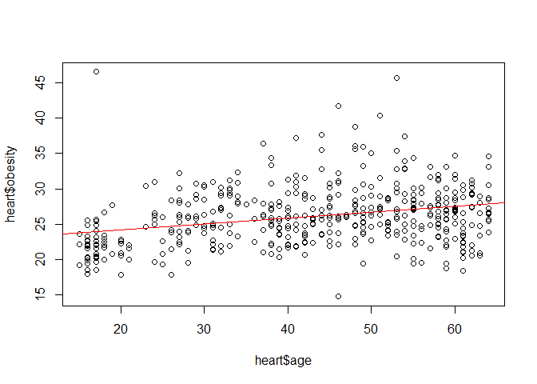
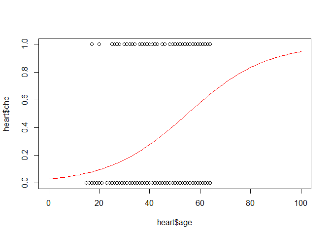
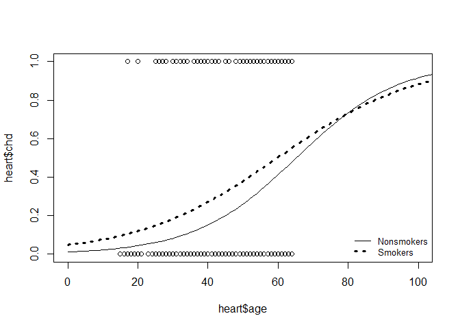

Logistic regression adjusting for confounder
================

``` r
heart<-read.table("http://statweb.stanford.edu/~tibs/ElemStatLearn/datasets/SAheart.data",header = TRUE,sep = ",")
head(heart)
```

    ##   row.names sbp tobacco  ldl adiposity famhist typea obesity alcohol age chd
    ## 1         1 160   12.00 5.73     23.11 Present    49   25.30   97.20  52   1
    ## 2         2 144    0.01 4.41     28.61  Absent    55   28.87    2.06  63   1
    ## 3         3 118    0.08 3.48     32.28 Present    52   29.14    3.81  46   0
    ## 4         4 170    7.50 6.41     38.03 Present    51   31.99   24.26  58   1
    ## 5         5 134   13.60 3.50     27.78 Present    60   25.99   57.34  49   1
    ## 6         6 132    6.20 6.47     36.21 Present    62   30.77   14.14  45   0

``` r
heart$famhist <- ifelse(heart$famhist=="Present", 1, 0)
str(heart)
```

    ## 'data.frame':    462 obs. of  11 variables:
    ##  $ row.names: int  1 2 3 4 5 6 7 8 9 10 ...
    ##  $ sbp      : int  160 144 118 170 134 132 142 114 114 132 ...
    ##  $ tobacco  : num  12 0.01 0.08 7.5 13.6 6.2 4.05 4.08 0 0 ...
    ##  $ ldl      : num  5.73 4.41 3.48 6.41 3.5 6.47 3.38 4.59 3.83 5.8 ...
    ##  $ adiposity: num  23.1 28.6 32.3 38 27.8 ...
    ##  $ famhist  : num  1 0 1 1 1 1 0 1 1 1 ...
    ##  $ typea    : int  49 55 52 51 60 62 59 62 49 69 ...
    ##  $ obesity  : num  25.3 28.9 29.1 32 26 ...
    ##  $ alcohol  : num  97.2 2.06 3.81 24.26 57.34 ...
    ##  $ age      : int  52 63 46 58 49 45 38 58 29 53 ...
    ##  $ chd      : int  1 1 0 1 1 0 0 1 0 1 ...

``` r
heart$anysmoke <- 0
heart$anysmoke[heart$tobacco>0] <- 1
```

``` r
mytable <- table(heart$anysmoke,heart$chd) 
mytable
```

    ##    
    ##       0   1
    ##   0  92  15
    ##   1 210 145

``` r
# Odds ratio btw any smoking and CHD
#   = 145*92 / 210*15 = 4.235
```

``` r
plot(heart$age,heart$obesity)
fit <- lm(heart$obesity ~ heart$age)
abline(fit, col="red", lwd=1.5)
```



``` r
summary(fit)
```

    ## 
    ## Call:
    ## lm(formula = heart$obesity ~ heart$age)
    ## 
    ## Residuals:
    ##      Min       1Q   Median       3Q      Max 
    ## -11.6121  -2.6293  -0.4255   2.0844  22.7085 
    ## 
    ## Coefficients:
    ##             Estimate Std. Error t value Pr(>|t|)    
    ## (Intercept) 22.44082    0.58185  38.568  < 2e-16 ***
    ## heart$age    0.08416    0.01286   6.543 1.61e-10 ***
    ## ---
    ## Signif. codes:  0 '***' 0.001 '**' 0.01 '*' 0.05 '.' 0.1 ' ' 1
    ## 
    ## Residual standard error: 4.035 on 460 degrees of freedom
    ## Multiple R-squared:  0.08513,    Adjusted R-squared:  0.08315 
    ## F-statistic: 42.81 on 1 and 460 DF,  p-value: 1.614e-10

``` r
# Obesity = 22.44 + 0.084*Age
```

``` r
plot(heart$age, heart$chd, xlim=c(0,100))
fit2 <- glm(chd ~ age, family="binomial", data=heart)
curve(predict(fit2, data.frame(age=x), type="resp"),
      add=TRUE, col="red")
```



``` r
summary(fit2)
```

    ## 
    ## Call:
    ## glm(formula = chd ~ age, family = "binomial", data = heart)
    ## 
    ## Deviance Residuals: 
    ##     Min       1Q   Median       3Q      Max  
    ## -1.4321  -0.9215  -0.5392   1.0952   2.2433  
    ## 
    ## Coefficients:
    ##              Estimate Std. Error z value Pr(>|z|)    
    ## (Intercept) -3.521710   0.416031  -8.465  < 2e-16 ***
    ## age          0.064108   0.008532   7.513 5.76e-14 ***
    ## ---
    ## Signif. codes:  0 '***' 0.001 '**' 0.01 '*' 0.05 '.' 0.1 ' ' 1
    ## 
    ## (Dispersion parameter for binomial family taken to be 1)
    ## 
    ##     Null deviance: 596.11  on 461  degrees of freedom
    ## Residual deviance: 525.56  on 460  degrees of freedom
    ## AIC: 529.56
    ## 
    ## Number of Fisher Scoring iterations: 4

``` r
# Odds = exp(-3.522 + 0.064*Age)
```

``` r
fit.smoke <- glm(chd~anysmoke, family="binomial",
                 data=heart)
summary(fit.smoke)
```

    ## 
    ## Call:
    ## glm(formula = chd ~ anysmoke, family = "binomial", data = heart)
    ## 
    ## Deviance Residuals: 
    ##     Min       1Q   Median       3Q      Max  
    ## -1.0247  -1.0247  -0.5496   1.3382   1.9823  
    ## 
    ## Coefficients:
    ##             Estimate Std. Error z value Pr(>|z|)    
    ## (Intercept)  -1.8137     0.2785  -6.514 7.34e-11 ***
    ## anysmoke      1.4434     0.2987   4.833 1.35e-06 ***
    ## ---
    ## Signif. codes:  0 '***' 0.001 '**' 0.01 '*' 0.05 '.' 0.1 ' ' 1
    ## 
    ## (Dispersion parameter for binomial family taken to be 1)
    ## 
    ##     Null deviance: 596.11  on 461  degrees of freedom
    ## Residual deviance: 566.90  on 460  degrees of freedom
    ## AIC: 570.9
    ## 
    ## Number of Fisher Scoring iterations: 4

``` r
exp(fit.smoke$coefficients)
```

    ## (Intercept)    anysmoke 
    ##   0.1630435   4.2349206

``` r
fit.multi <- glm(chd~age+anysmoke, family="binomial",
                 data=heart)
summary(fit.multi)
```

    ## 
    ## Call:
    ## glm(formula = chd ~ age + anysmoke, family = "binomial", data = heart)
    ## 
    ## Deviance Residuals: 
    ##     Min       1Q   Median       3Q      Max  
    ## -1.4540  -0.9139  -0.4894   1.0615   2.4835  
    ## 
    ## Coefficients:
    ##              Estimate Std. Error z value Pr(>|z|)    
    ## (Intercept) -4.031792   0.480847  -8.385  < 2e-16 ***
    ## age          0.058514   0.008894   6.579 4.75e-11 ***
    ## anysmoke     0.916926   0.319456   2.870   0.0041 ** 
    ## ---
    ## Signif. codes:  0 '***' 0.001 '**' 0.01 '*' 0.05 '.' 0.1 ' ' 1
    ## 
    ## (Dispersion parameter for binomial family taken to be 1)
    ## 
    ##     Null deviance: 596.11  on 461  degrees of freedom
    ## Residual deviance: 516.50  on 459  degrees of freedom
    ## AIC: 522.5
    ## 
    ## Number of Fisher Scoring iterations: 4

``` r
exp(fit.multi$coefficients)
```

    ## (Intercept)         age    anysmoke 
    ##   0.0177425   1.0602600   2.5015892

``` r
# OR of smokers compared to non-smokers = 2.5016
```

``` r
plot(heart$age, heart$chd, xlim=c(0,100))

curve(plogis(-4.031792 + 0.058514*x), 0, 110,
      add=TRUE, lwd=1, lty=1)  
curve(plogis(-4.031792 + 0.916926 + 0.058514*x), 0,110,
      add=TRUE, lwd=3, lty=3)  
legend('bottomright', c('Nonsmokers','Smokers'),
       lty=c(1, 3), lwd=c(1,3), bty='n', cex=0.8)
```


``` r
# Why are the odds ratios calculated from the multivariate logistic regression model different from those calculated from univariate (single exposure) models? CONFOUNDING!!! If there was zero confounding by smoking on the age-CHD relationship, adding smoking to the model would not change the coefficient of age.

# So a common way of checking confounding is to add a potential confounder to a regression model and examine if/how much the coefficient of the exposure of interest changes.

# What is causing the confounding in this situation? We need to examine the relationship between age and smoking.
```

``` r
smoke.age <- glm(anysmoke~age, family="binomial",
                 data=heart)
summary(smoke.age)
```

    ## 
    ## Call:
    ## glm(formula = anysmoke ~ age, family = "binomial", data = heart)
    ## 
    ## Deviance Residuals: 
    ##     Min       1Q   Median       3Q      Max  
    ## -2.3877   0.3451   0.4707   0.7084   1.3133  
    ## 
    ## Coefficients:
    ##              Estimate Std. Error z value Pr(>|z|)    
    ## (Intercept) -1.348952   0.332969  -4.051 5.09e-05 ***
    ## age          0.064688   0.008538   7.577 3.54e-14 ***
    ## ---
    ## Signif. codes:  0 '***' 0.001 '**' 0.01 '*' 0.05 '.' 0.1 ' ' 1
    ## 
    ## (Dispersion parameter for binomial family taken to be 1)
    ## 
    ##     Null deviance: 500.07  on 461  degrees of freedom
    ## Residual deviance: 433.29  on 460  degrees of freedom
    ## AIC: 437.29
    ## 
    ## Number of Fisher Scoring iterations: 4

``` r
# Older People are far likelier to smoke than younger study subjects..But is this just confounding? Possibly, not only are old people more likely to smoke, but that greater age increases the negative effects of smoking, and smoking increases the negative effects of age on heart health. This would be effect modification.
```

``` r
fit.interaction<-glm(chd~age*anysmoke, 
                     family="binomial", data=heart)
summary(fit.interaction)
```

    ## 
    ## Call:
    ## glm(formula = chd ~ age * anysmoke, family = "binomial", data = heart)
    ## 
    ## Deviance Residuals: 
    ##     Min       1Q   Median       3Q      Max  
    ## -1.4358  -0.9232  -0.5006   1.0718   2.5838  
    ## 
    ## Coefficients:
    ##              Estimate Std. Error z value Pr(>|z|)    
    ## (Intercept)  -4.46666    0.94923  -4.706 2.53e-06 ***
    ## age           0.06853    0.02041   3.358 0.000785 ***
    ## anysmoke      1.47319    1.06750   1.380 0.167574    
    ## age:anysmoke -0.01254    0.02269  -0.553 0.580382    
    ## ---
    ## Signif. codes:  0 '***' 0.001 '**' 0.01 '*' 0.05 '.' 0.1 ' ' 1
    ## 
    ## (Dispersion parameter for binomial family taken to be 1)
    ## 
    ##     Null deviance: 596.11  on 461  degrees of freedom
    ## Residual deviance: 516.19  on 458  degrees of freedom
    ## AIC: 524.19
    ## 
    ## Number of Fisher Scoring iterations: 5

``` r
# The coefficient of age:anysmoke is negative. This means that the odds ratio of CHD for smokers of a certain age compared to non-smokeres of the reference age is less than what one would expect if they just combined the individual odds ratios of smoking and the odds ratios of being a certain age.
```

``` r
# Odds of Smokers at age 20 
#  = exp(-4.4667 + 0.0685*20 + 1.4732*1 - 0.0125*1*20)

# Odds of Nonsmokers at age 20
#  = exp(-4.4667 + 0.0685*20 + 1.4732*0 - 0.0125*0*20) 

# OR at age 20 = 0.154 / 0.045 = 3.40
```

``` r
# Odds of Smokers at age 60 
#  = exp(-4.4667 + 0.0685*60 + 1.4732*1 - 0.0125*1*60)

# Odds of Nonsmokers at age 60
#  = exp(-4.4667 + 0.0685*60 + 1.4732*0 - 0.0125*0*60) 

# OR at age 20 = 1.44 / 0.70 = 2.06

# Smokers have a higher odds ratio of CHD compared to nonsmokers at age 20 than at age 60
```

``` r
# The p-value of the interaction term can be used to assess the strength of the effect modification. Here, it is greate than 0.05, the common significance threshold, but it is close, so I personally would include it in the model. 

#It is common to include any confounders with a univariate regression p-value <0.2 in an adjusted model. and to include tested interaction terms with a p-values <0.2 in the adjusted model. But these are complicated decisions with no set template
```

``` r
plot(heart$age, heart$chd, xlim=c(0,100))

curve(plogis(-4.46666 + 0.06853*x), 0, 110, 
      add=TRUE, lwd=1, lty=1)  
curve(plogis(-4.46666 +0.06853*x 
             + 1.47319 - 0.01254*1.47319*x), 0,110,
      add=TRUE, lwd=3, lty=3) 

legend('bottomright', c('Nonsmokers','Smokers'),
       lty=c(1, 3), lwd=c(1,3), bty='n', cex=0.8)
```



``` r
# The effect modification term has been added, the lines of predicted risk for smokers and non-smokers, over age, now cross over. In this model, older smokers have less CHD risk than older non-smokers.
```
