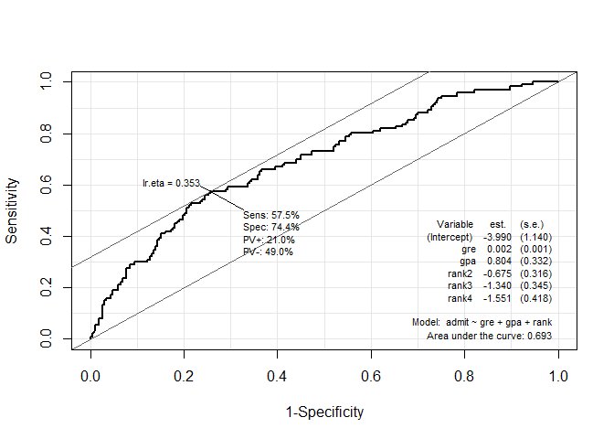

Logistic Regression vs Naive Bayes classifier
================

``` r
# 1. Logistic Regression
# 참고 https://stats.idre.ucla.edu/r/dae/logit-regression/
library(aod)
library(ggplot2)
data <- read.csv("https://stats.idre.ucla.edu/stat/data/binary.csv")
head(data)
```

    ##   admit gre  gpa rank
    ## 1     0 380 3.61    3
    ## 2     1 660 3.67    3
    ## 3     1 800 4.00    1
    ## 4     1 640 3.19    4
    ## 5     0 520 2.93    4
    ## 6     1 760 3.00    2

``` r
str(data)
```

    ## 'data.frame':    400 obs. of  4 variables:
    ##  $ admit: int  0 1 1 1 0 1 1 0 1 0 ...
    ##  $ gre  : int  380 660 800 640 520 760 560 400 540 700 ...
    ##  $ gpa  : num  3.61 3.67 4 3.19 2.93 3 2.98 3.08 3.39 3.92 ...
    ##  $ rank : int  3 3 1 4 4 2 1 2 3 2 ...

``` r
data$rank <- factor(data$rank)
logistic <- glm(admit~gre+gpa+rank, data=data, family="binomial")
summary(logistic)
```

    ## 
    ## Call:
    ## glm(formula = admit ~ gre + gpa + rank, family = "binomial", 
    ##     data = data)
    ## 
    ## Deviance Residuals: 
    ##     Min       1Q   Median       3Q      Max  
    ## -1.6268  -0.8662  -0.6388   1.1490   2.0790  
    ## 
    ## Coefficients:
    ##              Estimate Std. Error z value Pr(>|z|)    
    ## (Intercept) -3.989979   1.139951  -3.500 0.000465 ***
    ## gre          0.002264   0.001094   2.070 0.038465 *  
    ## gpa          0.804038   0.331819   2.423 0.015388 *  
    ## rank2       -0.675443   0.316490  -2.134 0.032829 *  
    ## rank3       -1.340204   0.345306  -3.881 0.000104 ***
    ## rank4       -1.551464   0.417832  -3.713 0.000205 ***
    ## ---
    ## Signif. codes:  0 '***' 0.001 '**' 0.01 '*' 0.05 '.' 0.1 ' ' 1
    ## 
    ## (Dispersion parameter for binomial family taken to be 1)
    ## 
    ##     Null deviance: 499.98  on 399  degrees of freedom
    ## Residual deviance: 458.52  on 394  degrees of freedom
    ## AIC: 470.52
    ## 
    ## Number of Fisher Scoring iterations: 4

``` r
# gpa 가 1 증가하면 admission 의 log(odds) 가 0.8040 증가한다. 
# rank가 1에서 2로 바뀌면 admission의 log(odds)가 -0.6754 증가한다.
```

``` r
confint(logistic)
```

    ## Waiting for profiling to be done...

    ##                     2.5 %       97.5 %
    ## (Intercept) -6.2716202334 -1.792547080
    ## gre          0.0001375921  0.004435874
    ## gpa          0.1602959439  1.464142727
    ## rank2       -1.3008888002 -0.056745722
    ## rank3       -2.0276713127 -0.670372346
    ## rank4       -2.4000265384 -0.753542605

``` r
library(Epi)
roc_lr <- ROC(form=admit~gre+gpa+rank, data=data)
```



``` r
source("ROC_sub.R")
```

    ## Loading required package: pROC

    ## Type 'citation("pROC")' for a citation.

    ## 
    ## Attaching package: 'pROC'

    ## The following objects are masked from 'package:stats':
    ## 
    ##     cov, smooth, var

    ## Loading required package: ztable

    ## Welcome to package ztable ver 0.2.0

    ## Loading required package: moonBook

``` r
plot_ROC(roc_lr)
```


``` r
newdata1 <- with(data, data.frame(gre=mean(gre), gpa=mean(gpa),
                                 rank=factor(1:4)))
newdata1
```

    ##     gre    gpa rank
    ## 1 587.7 3.3899    1
    ## 2 587.7 3.3899    2
    ## 3 587.7 3.3899    3
    ## 4 587.7 3.3899    4

``` r
newdata1$rankP <- predict(logistic, newdata=newdata1,
                          type="response")
newdata1
```

    ##     gre    gpa rank     rankP
    ## 1 587.7 3.3899    1 0.5166016
    ## 2 587.7 3.3899    2 0.3522846
    ## 3 587.7 3.3899    3 0.2186120
    ## 4 587.7 3.3899    4 0.1846684

``` r
newdata2 <- with(data,
      data.frame(gre=rep(seq(from=200,to=800,length.out=100),4),
                 gpa=mean(gpa), rank=factor(rep(1:4,each=100))))
head(newdata2)
```

    ##        gre    gpa rank
    ## 1 200.0000 3.3899    1
    ## 2 206.0606 3.3899    1
    ## 3 212.1212 3.3899    1
    ## 4 218.1818 3.3899    1
    ## 5 224.2424 3.3899    1
    ## 6 230.3030 3.3899    1

``` r
newdata3 <- cbind(newdata2, predict(logistic, newdata=newdata2,
                                    type="link", se=TRUE))
newdata3 <- within(newdata3, {
  PredictedProb <- plogis(fit)
  LL <- plogis(fit - 1.96*se.fit)
  UL <- plogis(fit + 1.96*se.fit)
})
head(newdata3)
```

    ##        gre    gpa rank        fit    se.fit residual.scale        UL        LL
    ## 1 200.0000 3.3899    1 -0.8114870 0.5147714              1 0.5492064 0.1393812
    ## 2 206.0606 3.3899    1 -0.7977632 0.5090986              1 0.5498513 0.1423880
    ## 3 212.1212 3.3899    1 -0.7840394 0.5034491              1 0.5505074 0.1454429
    ## 4 218.1818 3.3899    1 -0.7703156 0.4978239              1 0.5511750 0.1485460
    ## 5 224.2424 3.3899    1 -0.7565919 0.4922237              1 0.5518545 0.1516973
    ## 6 230.3030 3.3899    1 -0.7428681 0.4866494              1 0.5525464 0.1548966
    ##   PredictedProb
    ## 1     0.3075737
    ## 2     0.3105042
    ## 3     0.3134499
    ## 4     0.3164108
    ## 5     0.3193867
    ## 6     0.3223773

``` r
ggplot(newdata3, aes(x=gre, y=PredictedProb)) + geom_ribbon(aes(ymin=LL, ymax=UL, fill=rank), alpha=0.2) +
geom_line(aes(color=rank), size=1)
```


``` r
# 2. Naive Bayes Classifier

library(naivebayes)
```

    ## Warning: package 'naivebayes' was built under R version 4.0.3

    ## naivebayes 0.9.7 loaded

``` r
library(dplyr)
```

    ## 
    ## Attaching package: 'dplyr'

    ## The following objects are masked from 'package:stats':
    ## 
    ##     filter, lag

    ## The following objects are masked from 'package:base':
    ## 
    ##     intersect, setdiff, setequal, union

``` r
library(psych)
```

    ## 
    ## Attaching package: 'psych'

    ## The following objects are masked from 'package:ggplot2':
    ## 
    ##     %+%, alpha

``` r
data$admit <- as.factor(data$admit)
pairs.panels(data[-1])
```


``` r
data %>%
  ggplot(aes(x=admit, y=gre, fill=admit)) +
  geom_boxplot() 
```


``` r
data %>%
  ggplot(aes(x=gre, fill=admit)) +
  geom_density(alpha=0.8, color='black')
```


``` r
# P(admit=1|rank=1) = P(admit=1)*P(rank=1|admit=1)/P(rank=1)
```

``` r
model <- naive_bayes(admit~gre+gpa+rank, data=data)
model
```

    ## 
    ## ================================== Naive Bayes ================================== 
    ##  
    ##  Call: 
    ## naive_bayes.formula(formula = admit ~ gre + gpa + rank, data = data)
    ## 
    ## --------------------------------------------------------------------------------- 
    ##  
    ## Laplace smoothing: 0
    ## 
    ## --------------------------------------------------------------------------------- 
    ##  
    ##  A priori probabilities: 
    ## 
    ##      0      1 
    ## 0.6825 0.3175 
    ## 
    ## --------------------------------------------------------------------------------- 
    ##  
    ##  Tables: 
    ## 
    ## --------------------------------------------------------------------------------- 
    ##  ::: gre (Gaussian) 
    ## --------------------------------------------------------------------------------- 
    ##       
    ## gre           0        1
    ##   mean 573.1868 618.8976
    ##   sd   115.8302 108.8849
    ## 
    ## --------------------------------------------------------------------------------- 
    ##  ::: gpa (Gaussian) 
    ## --------------------------------------------------------------------------------- 
    ##       
    ## gpa            0         1
    ##   mean 3.3436996 3.4892126
    ##   sd   0.3771330 0.3701771
    ## 
    ## --------------------------------------------------------------------------------- 
    ##  ::: rank (Categorical) 
    ## --------------------------------------------------------------------------------- 
    ##     
    ## rank          0          1
    ##    1 0.10256410 0.25984252
    ##    2 0.35531136 0.42519685
    ##    3 0.34065934 0.22047244
    ##    4 0.20146520 0.09448819
    ## 
    ## ---------------------------------------------------------------------------------

``` r
# P(rank=1|admit=0) = 0.1031
```

``` r
plot(model)
```


``` r
p1 <- predict(model, data, type='prob')
```

    ## Warning: predict.naive_bayes(): more features in the newdata are provided as
    ## there are probability tables in the object. Calculation is performed based on
    ## features to be found in the tables.

``` r
head(cbind(p1, data))
```

    ##           0          1 admit gre  gpa rank
    ## 1 0.8743442 0.12565577     0 380 3.61    3
    ## 2 0.6582011 0.34179893     1 660 3.67    3
    ## 3 0.2073519 0.79264814     1 800 4.00    1
    ## 4 0.8231765 0.17682346     1 640 3.19    4
    ## 5 0.9079140 0.09208601     0 520 2.93    4
    ## 6 0.6230069 0.37699308     1 760 3.00    2

``` r
p2 <- predict(model, data, type="prob")
```

    ## Warning: predict.naive_bayes(): more features in the newdata are provided as
    ## there are probability tables in the object. Calculation is performed based on
    ## features to be found in the tables.

``` r
library(ROCR)
pred <- prediction(predictions=p2[,2], labels=data$admit)
```

``` r
roc_nb <- performance(pred, measure="tpr", x.measure="fpr")
plot(roc_nb)
segments(0,0,1,1, lty=2)
```


``` r
auc <- performance(pred, measure="auc")
str(auc)
```

    ## Formal class 'performance' [package "ROCR"] with 6 slots
    ##   ..@ x.name      : chr "None"
    ##   ..@ y.name      : chr "Area under the ROC curve"
    ##   ..@ alpha.name  : chr "none"
    ##   ..@ x.values    : list()
    ##   ..@ y.values    :List of 1
    ##   .. ..$ : num 0.691
    ##   ..@ alpha.values: list()

``` r
set.seed(1234)
index <- sample(2, nrow(data), replace=TRUE, prob=c(0.8,0.2))
train <- data[index==1,]
test <- data[index==2,]
head(train)
```

    ##   admit gre  gpa rank
    ## 1     0 380 3.61    3
    ## 2     1 660 3.67    3
    ## 3     1 800 4.00    1
    ## 4     1 640 3.19    4
    ## 6     1 760 3.00    2
    ## 7     1 560 2.98    1

``` r
model_train <- naive_bayes(admit~gre+gpa+rank, data=train)
```

``` r
p3 <- predict(model_train, test)
```

    ## Warning: predict.naive_bayes(): more features in the newdata are provided as
    ## there are probability tables in the object. Calculation is performed based on
    ## features to be found in the tables.

``` r
xtab <- table(p3, test$admit)
xtab
```

    ##    
    ## p3   0  1
    ##   0 47 21
    ##   1  3  4

``` r
sum(diag(xtab))/sum(xtab)
```

    ## [1] 0.68
