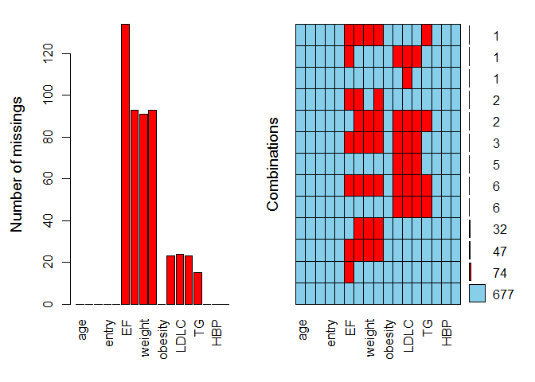

Missing data processing
================

``` r
library(moonBook)
data(acs)
head(acs)
```

    ##   age    sex cardiogenicShock   entry              Dx   EF height weight
    ## 1  62   Male               No Femoral           STEMI 18.0    168     72
    ## 2  78 Female               No Femoral           STEMI 18.4    148     48
    ## 3  76 Female              Yes Femoral           STEMI 20.0     NA     NA
    ## 4  89 Female               No Femoral           STEMI 21.8    165     50
    ## 5  56   Male               No  Radial          NSTEMI 21.8    162     64
    ## 6  73 Female               No  Radial Unstable Angina 22.0    153     59
    ##        BMI obesity  TC LDLC HDLC  TG  DM HBP smoking
    ## 1 25.51020     Yes 215  154   35 155 Yes  No  Smoker
    ## 2 21.91381      No  NA   NA   NA 166  No Yes   Never
    ## 3       NA      No  NA   NA   NA  NA  No Yes   Never
    ## 4 18.36547      No 121   73   20  89  No  No   Never
    ## 5 24.38653      No 195  151   36  63 Yes Yes  Smoker
    ## 6 25.20398     Yes 184  112   38 137 Yes Yes   Never

``` r
na.count <- apply(acs,2,function(x) sum(is.na(x)))
na.count[na.count>0]
```

    ##     EF height weight    BMI     TC   LDLC   HDLC     TG 
    ##    134     93     91     93     23     24     23     15

``` r
barplot(na.count[na.count>0])
```


``` r
library(VIM)
```

    ## Warning: package 'VIM' was built under R version 4.0.3

    ## Loading required package: colorspace

    ## Loading required package: grid

    ## VIM is ready to use.

    ## Suggestions and bug-reports can be submitted at: https://github.com/statistikat/VIM/issues

    ## 
    ## Attaching package: 'VIM'

    ## The following object is masked from 'package:datasets':
    ## 
    ##     sleep

``` r
aggr(acs, prop=FALSE, numbers=TRUE)
```



``` r
marginplot(acs[c("EF","BMI")], 
           pch=20, col=c("gray","red","blue"))
```


``` r
x <- as.data.frame(abs(is.na(acs)))
y <- apply(x, 2, function(x) sum(x)>0)
round(cor(x[y]),2)
```

    ##          EF height weight  BMI   TC LDLC HDLC   TG
    ## EF     1.00   0.46   0.45 0.46 0.13 0.12 0.13 0.11
    ## height 0.46   1.00   0.99 1.00 0.20 0.19 0.20 0.21
    ## weight 0.45   0.99   1.00 0.99 0.20 0.19 0.20 0.21
    ## BMI    0.46   1.00   0.99 1.00 0.20 0.19 0.20 0.21
    ## TC     0.13   0.20   0.20 0.20 1.00 0.98 1.00 0.75
    ## LDLC   0.12   0.19   0.19 0.19 0.98 1.00 0.98 0.73
    ## HDLC   0.13   0.20   0.20 0.20 1.00 0.98 1.00 0.75
    ## TG     0.11   0.21   0.21 0.21 0.75 0.73 0.75 1.00

``` r
# MCAR (missing completely at random) MCAR은 변수의 종류와 변수의 값과 상관없이 전체에 걸쳐 무작위적으로 나타나는 것으로, 이러한 missing data는 분석에 영향을 주지 않는다. 실제로 MCAR의 경우는 거의 없다.

# MAR (Missing at random) 누락된 자료가 특정 변수와 관련되어 일어나지만 그 변수의 값과는 관계가 없는 경우이다. 예를 들어 어떤 설문조사에서 누락된 자료가 특정 변수들에 국한되어 발견되었는데 알고 보니 일부 대상자가 설문지 3페이지에 반대쪽 면이 있는 것을 모르고 채우지 않았을 경우 MAR로 볼 수 있다.

# MNAR (Missing at not random) 누락된 변수의 값과 누락된 이유가 관련이 있는 경우이다. 예를 들어 노인에서 우울증에 대한 설문조사를 했는데 실제로 우울증이 심한 경우는 우울한 기분에 대해 자세히 조사하는 항목을 대답하는 것이 괴로워 일부러 회피하여 누락되는 경우 등이다. 일부 설문에 정치적인 이유로 일부러 대답을 회피하거나 하는 경우도 MNAR로 볼수 있다. 

# 그 외에 오랜 시간을 두고 진행하는 연구인 경우 dropout도 누락의 원인이 될 수 있고 연구자의 데이터 수집이 불충분했거나 데이터 입력 과정에서 실수한 경우 등도 누락의 원인이 될 수 있다.
```

1.  MCAR 이면 Litewise deletion 가능

``` r
acs1 <- na.omit(acs)
nrow(acs1)
```

    ## [1] 677

``` r
cor(acs$EF, acs$BMI)
```

    ## [1] NA

``` r
cor(acs1$EF, acs1$BMI)
```

    ## [1] 0.09038604

``` r
acs2 <- na.omit(acs[c("EF","BMI")])
 # EF 와 BMI 에 대해서만 결측 개체 제외시키려면
nrow(acs2)
```

    ## [1] 689

``` r
cor(acs2$EF, acs2$BMI)
```

    ## [1] 0.09332209

``` r
fit <- lm(EF~BMI, data=acs)
summary(fit)
```

    ## 
    ## Call:
    ## lm(formula = EF ~ BMI, data = acs)
    ## 
    ## Residuals:
    ##     Min      1Q  Median      3Q     Max 
    ## -38.157  -4.860   2.031   6.427  24.090 
    ## 
    ## Coefficients:
    ##             Estimate Std. Error t value Pr(>|t|)    
    ## (Intercept)  49.4581     2.6130  18.928   <2e-16 ***
    ## BMI           0.2626     0.1069   2.457   0.0143 *  
    ## ---
    ## Signif. codes:  0 '***' 0.001 '**' 0.01 '*' 0.05 '.' 0.1 ' ' 1
    ## 
    ## Residual standard error: 9.453 on 687 degrees of freedom
    ##   (168 observations deleted due to missingness)
    ## Multiple R-squared:  0.008709,   Adjusted R-squared:  0.007266 
    ## F-statistic: 6.036 on 1 and 687 DF,  p-value: 0.01427

``` r
fit2 <- lm(EF~BMI, data=acs2)
summary(fit2)
```

    ## 
    ## Call:
    ## lm(formula = EF ~ BMI, data = acs2)
    ## 
    ## Residuals:
    ##     Min      1Q  Median      3Q     Max 
    ## -38.157  -4.860   2.031   6.427  24.090 
    ## 
    ## Coefficients:
    ##             Estimate Std. Error t value Pr(>|t|)    
    ## (Intercept)  49.4581     2.6130  18.928   <2e-16 ***
    ## BMI           0.2626     0.1069   2.457   0.0143 *  
    ## ---
    ## Signif. codes:  0 '***' 0.001 '**' 0.01 '*' 0.05 '.' 0.1 ' ' 1
    ## 
    ## Residual standard error: 9.453 on 687 degrees of freedom
    ## Multiple R-squared:  0.008709,   Adjusted R-squared:  0.007266 
    ## F-statistic: 6.036 on 1 and 687 DF,  p-value: 0.01427

``` r
identical(fit$coef, fit2$coef)
```

    ## [1] TRUE

``` r
 # cf. Pairwise deletion : na 있는 관측치 모두 제거하지 않고, 그때그때 통계의 필요에 따라 누락자료 제거

cor(acs[c("EF","BMI","LDLC")],
    use="pairwise.complete.obs")
```

    ##              EF        BMI       LDLC
    ## EF   1.00000000 0.09332209 0.03309854
    ## BMI  0.09332209 1.00000000 0.08559547
    ## LDLC 0.03309854 0.08559547 1.00000000

1.  Multiple Imputation

``` r
# Monte carlo simulation 을 통해 누락된 자료를 채운 complete dataset 을 여러 개 만들고, 각 dataset 에 대해 표준적인 통계방법 적용해 결과 제공
library(mice)
```

    ## 
    ## Attaching package: 'mice'

    ## The following object is masked from 'package:moonBook':
    ## 
    ##     densityplot

    ## The following objects are masked from 'package:base':
    ## 
    ##     cbind, rbind

``` r
data(iris)
head(iris)
```

    ##   Sepal.Length Sepal.Width Petal.Length Petal.Width Species
    ## 1          5.1         3.5          1.4         0.2  setosa
    ## 2          4.9         3.0          1.4         0.2  setosa
    ## 3          4.7         3.2          1.3         0.2  setosa
    ## 4          4.6         3.1          1.5         0.2  setosa
    ## 5          5.0         3.6          1.4         0.2  setosa
    ## 6          5.4         3.9          1.7         0.4  setosa

``` r
fit_iris <- lm(Sepal.Length~Petal.Length+Species,
               data=iris)
summary(fit_iris)
```

    ## 
    ## Call:
    ## lm(formula = Sepal.Length ~ Petal.Length + Species, data = iris)
    ## 
    ## Residuals:
    ##      Min       1Q   Median       3Q      Max 
    ## -0.75310 -0.23142 -0.00081  0.23085  1.03100 
    ## 
    ## Coefficients:
    ##                   Estimate Std. Error t value Pr(>|t|)    
    ## (Intercept)        3.68353    0.10610  34.719  < 2e-16 ***
    ## Petal.Length       0.90456    0.06479  13.962  < 2e-16 ***
    ## Speciesversicolor -1.60097    0.19347  -8.275 7.37e-14 ***
    ## Speciesvirginica  -2.11767    0.27346  -7.744 1.48e-12 ***
    ## ---
    ## Signif. codes:  0 '***' 0.001 '**' 0.01 '*' 0.05 '.' 0.1 ' ' 1
    ## 
    ## Residual standard error: 0.338 on 146 degrees of freedom
    ## Multiple R-squared:  0.8367, Adjusted R-squared:  0.8334 
    ## F-statistic: 249.4 on 3 and 146 DF,  p-value: < 2.2e-16

``` r
set.seed(123)
random1 <- sample(1:150,10)
random2 <- sample(1:5, 10, replace=TRUE)

iris1 <- iris
for (i in 1:10)
  iris1[random1[i], random2[i]] <- NA
# 10% 에 해당하는 10개의 데이터를 무작위로 선택해 자료의 일부를 무작위로 누락
```

``` r
iris1[random1,]
```

    ##     Sepal.Length Sepal.Width Petal.Length Petal.Width    Species
    ## 14            NA         3.0          1.1         0.1     setosa
    ## 50            NA         3.3          1.4         0.2     setosa
    ## 118          7.7         3.8          6.7         2.2       <NA>
    ## 43           4.4         3.2           NA         0.2     setosa
    ## 150          5.9          NA          5.1         1.8  virginica
    ## 148          6.5          NA          5.2         2.0  virginica
    ## 90            NA         2.5          4.0         1.3 versicolor
    ## 91           5.5         2.6           NA         1.2 versicolor
    ## 143          5.8         2.7          5.1          NA  virginica
    ## 92            NA         3.0          4.6         1.4 versicolor

``` r
imput <- mice(iris1, seed=1234)
```

    ## 
    ##  iter imp variable
    ##   1   1  Sepal.Length  Sepal.Width  Petal.Length  Petal.Width  Species
    ##   1   2  Sepal.Length  Sepal.Width  Petal.Length  Petal.Width  Species
    ##   1   3  Sepal.Length  Sepal.Width  Petal.Length  Petal.Width  Species
    ##   1   4  Sepal.Length  Sepal.Width  Petal.Length  Petal.Width  Species
    ##   1   5  Sepal.Length  Sepal.Width  Petal.Length  Petal.Width  Species
    ##   2   1  Sepal.Length  Sepal.Width  Petal.Length  Petal.Width  Species
    ##   2   2  Sepal.Length  Sepal.Width  Petal.Length  Petal.Width  Species
    ##   2   3  Sepal.Length  Sepal.Width  Petal.Length  Petal.Width  Species
    ##   2   4  Sepal.Length  Sepal.Width  Petal.Length  Petal.Width  Species
    ##   2   5  Sepal.Length  Sepal.Width  Petal.Length  Petal.Width  Species
    ##   3   1  Sepal.Length  Sepal.Width  Petal.Length  Petal.Width  Species
    ##   3   2  Sepal.Length  Sepal.Width  Petal.Length  Petal.Width  Species
    ##   3   3  Sepal.Length  Sepal.Width  Petal.Length  Petal.Width  Species
    ##   3   4  Sepal.Length  Sepal.Width  Petal.Length  Petal.Width  Species
    ##   3   5  Sepal.Length  Sepal.Width  Petal.Length  Petal.Width  Species
    ##   4   1  Sepal.Length  Sepal.Width  Petal.Length  Petal.Width  Species
    ##   4   2  Sepal.Length  Sepal.Width  Petal.Length  Petal.Width  Species
    ##   4   3  Sepal.Length  Sepal.Width  Petal.Length  Petal.Width  Species
    ##   4   4  Sepal.Length  Sepal.Width  Petal.Length  Petal.Width  Species
    ##   4   5  Sepal.Length  Sepal.Width  Petal.Length  Petal.Width  Species
    ##   5   1  Sepal.Length  Sepal.Width  Petal.Length  Petal.Width  Species
    ##   5   2  Sepal.Length  Sepal.Width  Petal.Length  Petal.Width  Species
    ##   5   3  Sepal.Length  Sepal.Width  Petal.Length  Petal.Width  Species
    ##   5   4  Sepal.Length  Sepal.Width  Petal.Length  Petal.Width  Species
    ##   5   5  Sepal.Length  Sepal.Width  Petal.Length  Petal.Width  Species

``` r
imput
```

    ## Class: mids
    ## Number of multiple imputations:  5 
    ## Imputation methods:
    ## Sepal.Length  Sepal.Width Petal.Length  Petal.Width      Species 
    ##        "pmm"        "pmm"        "pmm"        "pmm"    "polyreg" 
    ## PredictorMatrix:
    ##              Sepal.Length Sepal.Width Petal.Length Petal.Width Species
    ## Sepal.Length            0           1            1           1       1
    ## Sepal.Width             1           0            1           1       1
    ## Petal.Length            1           1            0           1       1
    ## Petal.Width             1           1            1           0       1
    ## Species                 1           1            1           1       0

``` r
# 5 datasets were generated, and we can see how many data were missed from each columns
```

``` r
imput$imp
```

    ## $Sepal.Length
    ##      1   2   3   4   5
    ## 14 4.4 4.5 4.4 5.0 4.4
    ## 50 4.9 4.6 4.9 5.0 5.0
    ## 90 5.8 6.0 6.1 6.0 5.5
    ## 92 6.1 6.7 6.1 6.8 6.4
    ## 
    ## $Sepal.Width
    ##       1   2   3   4   5
    ## 148 2.8 2.9 2.8 3.0 3.0
    ## 150 2.8 3.0 2.6 2.9 2.7
    ## 
    ## $Petal.Length
    ##      1   2   3   4   5
    ## 43 1.1 1.4 1.4 1.3 1.3
    ## 91 4.5 3.5 3.9 3.9 3.9
    ## 
    ## $Petal.Width
    ##       1   2   3   4   5
    ## 143 1.5 1.9 1.8 1.9 1.9
    ## 
    ## $Species
    ##             1         2         3         4         5
    ## 118 virginica virginica virginica virginica virginica

``` r
# 실제로 어떤 값이 대입되었는지도 알 수 있음
```

``` r
iris[random1,]
```

    ##     Sepal.Length Sepal.Width Petal.Length Petal.Width    Species
    ## 14           4.3         3.0          1.1         0.1     setosa
    ## 50           5.0         3.3          1.4         0.2     setosa
    ## 118          7.7         3.8          6.7         2.2  virginica
    ## 43           4.4         3.2          1.3         0.2     setosa
    ## 150          5.9         3.0          5.1         1.8  virginica
    ## 148          6.5         3.0          5.2         2.0  virginica
    ## 90           5.5         2.5          4.0         1.3 versicolor
    ## 91           5.5         2.6          4.4         1.2 versicolor
    ## 143          5.8         2.7          5.1         1.9  virginica
    ## 92           6.1         3.0          4.6         1.4 versicolor

``` r
fit_imput <- with(imput,
                lm(Sepal.Length~Petal.Length+Species))

pooled <- pool(fit_imput)
summary(pooled)
```

    ##                term   estimate  std.error statistic       df      p.value
    ## 1       (Intercept)  3.6876871 0.10582850 34.845877 142.2271 0.000000e+00
    ## 2      Petal.Length  0.9033591 0.06450248 14.005028 142.7442 0.000000e+00
    ## 3 Speciesversicolor -1.5776782 0.19296163 -8.176124 140.6045 1.554312e-13
    ## 4  Speciesvirginica -2.1151368 0.27251131 -7.761648 142.4407 1.482814e-12

``` r
# The result of linear regression fitting from mice-generated data is quite similar to that of original data
```
