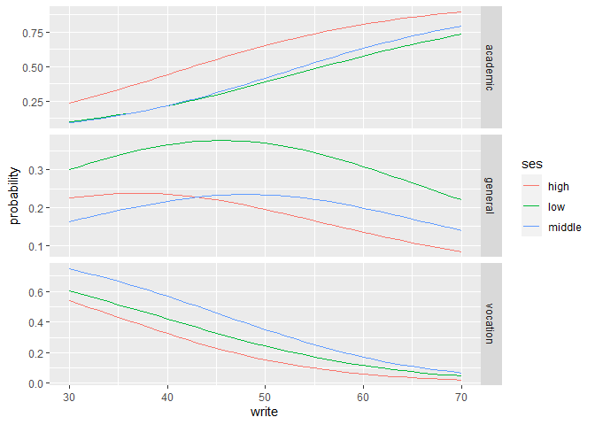

Multinomial Logistic Regression
================

``` r
library(foreign)
library(nnet)
library(ggplot2)
library(reshape2)
```

``` r
ml <- read.dta("https://stats.idre.ucla.edu/stat/data/hsbdemo.dta")
```

``` r
head(ml)
```

    ##    id female    ses schtyp     prog read write math science socst       honors
    ## 1  45 female    low public vocation   34    35   41      29    26 not enrolled
    ## 2 108   male middle public  general   34    33   41      36    36 not enrolled
    ## 3  15   male   high public vocation   39    39   44      26    42 not enrolled
    ## 4  67   male    low public vocation   37    37   42      33    32 not enrolled
    ## 5 153   male middle public vocation   39    31   40      39    51 not enrolled
    ## 6  51 female   high public  general   42    36   42      31    39 not enrolled
    ##   awards cid
    ## 1      0   1
    ## 2      0   1
    ## 3      0   1
    ## 4      0   1
    ## 5      0   1
    ## 6      0   1

``` r
with(ml, table(ses, prog))
```

    ##         prog
    ## ses      general academic vocation
    ##   low         16       19       12
    ##   middle      20       44       31
    ##   high         9       42        7

``` r
with(ml, do.call(rbind, tapply(write, prog,
                               function(x) c(M=mean(x), SD=sd(x)))))
```

    ##                 M       SD
    ## general  51.33333 9.397775
    ## academic 56.25714 7.943343
    ## vocation 46.76000 9.318754

``` r
ml$prog2 <- relevel(ml$prog, ref="academic")
test <- multinom(prog2 ~ ses + write, data=ml)
```

    ## # weights:  15 (8 variable)
    ## initial  value 219.722458 
    ## iter  10 value 179.982880
    ## final  value 179.981726 
    ## converged

``` r
summary(test)
```

    ## Call:
    ## multinom(formula = prog2 ~ ses + write, data = ml)
    ## 
    ## Coefficients:
    ##          (Intercept)  sesmiddle    seshigh      write
    ## general     2.852198 -0.5332810 -1.1628226 -0.0579287
    ## vocation    5.218260  0.2913859 -0.9826649 -0.1136037
    ## 
    ## Std. Errors:
    ##          (Intercept) sesmiddle   seshigh      write
    ## general     1.166441 0.4437323 0.5142196 0.02141097
    ## vocation    1.163552 0.4763739 0.5955665 0.02221996
    ## 
    ## Residual Deviance: 359.9635 
    ## AIC: 375.9635

``` r
z <- summary(test)$coefficients/summary(test)$standard.errors
z
```

    ##          (Intercept)  sesmiddle   seshigh     write
    ## general     2.445214 -1.2018081 -2.261334 -2.705562
    ## vocation    4.484769  0.6116747 -1.649967 -5.112689

``` r
p <- (1-pnorm(abs(z),0,1))*2
p
```

    ##           (Intercept) sesmiddle    seshigh        write
    ## general  0.0144766100 0.2294379 0.02373856 6.818902e-03
    ## vocation 0.0000072993 0.5407530 0.09894976 3.176045e-07

``` r
exp(coef(test))
```

    ##          (Intercept) sesmiddle   seshigh     write
    ## general     17.32582 0.5866769 0.3126026 0.9437172
    ## vocation   184.61262 1.3382809 0.3743123 0.8926116

``` r
head(pp <- fitted(test))
```

    ##    academic   general  vocation
    ## 1 0.1482764 0.3382454 0.5134781
    ## 2 0.1202017 0.1806283 0.6991700
    ## 3 0.4186747 0.2368082 0.3445171
    ## 4 0.1726885 0.3508384 0.4764731
    ## 5 0.1001231 0.1689374 0.7309395
    ## 6 0.3533566 0.2377976 0.4088458

``` r
dses <- data.frame(ses=c("low","middle","high"), write=mean(ml$write))

predict(test, newdata=dses, "probs")
```

    ##    academic   general  vocation
    ## 1 0.4396845 0.3581917 0.2021238
    ## 2 0.4777488 0.2283353 0.2939159
    ## 3 0.7009007 0.1784939 0.1206054

``` r
dwrite <-data.frame(ses=rep(c("low","middle","high"),
                      each=41),write=rep(c(30:70),3))
pp.write <- cbind(dwrite, predict(test, 
                                  newdata = dwrite,
                                  type="probs",
                                  se=TRUE))
by(pp.write[,3:5], pp.write$ses, colMeans)
```

    ## pp.write$ses: high
    ##  academic   general  vocation 
    ## 0.6164315 0.1808037 0.2027648 
    ## ------------------------------------------------------------ 
    ## pp.write$ses: low
    ##  academic   general  vocation 
    ## 0.3972977 0.3278174 0.2748849 
    ## ------------------------------------------------------------ 
    ## pp.write$ses: middle
    ##  academic   general  vocation 
    ## 0.4256198 0.2010864 0.3732938

``` r
lpp <- melt(pp.write, id.vars=c("ses","write"),
            value.name="probability")
head(lpp)
```

    ##   ses write variable probability
    ## 1 low    30 academic  0.09843588
    ## 2 low    31 academic  0.10716868
    ## 3 low    32 academic  0.11650390
    ## 4 low    33 academic  0.12645834
    ## 5 low    34 academic  0.13704576
    ## 6 low    35 academic  0.14827643

``` r
ggplot(lpp, aes(x=write, y=probability, col=ses)) +
  geom_line() + facet_grid(variable~., scales="free")
```


