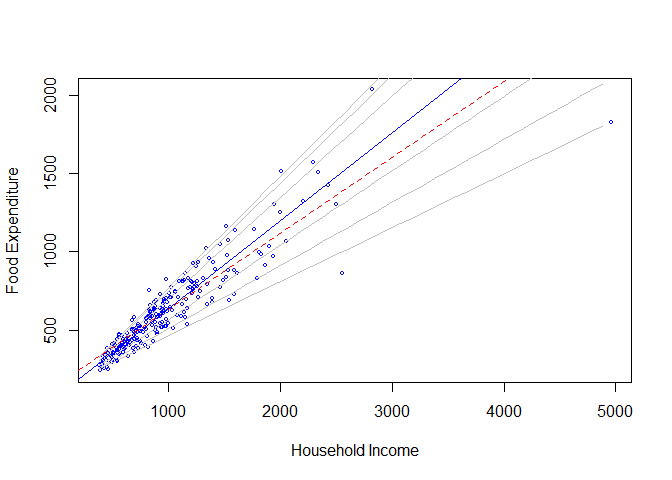
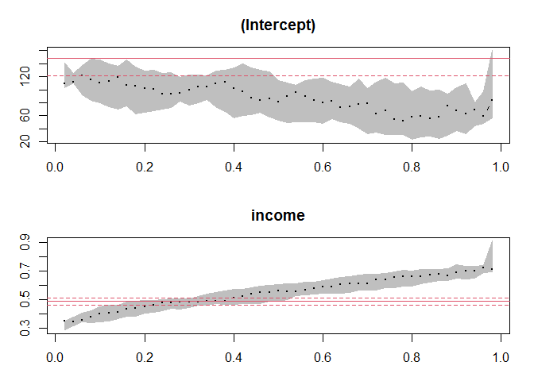

Quantile Regression
================

``` r
library(quantreg)
```

    ## Loading required package: SparseM

    ## 
    ## Attaching package: 'SparseM'

    ## The following object is masked from 'package:base':
    ## 
    ##     backsolve

``` r
data(engel)
attach(engel)
plot(income, foodexp, xlab="Household Income", ylab="Food Expenditure", type="n", cex=0.5)
points(income, foodexp, cex=0.5, col="blue")

taus <- c(0.05, 0.1, 0.25, 0.75, 0.9, 0.95)
xx <- seq(min(income), max(income), 100)
f <- coef(rq((foodexp)~(income), tau=taus))
yy <- cbind(1,xx) %*%f

for (i in 1:length(taus)){
  lines(xx,yy[,i], col="gray")
}
abline(lm(foodexp~income), col="red", lty=2)
abline(rq(foodexp~income), col="blue")
```



``` r
plot(summary(rq(foodexp~income, 
                tau=1:49/50, data=engel)))
```

    ## Warning in rq.fit.br(x, y, tau = tau, ci = TRUE, ...): Solution may be nonunique

    ## Warning in rq.fit.br(x, y, tau = tau, ci = TRUE, ...): Solution may be nonunique

    ## Warning in rq.fit.br(x, y, tau = tau, ci = TRUE, ...): Solution may be nonunique

    ## Warning in rq.fit.br(x, y, tau = tau, ci = TRUE, ...): Solution may be nonunique


