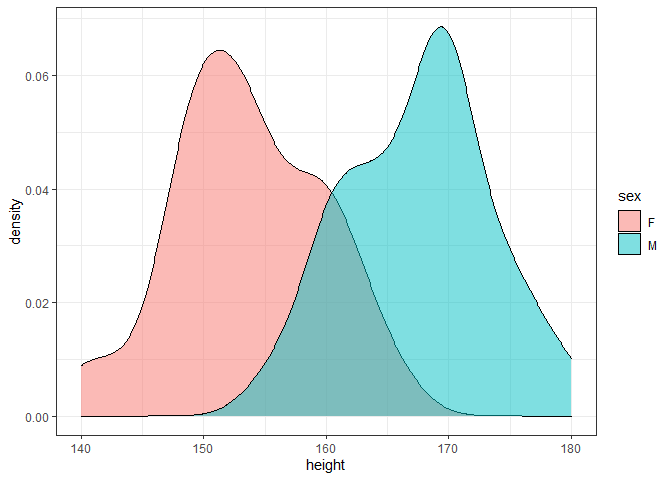
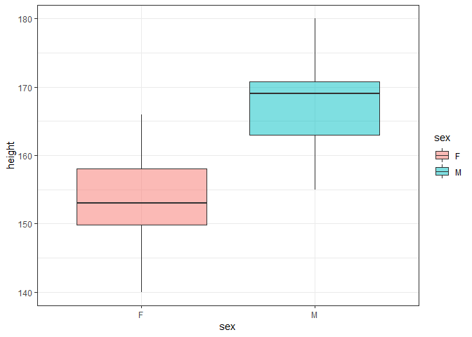
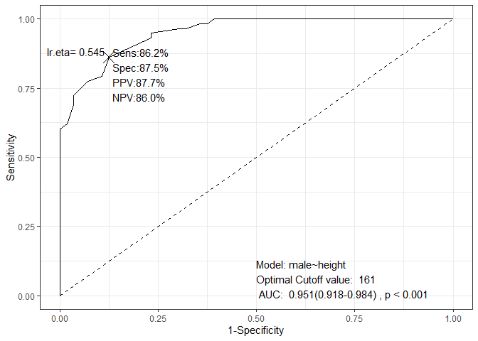
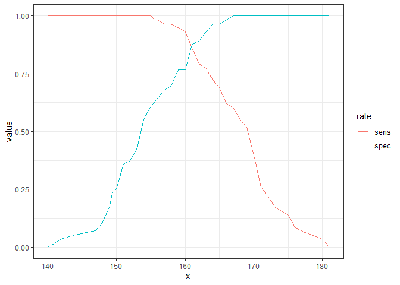
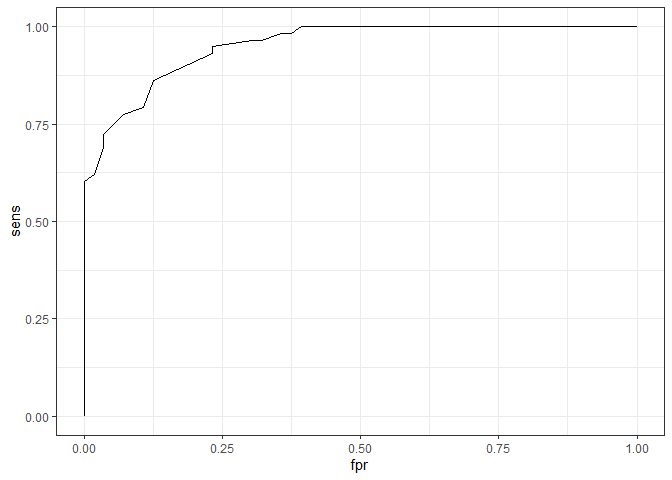
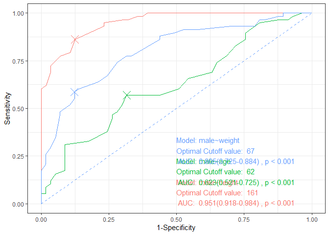
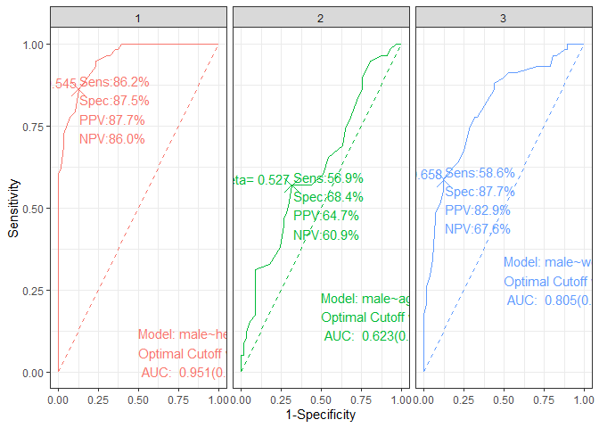
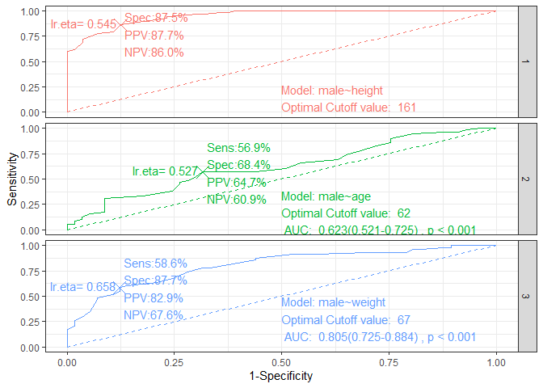
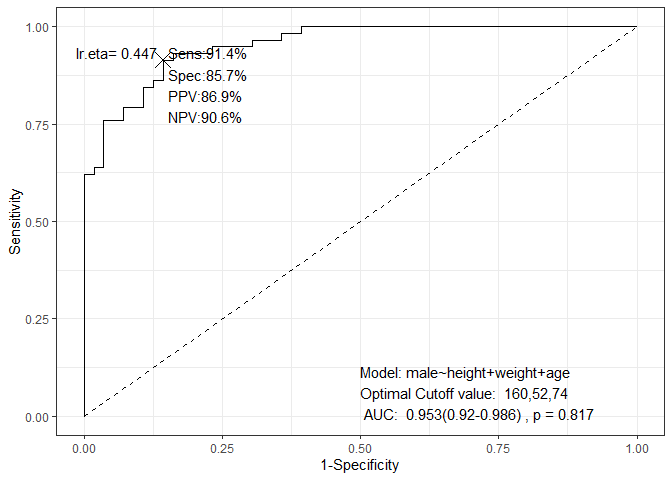
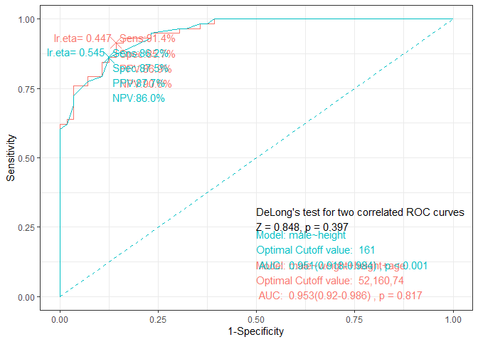

ROC curve
================

``` r
library(webr)
```

    ## Warning: package 'webr' was built under R version 3.6.3

``` r
library(ggplot2)
```

    ## Warning: package 'ggplot2' was built under R version 3.6.3

``` r
library(dplyr)
```

    ## Warning: package 'dplyr' was built under R version 3.6.3

    ## 
    ## Attaching package: 'dplyr'

    ## The following objects are masked from 'package:stats':
    ## 
    ##     filter, lag

    ## The following objects are masked from 'package:base':
    ## 
    ##     intersect, setdiff, setequal, union

``` r
library(tidyr)
```

    ## Warning: package 'tidyr' was built under R version 3.6.3

``` r
library(purrr)
```

    ## Warning: package 'purrr' was built under R version 3.6.3

``` r
remotes::install_github("cardiomoon/multipleROC")
```

    ## Skipping install of 'multipleROC' from a github remote, the SHA1 (caf47bd9) has not changed since last install.
    ##   Use `force = TRUE` to force installation

``` r
library(multipleROC)
```

``` r
theme_set(theme_bw())
data(radial, package="moonBook")
radial %>% group_by(sex) %>% numSummary(height)
```

    ## Warning: `cols` is now required when using unnest().
    ## Please use `cols = c(summary)`

    ## # A tibble: 2 x 13
    ## # Groups:   sex [2]
    ##   sex       n  mean    sd median trimmed   mad   min   max range     skew
    ##   <fct> <dbl> <dbl> <dbl>  <dbl>   <dbl> <dbl> <dbl> <dbl> <dbl>    <dbl>
    ## 1 F        56  154.  6.01    153    154.  5.93   140   166    26 -0.0679 
    ## 2 M        58  168.  5.84    169    167.  5.93   155   180    25 -0.00647
    ## # ... with 2 more variables: kurtosis <dbl>, se <dbl>

``` r
ggplot(data=radial) + geom_density(aes(x=height, fill=sex), alpha=0.5)
```

    ## Warning: Removed 1 rows containing non-finite values (stat_density).



``` r
ggplot(data=radial)+geom_boxplot(aes(x=sex, y=height, fill=sex), alpha=0.5)
```

    ## Warning: Removed 1 rows containing non-finite values (stat_boxplot).



``` r
data(radial, package="moonBook")
x=multipleROC(male~height, data=radial)
```



``` r
table(radial$height>=161, radial$male)
```

    ##        
    ##          0  1
    ##   FALSE 49  8
    ##   TRUE   7 50

``` r
length(unique(radial$height))
```

    ## [1] 39

``` r
result = calSens(radial$height, radial$male)
result
```

    ##        x       sens       spec        fpr       ppv       npv      sum
    ## 1  140.0 1.00000000 0.00000000 1.00000000 0.5087719       NaN 1.000000
    ## 2  142.0 1.00000000 0.03571429 0.96428571 0.5178571 1.0000000 1.035714
    ## 3  144.0 1.00000000 0.05357143 0.94642857 0.5225225 1.0000000 1.053571
    ## 4  147.0 1.00000000 0.07142857 0.92857143 0.5272727 1.0000000 1.071429
    ## 5  147.5 1.00000000 0.08928571 0.91071429 0.5321101 1.0000000 1.089286
    ## 6  148.0 1.00000000 0.10714286 0.89285714 0.5370370 1.0000000 1.107143
    ## 7  149.0 1.00000000 0.17857143 0.82142857 0.5576923 1.0000000 1.178571
    ## 8  149.4 1.00000000 0.23214286 0.76785714 0.5742574 1.0000000 1.232143
    ## 9  150.0 1.00000000 0.25000000 0.75000000 0.5800000 1.0000000 1.250000
    ## 10 151.0 1.00000000 0.35714286 0.64285714 0.6170213 1.0000000 1.357143
    ## 11 152.0 1.00000000 0.37500000 0.62500000 0.6236559 1.0000000 1.375000
    ## 12 153.0 1.00000000 0.42857143 0.57142857 0.6444444 1.0000000 1.428571
    ## 13 154.0 1.00000000 0.55357143 0.44642857 0.6987952 1.0000000 1.553571
    ## 14 155.0 1.00000000 0.60714286 0.39285714 0.7250000 1.0000000 1.607143
    ## 15 155.5 0.98275862 0.62500000 0.37500000 0.7307692 0.9722222 1.607759
    ## 16 156.0 0.98275862 0.64285714 0.35714286 0.7402597 0.9729730 1.625616
    ## 17 157.0 0.96551724 0.67857143 0.32142857 0.7567568 0.9500000 1.644089
    ## 18 158.0 0.96551724 0.69642857 0.30357143 0.7671233 0.9512195 1.661946
    ## 19 159.0 0.94827586 0.76785714 0.23214286 0.8088235 0.9347826 1.716133
    ## 20 160.0 0.93103448 0.76785714 0.23214286 0.8059701 0.9148936 1.698892
    ## 21 161.0 0.86206897 0.87500000 0.12500000 0.8771930 0.8596491 1.737069
    ## 22 162.0 0.79310345 0.89285714 0.10714286 0.8846154 0.8064516 1.685961
    ## 23 163.0 0.77586207 0.92857143 0.07142857 0.9183673 0.8000000 1.704433
    ## 24 164.0 0.72413793 0.96428571 0.03571429 0.9545455 0.7714286 1.688424
    ## 25 165.0 0.68965517 0.96428571 0.03571429 0.9523810 0.7500000 1.653941
    ## 26 166.0 0.62068966 0.98214286 0.01785714 0.9729730 0.7142857 1.602833
    ## 27 167.0 0.60344828 1.00000000 0.00000000 1.0000000 0.7088608 1.603448
    ## 28 168.0 0.55172414 1.00000000 0.00000000 1.0000000 0.6829268 1.551724
    ## 29 169.0 0.51724138 1.00000000 0.00000000 1.0000000 0.6666667 1.517241
    ## 30 170.0 0.39655172 1.00000000 0.00000000 1.0000000 0.6153846 1.396552
    ## 31 171.0 0.25862069 1.00000000 0.00000000 1.0000000 0.5656566 1.258621
    ## 32 172.0 0.22413793 1.00000000 0.00000000 1.0000000 0.5544554 1.224138
    ## 33 173.0 0.17241379 1.00000000 0.00000000 1.0000000 0.5384615 1.172414
    ## 34 174.0 0.15517241 1.00000000 0.00000000 1.0000000 0.5333333 1.155172
    ## 35 175.0 0.13793103 1.00000000 0.00000000 1.0000000 0.5283019 1.137931
    ## 36 176.0 0.08620690 1.00000000 0.00000000 1.0000000 0.5137615 1.086207
    ## 37 177.0 0.06896552 1.00000000 0.00000000 1.0000000 0.5090909 1.068966
    ## 38 180.0 0.03448276 1.00000000 0.00000000 1.0000000 0.5000000 1.034483
    ## 39 181.0 0.00000000 1.00000000 0.00000000       NaN 0.4912281 1.000000

``` r
longdf <- result %>% pivot_longer(cols=sens:spec, names_to="rate")
ggplot(data=longdf, aes(x=x, y=value, color=rate)) + geom_line()
```



``` r
result[which.max(result$sum),]
```

    ##      x     sens  spec   fpr      ppv       npv      sum
    ## 21 161 0.862069 0.875 0.125 0.877193 0.8596491 1.737069

``` r
result=result[order(result$sens),]
ggplot(data=result, aes(x=fpr, y=sens)) + geom_line()
```



``` r
fit = glm(male~height, data=radial, family=binomial)
fit$fitted.values
```

    ##            1            2            3            4            5            6 
    ## 0.0647799156 0.0089609908 0.5450612249 0.1902888834 0.7301078853 0.0134046841 
    ##            7            8            9           10           11           12 
    ## 0.8593140964 0.2609731323 0.9688855513 0.1131501263 0.8593140964 0.9972179420 
    ##           13           14           15           16           17           18 
    ## 0.0134046841 0.0059814642 0.9790755722 0.6428952491 0.9688855513 0.0089609908 
    ##           19           20           21           22           23           24 
    ## 0.9790755722 0.0059814642 0.0440658619 0.0039886420 0.9539663976 0.9859766507 
    ##           25           26           27           28           29           30 
    ## 0.0134046841 0.8593140964 0.4436202683 0.9906234843 0.9906234843 0.8593140964 
    ##           31           32           33           34           35           36 
    ## 0.9688855513 0.5450612249 0.9688855513 0.4436202683 0.9987659427 0.0440658619 
    ##           37           38           39           40           41           42 
    ## 0.9972179420 0.0059814642 0.5450612249 0.4436202683 0.4436202683 0.0440658619 
    ##           43           44           45           46           47           48 
    ## 0.3466721723 0.5450612249 0.4436202683 0.9323927854 0.0297645408 0.0297645408 
    ##           49           50           51           52           53           54 
    ## 0.9790755722 0.9790755722 0.7301078853 0.9688855513 0.7301078853 0.9937403001 
    ##           55           56           57           58           59           60 
    ## 0.9790755722 0.0011789400 0.1352457877 0.9539663976 0.7301078853 0.0059814642 
    ##           61           62           63           64           65           66 
    ## 0.7301078853 0.0134046841 0.9996359536 0.9790755722 0.6428952491 0.4436202683 
    ##           67           68           69           70           71           72 
    ## 0.1352457877 0.0942707968 0.0647799156 0.5450612249 0.9906234843 0.9017500029 
    ##           73           74           75           76           77           78 
    ## 0.9859766507 0.2609731323 0.9981468171 0.4436202683 0.6428952491 0.9996359536 
    ##           79           80           81           82           83           84 
    ## 0.0005224834 0.2609731323 0.4436202683 0.9688855513 0.4436202683 0.9017500029 
    ##           85           86           87           88           89           90 
    ## 0.0440658619 0.8593140964 0.9323927854 0.0002314699 0.9972179420 0.0297645408 
    ##           91           92           93           94           95           96 
    ## 0.8025624552 0.9958254317 0.0647799156 0.9790755722 0.0089609908 0.0048849508 
    ##           97           98           99          100          102          103 
    ## 0.0105295308 0.0134046841 0.0440658619 0.9688855513 0.0942707968 0.0200074872 
    ##          104          105          106          107          108          109 
    ## 0.0440658619 0.8025624552 0.9790755722 0.4436202683 0.9987659427 0.0440658619 
    ##          110          111          112          113          114          115 
    ## 0.0134046841 0.0002314699 0.1352457877 0.2609731323 0.2609731323 0.9323927854

``` r
result2 = calSens(fit$fitted.values, fit$y)
result2[which.max(result2$sum),]
```

    ##            x     sens  spec   fpr      ppv       npv      sum
    ## 21 0.5450612 0.862069 0.875 0.125 0.877193 0.8596491 1.737069

``` r
result2 = result2[order(result2$sens),]
ggplot(data=result2, aes(x=fpr, y=sens)) + geom_line()
```


``` r
height = (qlogis(x$cutpoint) - unname(coef(x$fit)[1])) / unname(coef(x$fit)[2])
height
```

    ## [1] 161

``` r
plogis(unname(coef(x$fit)[1])+unname(coef(x$fit)[2])*161)
```

    ## [1] 0.5450612

``` r
simpleAUC(x$df)
```

    ## [1] 0.9510468

``` r
wilcox.test(radial$height, radial$male)
```

    ## 
    ##  Wilcoxon rank sum test with continuity correction
    ## 
    ## data:  radial$height and radial$male
    ## W = 13110, p-value < 2.2e-16
    ## alternative hypothesis: true location shift is not equal to 0

``` r
a=multipleROC(male~height, data=radial, plot=FALSE)
b=multipleROC(male~age, data=radial, plot=FALSE)
c=multipleROC(form=male~weight, data=radial, plot=FALSE)
plot_ROC(list(a,b,c), show.eta=FALSE, show.sens=FALSE)
```



``` r
plot_ROC(list(a,b,c), facet=TRUE)
```



``` r
plot_ROC(list(a,b,c)) + facet_grid(no~.)
```



``` r
multipleROC(male~height+weight+age, data=radial)
```



``` r
final=step(fit, trace=0)
summary(final)
```

    ## 
    ## Call:
    ## glm(formula = male ~ height, family = binomial, data = radial)
    ## 
    ## Deviance Residuals: 
    ##      Min        1Q    Median        3Q       Max  
    ## -2.15418  -0.30022   0.02699   0.25143   2.17328  
    ## 
    ## Coefficients:
    ##              Estimate Std. Error z value Pr(>|z|)    
    ## (Intercept) -65.38126   12.72530  -5.138 2.78e-07 ***
    ## height        0.40722    0.07918   5.143 2.71e-07 ***
    ## ---
    ## Signif. codes:  0 '***' 0.001 '**' 0.01 '*' 0.05 '.' 0.1 ' ' 1
    ## 
    ## (Dispersion parameter for binomial family taken to be 1)
    ## 
    ##     Null deviance: 158.002  on 113  degrees of freedom
    ## Residual deviance:  63.462  on 112  degrees of freedom
    ##   (1 observation deleted due to missingness)
    ## AIC: 67.462
    ## 
    ## Number of Fisher Scoring iterations: 6

``` r
anova(final, fit, test="Chisq")
```

    ## Analysis of Deviance Table
    ## 
    ## Model 1: male ~ height
    ## Model 2: male ~ height
    ##   Resid. Df Resid. Dev Df Deviance Pr(>Chi)
    ## 1       112     63.462                     
    ## 2       112     63.462  0        0

``` r
step_ROC(male~weight+height+age, data=radial)
```

    ## Setting levels: control = 0, case = 1

    ## Setting direction: controls < cases

    ## Setting levels: control = 0, case = 1

    ## Setting direction: controls < cases



``` r
step_ROC(male~weight+height+age, data=radial, plot=FALSE)
```

    ## Analysis of Deviance Table
    ## 
    ## Model 1: male ~ height
    ## Model 2: male ~ weight + height + age
    ##   Resid. Df Resid. Dev Df Deviance Pr(>Chi)
    ## 1       112     63.462                     
    ## 2       110     63.352  2  0.11025   0.9464
