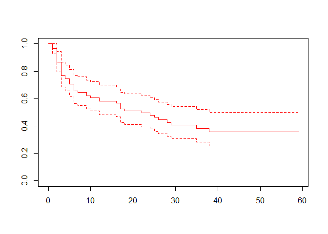
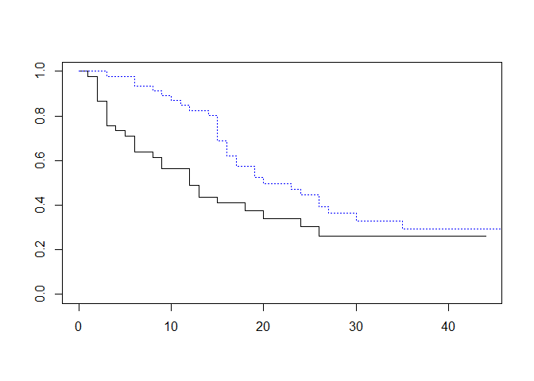

Recurrent event survival anlysis
================

``` r
library(survival)
library(foreign)
bladder <- read.dta("bladder.dta")
bladder[12:20,]
```

    ##    id event interval start stop tx num size
    ## 12 10     1        1     0   12  0   1    1
    ## 13 10     1        2    12   16  0   1    1
    ## 14 10     0        3    16   18  0   1    1
    ## 15 11     0        1     0   23  0   3    3
    ## 16 12     1        1     0   10  0   1    3
    ## 17 12     1        2    10   15  0   1    3
    ## 18 12     0        3    15   23  0   1    3
    ## 19 13     1        1     0    3  0   1    1
    ## 20 13     1        2     3   16  0   1    1

``` r
bladder$inttime <- bladder$stop - bladder$start
bladder[12:20,]
```

    ##    id event interval start stop tx num size inttime
    ## 12 10     1        1     0   12  0   1    1      12
    ## 13 10     1        2    12   16  0   1    1       4
    ## 14 10     0        3    16   18  0   1    1       2
    ## 15 11     0        1     0   23  0   3    3      23
    ## 16 12     1        1     0   10  0   1    3      10
    ## 17 12     1        2    10   15  0   1    3       5
    ## 18 12     0        3    15   23  0   1    3       8
    ## 19 13     1        1     0    3  0   1    1       3
    ## 20 13     1        2     3   16  0   1    1      13

``` r
coxph(Surv(start, stop, event)~tx+num+size,
      data=bladder)
```

    ## Warning in Surv(start, stop, event): Stop time must be > start time, NA created

    ## Call:
    ## coxph(formula = Surv(start, stop, event) ~ tx + num + size, data = bladder)
    ## 
    ##          coef exp(coef) se(coef)      z        p
    ## tx   -0.41164   0.66256  0.19989 -2.059 0.039466
    ## num   0.16367   1.17782  0.04777  3.426 0.000611
    ## size -0.04108   0.95975  0.07029 -0.584 0.558967
    ## 
    ## Likelihood ratio test=14.66  on 3 df, p=0.002127
    ## n= 190, number of events= 112 
    ##    (1 observation deleted due to missingness)

``` r
coxph(Surv(start, stop, event) ~ tx+num+size+
        size:tx+num:tx, data=bladder)
```

    ## Warning in Surv(start, stop, event): Stop time must be > start time, NA created

    ## Call:
    ## coxph(formula = Surv(start, stop, event) ~ tx + num + size + 
    ##     size:tx + num:tx, data = bladder)
    ## 
    ##               coef  exp(coef)   se(coef)      z      p
    ## tx      -0.3564080  0.7001869  0.4683859 -0.761 0.4467
    ## num      0.0851947  1.0889291  0.0784746  1.086 0.2776
    ## size    -0.0008744  0.9991260  0.0795484 -0.011 0.9912
    ## tx:size -0.3005622  0.7404018  0.1807852 -1.663 0.0964
    ## tx:num   0.1669483  1.1816932  0.1018477  1.639 0.1012
    ## 
    ## Likelihood ratio test=21.15  on 5 df, p=0.0007587
    ## n= 190, number of events= 112 
    ##    (1 observation deleted due to missingness)

``` r
1 - pchisq(21.15-14.66, 5-3)
```

    ## [1] 0.03896856

``` r
# Interaction term is significant
```

``` r
# id 별로 같은 subject 에서 나온 data 임을 감안해서 해석
fit.bladder <- coxph(Surv(start,stop,event) ~ tx+num+size
                     +cluster(id), data=bladder)
```

    ## Warning in Surv(start, stop, event): Stop time must be > start time, NA created

``` r
fit.bladder
```

    ## Call:
    ## coxph(formula = Surv(start, stop, event) ~ tx + num + size, data = bladder, 
    ##     cluster = id)
    ## 
    ##          coef exp(coef) se(coef) robust se      z       p
    ## tx   -0.41164   0.66256  0.19989   0.24876 -1.655 0.09798
    ## num   0.16367   1.17782  0.04777   0.05842  2.801 0.00509
    ## size -0.04108   0.95975  0.07029   0.07421 -0.554 0.57991
    ## 
    ## Likelihood ratio test=14.66  on 3 df, p=0.002127
    ## n= 190, number of events= 112 
    ##    (1 observation deleted due to missingness)

``` r
# subject 내 correlation 감안한 "robust se" 구해준다
```

``` r
fit.bladder$var
```

    ##               [,1]         [,2]          [,3]
    ## [1,]  0.0618837614 -0.002574322 -0.0004320096
    ## [2,] -0.0025743223  0.003413165  0.0012660154
    ## [3,] -0.0004320096  0.001266015  0.0055077532

``` r
# Stratified CP : actual time 을 그대로 쓰는 방법
Y <- Surv(bladder$start, bladder$stop, bladder$event==1)
```

    ## Warning in Surv(bladder$start, bladder$stop, bladder$event == 1): Stop time must
    ## be > start time, NA created

``` r
coxph(Y ~ tx+num+size+strata(interval)+cluster(id),
      data=bladder)
```

    ## Call:
    ## coxph(formula = Y ~ tx + num + size + strata(interval), data = bladder, 
    ##     cluster = id)
    ## 
    ##           coef exp(coef)  se(coef) robust se      z      p
    ## tx   -0.333489  0.716420  0.216168  0.204787 -1.628 0.1034
    ## num   0.119617  1.127065  0.053338  0.051387  2.328 0.0199
    ## size -0.008495  0.991541  0.072762  0.061635 -0.138 0.8904
    ## 
    ## Likelihood ratio test=6.51  on 3 df, p=0.08928
    ## n= 190, number of events= 112 
    ##    (1 observation deleted due to missingness)

``` r
# Gap time model (Recurrent event model with initerval as strata)
bladder$start2 = 0
bladder$stop2 = bladder$stop - bladder$start
attach(bladder)
data.frame(id, event, start, stop, start2, stop2)[12:20,]
```

    ##    id event start stop start2 stop2
    ## 12 10     1     0   12      0    12
    ## 13 10     1    12   16      0     4
    ## 14 10     0    16   18      0     2
    ## 15 11     0     0   23      0    23
    ## 16 12     1     0   10      0    10
    ## 17 12     1    10   15      0     5
    ## 18 12     0    15   23      0     8
    ## 19 13     1     0    3      0     3
    ## 20 13     1     3   16      0    13

``` r
Y2 <- Surv(bladder$start2, bladder$stop2, bladder$event)
```

    ## Warning in Surv(bladder$start2, bladder$stop2, bladder$event): Stop time must be
    ## > start time, NA created

``` r
coxph(Y2 ~ tx+num+size+strata(interval)+cluster(id), data=bladder)
```

    ## Call:
    ## coxph(formula = Y2 ~ tx + num + size + strata(interval), data = bladder, 
    ##     cluster = id)
    ## 
    ##           coef exp(coef)  se(coef) robust se      z       p
    ## tx   -0.279005  0.756536  0.207348  0.215624 -1.294 0.19569
    ## num   0.158046  1.171220  0.051942  0.050940  3.103 0.00192
    ## size  0.007415  1.007443  0.070023  0.064333  0.115 0.90824
    ## 
    ## Likelihood ratio test=9.33  on 3 df, p=0.02517
    ## n= 190, number of events= 112 
    ##    (1 observation deleted due to missingness)

``` r
# Interaction SC model

z1 = ifelse(interval==1, 1, 0)
z2 = ifelse(interval==2, 1, 0)
z3 = ifelse(interval==3, 1, 0)

bladder$z1 = z1
bladder$z2 = z2
bladder$z3 = z3

bladder[20:30,]
```

    ##    id event interval start stop tx num size inttime start2 stop2 z1 z2 z3
    ## 20 13     1        2     3   16  0   1    1      13      0    13  0  1  0
    ## 21 13     1        3    16   23  0   1    1       7      0     7  0  0  1
    ## 22 14     1        1     0    3  0   3    1       3      0     3  1  0  0
    ## 23 14     1        2     3    9  0   3    1       6      0     6  0  1  0
    ## 24 14     1        3     9   21  0   3    1      12      0    12  0  0  1
    ## 25 14     0        4    21   23  0   3    1       2      0     2  0  0  0
    ## 26 15     1        1     0    7  0   2    3       7      0     7  1  0  0
    ## 27 15     1        2     7   10  0   2    3       3      0     3  0  1  0
    ## 28 15     1        3    10   16  0   2    3       6      0     6  0  0  1
    ## 29 15     1        4    16   24  0   2    3       8      0     8  0  0  0
    ## 30 16     1        1     0    3  0   1    1       3      0     3  1  0  0

``` r
Y3 <- Surv(bladder$start, bladder$stop, bladder$event==1)
```

    ## Warning in Surv(bladder$start, bladder$stop, bladder$event == 1): Stop time must
    ## be > start time, NA created

``` r
coxph(Y~tx+num+size+ z1:tx+z2:tx+z3:tx + z1:num+z2:num+z3:num
      +z1:size+z2:size+z3:size + strata(interval) + cluster(id),
      data=bladder, method="breslow")
```

    ## Call:
    ## coxph(formula = Y ~ tx + num + size + strata(interval) + cluster(id) + 
    ##     tx:z1 + tx:z2 + num:z1 + num:z2 + num:z3 + size:z1 + size:z2 + 
    ##     size:z3, data = bladder, method = "breslow", cluster = id)
    ## 
    ##                   coef  exp(coef)   se(coef)  robust se      z     p
    ## tx           0.1451174  1.1561753  0.6144857  0.4684726  0.310 0.757
    ## num          0.1786334  1.1955824  0.2301038  0.1858825  0.961 0.337
    ## size        -0.0004431  0.9995570  0.3398875  0.3409162 -0.001 0.999
    ## cluster(id) -0.0026915  0.9973122  0.0096166  0.0105636 -0.255 0.799
    ## tx:z1       -0.5438707  0.5804970  0.6092974  0.4748678 -1.145 0.252
    ## tx:z2       -0.4861538  0.6149872  0.6608036  0.5698121 -0.853 0.394
    ## num:z1       0.0553963  1.0569594  0.2425000  0.2004109  0.276 0.782
    ## num:z2      -0.1998489  0.8188545  0.2471611  0.2116534 -0.944 0.345
    ## num:z3      -0.1487019  0.8618260  0.2815468  0.2030349 -0.732 0.464
    ## size:z1      0.0708586  1.0734294  0.3552383  0.3652161  0.194 0.846
    ## size:z2     -0.1527613  0.8583346  0.3617667  0.3669939 -0.416 0.677
    ## size:z3      0.1492031  1.1609088  0.4286510  0.4038520  0.369 0.712
    ## 
    ## Likelihood ratio test=13.6  on 12 df, p=0.3269
    ## n= 190, number of events= 112 
    ##    (1 observation deleted due to missingness)

``` r
bladder.s1 = bladder[bladder$interval==1, ]

s1=survfit(Surv(stop, event)~1, data=bladder.s1)

plot(s1, lty=1, col ="red")
```



``` r
bladder.s2 = bladder[bladder$interval==2, ]

s2c=survfit(Surv(stop-start, event)~1, data=bladder.s2)
plot(s2c, conf.int=FALSE, col ="black")

s2m=survfit(Surv(stop, event)~1, data=bladder.s2)
lines(s2m, conf.int=FALSE, lty=3, col ="blue")
```



``` r
#  black : conditional, blue : marginal
```
