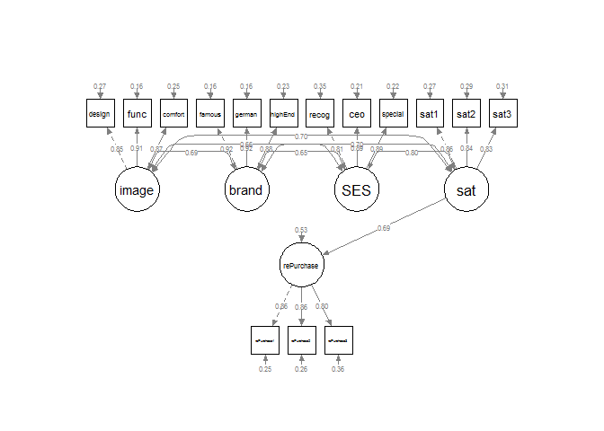

Structural Equation Model
================

``` r
library(lavaan)
```

    ## Warning: package 'lavaan' was built under R version 3.6.3

    ## This is lavaan 0.6-6

    ## lavaan is BETA software! Please report any bugs.

``` r
library(semPlot)
```

    ## Warning: package 'semPlot' was built under R version 3.6.3

    ## Registered S3 methods overwritten by 'huge':
    ##   method    from   
    ##   plot.sim  BDgraph
    ##   print.sim BDgraph

``` r
Benz <- read.csv("Benz.csv")
head(Benz,10)
```

    ##    design func comfort famous german highEnd recog ceo special sat1 sat2 sat3
    ## 1       3    4       3      5      5       4     3   4       5    4    5    4
    ## 2       3    4       4      5      5       5     2   2       3    3    4    4
    ## 3       3    3       2      3      4       3     2   3       3    3    3    2
    ## 4       3    3       3      4      4       3     3   3       3    4    4    4
    ## 5       3    3       3      4      4       4     4   4       4    3    3    3
    ## 6       5    5       5      5      4       4     4   4       4    3    4    4
    ## 7       5    5       5      5      5       5     3   4       4    2    3    3
    ## 8       3    4       3      4      4       4     3   3       3    3    3    3
    ## 9       3    4       3      4      4       4     4   4       4    4    4    2
    ## 10      2    4       3      5      5       5     2   4       5    4    2    5
    ##    rePurchase1 rePurchase2 rePurchase3
    ## 1            4           5           5
    ## 2            5           5           5
    ## 3            4           4           4
    ## 4            4           4           4
    ## 5            4           4           4
    ## 6            5           5           5
    ## 7            5           5           5
    ## 8            4           4           4
    ## 9            4           4           4
    ## 10           5           5           5

``` r
model <- 'image= ~ design + func + comfort
          brand = ~ famous + german + highEnd
          SES = ~ recog + ceo + special
          sat = ~ sat1 + sat2 + sat3
          rePurchase = ~ rePurchase1 + rePurchase2 + rePurchase3
          rePurchase ~ sat'
```

``` r
fit <- sem(model, data=Benz)
```

``` r
summary(fit, standardized=TRUE, fit.measures=TRUE)
```

    ## lavaan 0.6-6 ended normally after 55 iterations
    ## 
    ##   Estimator                                         ML
    ##   Optimization method                           NLMINB
    ##   Number of free parameters                         37
    ##                                                       
    ##   Number of observations                           200
    ##                                                       
    ## Model Test User Model:
    ##                                                       
    ##   Test statistic                               156.109
    ##   Degrees of freedom                                83
    ##   P-value (Chi-square)                           0.000
    ## 
    ## Model Test Baseline Model:
    ## 
    ##   Test statistic                              2549.400
    ##   Degrees of freedom                               105
    ##   P-value                                        0.000
    ## 
    ## User Model versus Baseline Model:
    ## 
    ##   Comparative Fit Index (CFI)                    0.970
    ##   Tucker-Lewis Index (TLI)                       0.962
    ## 
    ## Loglikelihood and Information Criteria:
    ## 
    ##   Loglikelihood user model (H0)              -2765.335
    ##   Loglikelihood unrestricted model (H1)      -2687.281
    ##                                                       
    ##   Akaike (AIC)                                5604.670
    ##   Bayesian (BIC)                              5726.708
    ##   Sample-size adjusted Bayesian (BIC)         5609.488
    ## 
    ## Root Mean Square Error of Approximation:
    ## 
    ##   RMSEA                                          0.066
    ##   90 Percent confidence interval - lower         0.050
    ##   90 Percent confidence interval - upper         0.082
    ##   P-value RMSEA <= 0.05                          0.049
    ## 
    ## Standardized Root Mean Square Residual:
    ## 
    ##   SRMR                                           0.062
    ## 
    ## Parameter Estimates:
    ## 
    ##   Standard errors                             Standard
    ##   Information                                 Expected
    ##   Information saturated (h1) model          Structured
    ## 
    ## Latent Variables:
    ##                    Estimate  Std.Err  z-value  P(>|z|)   Std.lv  Std.all
    ##   image =~                                                              
    ##     design            1.000                               0.868    0.854
    ##     func              0.989    0.058   16.976    0.000    0.858    0.915
    ##     comfort           0.950    0.060   15.706    0.000    0.824    0.867
    ##   brand =~                                                              
    ##     famous            1.000                               0.828    0.917
    ##     german            1.066    0.051   20.726    0.000    0.882    0.916
    ##     highEnd           0.950    0.051   18.702    0.000    0.787    0.875
    ##   SES =~                                                                
    ##     recog             1.000                               0.704    0.806
    ##     ceo               1.136    0.078   14.582    0.000    0.800    0.891
    ##     special           1.168    0.081   14.474    0.000    0.823    0.886
    ##   sat =~                                                                
    ##     sat1              1.000                               0.722    0.857
    ##     sat2              1.056    0.072   14.714    0.000    0.763    0.843
    ##     sat3              1.027    0.072   14.338    0.000    0.741    0.829
    ##   rePurchase =~                                                         
    ##     rePurchase1       1.000                               0.743    0.864
    ##     rePurchase2       1.011    0.070   14.452    0.000    0.751    0.863
    ##     rePurchase3       0.936    0.071   13.156    0.000    0.695    0.798
    ## 
    ## Regressions:
    ##                    Estimate  Std.Err  z-value  P(>|z|)   Std.lv  Std.all
    ##   rePurchase ~                                                          
    ##     sat               0.707    0.075    9.369    0.000    0.687    0.687
    ## 
    ## Covariances:
    ##                    Estimate  Std.Err  z-value  P(>|z|)   Std.lv  Std.all
    ##   image ~~                                                              
    ##     brand             0.495    0.069    7.127    0.000    0.689    0.689
    ##     SES               0.402    0.061    6.585    0.000    0.659    0.659
    ##     sat               0.438    0.063    6.959    0.000    0.699    0.699
    ##   brand ~~                                                              
    ##     SES               0.377    0.056    6.685    0.000    0.647    0.647
    ##     sat               0.416    0.058    7.142    0.000    0.695    0.695
    ##   SES ~~                                                                
    ##     sat               0.408    0.056    7.337    0.000    0.803    0.803
    ## 
    ## Variances:
    ##                    Estimate  Std.Err  z-value  P(>|z|)   Std.lv  Std.all
    ##    .design            0.278    0.037    7.584    0.000    0.278    0.270
    ##    .func              0.144    0.026    5.472    0.000    0.144    0.163
    ##    .comfort           0.225    0.031    7.268    0.000    0.225    0.249
    ##    .famous            0.130    0.021    6.159    0.000    0.130    0.160
    ##    .german            0.148    0.024    6.174    0.000    0.148    0.160
    ##    .highEnd           0.189    0.025    7.680    0.000    0.189    0.234
    ##    .recog             0.267    0.032    8.243    0.000    0.267    0.350
    ##    .ceo               0.165    0.027    6.226    0.000    0.165    0.205
    ##    .special           0.186    0.029    6.435    0.000    0.186    0.216
    ##    .sat1              0.189    0.026    7.209    0.000    0.189    0.266
    ##    .sat2              0.237    0.032    7.520    0.000    0.237    0.290
    ##    .sat3              0.251    0.032    7.787    0.000    0.251    0.313
    ##    .rePurchase1       0.188    0.030    6.154    0.000    0.188    0.254
    ##    .rePurchase2       0.194    0.031    6.197    0.000    0.194    0.256
    ##    .rePurchase3       0.275    0.035    7.772    0.000    0.275    0.363
    ##     image             0.753    0.102    7.370    0.000    1.000    1.000
    ##     brand             0.686    0.082    8.337    0.000    1.000    1.000
    ##     SES               0.496    0.074    6.723    0.000    1.000    1.000
    ##     sat               0.521    0.071    7.356    0.000    1.000    1.000
    ##    .rePurchase        0.291    0.045    6.419    0.000    0.528    0.528

``` r
diagram <- semPlot:: semPaths(fit,
                              whatLabels="std",
                              intercepts=FALSE,
                              style="lisrel",
                              nCharNodes=0,
                              nCharEdges=0,
                              curveAdjacent=TRUE,
                              title=TRUE,
                              layout="tree2",
                              curvePivot=TRUE)
```


