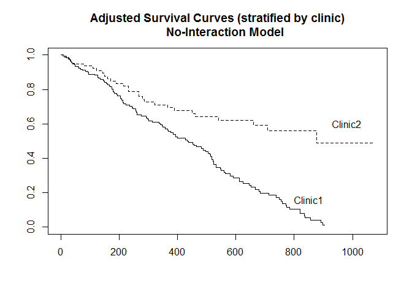
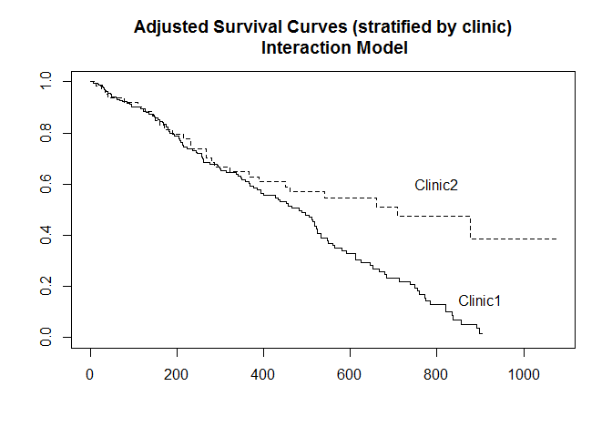

Survival analysis - Stratified Cox model
================

``` r
data <- read.table("addicts.txt", header=TRUE)
head(data)
```

    ##   ID Clinic Status Time Prison Methadone
    ## 1  1      1      1  428      0        50
    ## 2  2      1      1  275      1        55
    ## 3  3      1      1  262      0        55
    ## 4  4      1      1  183      0        30
    ## 5  5      1      1  259      1        65
    ## 6  6      1      1  714      0        55

``` r
library(survival)
```

``` r
# Q 1.2
coxph1 <- coxph(Surv(Time,Status) ~
               Clinic + Prison + Methadone,
               data=data)
summary(coxph1)
```

    ## Call:
    ## coxph(formula = Surv(Time, Status) ~ Clinic + Prison + Methadone, 
    ##     data = data)
    ## 
    ##   n= 238, number of events= 150 
    ## 
    ##                coef exp(coef)  se(coef)      z Pr(>|z|)    
    ## Clinic    -1.009896  0.364257  0.214889 -4.700 2.61e-06 ***
    ## Prison     0.326555  1.386184  0.167225  1.953   0.0508 .  
    ## Methadone -0.035369  0.965249  0.006379 -5.545 2.94e-08 ***
    ## ---
    ## Signif. codes:  0 '***' 0.001 '**' 0.01 '*' 0.05 '.' 0.1 ' ' 1
    ## 
    ##           exp(coef) exp(-coef) lower .95 upper .95
    ## Clinic       0.3643     2.7453    0.2391    0.5550
    ## Prison       1.3862     0.7214    0.9988    1.9238
    ## Methadone    0.9652     1.0360    0.9533    0.9774
    ## 
    ## Concordance= 0.665  (se = 0.025 )
    ## Likelihood ratio test= 64.56  on 3 df,   p=6e-14
    ## Wald test            = 54.12  on 3 df,   p=1e-11
    ## Score (logrank) test = 56.32  on 3 df,   p=4e-12

``` r
# Q 1.1

# stratified Cox 모델을 통해 각 clinic 변수에 대해 adjust 된 생존 곡선을 얻을 수 있어 다른 변수들ㅇ 보정하고 clinic 차이의 정도에 따른 시간적 생존을 시각적으로 표현할 수 있다.
# 그러나 clinic 변수가 모형에 포함되지 않기 때문에 clinic 효과에 따른 hazard ratio 의 추정치는 구할 수 없다.
```

``` r
# Q 2.2
coxph2 <- coxph(Surv(Time,Status) ~
               strata(Clinic) + Prison + Methadone,
               data=data)
coxph2.surv <- survfit(coxph2)
plot(coxph2.surv, lty=1:2,
     main="Adjusted Survival Curves (stratified by clinic)
     No-Interaction Model")
text(c(850,980), c(0.16,0.6), labels=c("Clinic1", "Clinic2"))
```



``` r
# Q 2.1

# Clinic 1 에 비해 clinic 2 가 일관되게 양호한 생존 예후를 보이며 두 그룹 간 차이는 시간이 지날수록 벌어진다.
```

``` r
# Q 3

# hg(t,X) = h0g(t) * exp[b1*Prison + b2* Dose] (g = 1,2)

# Prison 변수와 Methadone 변수에 대한 회귀계수가 각 Clinic stratum 에 따라 일정하기 때문에 no-interaction 임.
```

``` r
# Q 4.

summary(coxph2)
```

    ## Call:
    ## coxph(formula = Surv(Time, Status) ~ strata(Clinic) + Prison + 
    ##     Methadone, data = data)
    ## 
    ##   n= 238, number of events= 150 
    ## 
    ##                coef exp(coef)  se(coef)      z Pr(>|z|)    
    ## Prison     0.389605  1.476397  0.168930  2.306   0.0211 *  
    ## Methadone -0.035115  0.965495  0.006465 -5.432 5.59e-08 ***
    ## ---
    ## Signif. codes:  0 '***' 0.001 '**' 0.01 '*' 0.05 '.' 0.1 ' ' 1
    ## 
    ##           exp(coef) exp(-coef) lower .95 upper .95
    ## Prison       1.4764     0.6773    1.0603    2.0559
    ## Methadone    0.9655     1.0357    0.9533    0.9778
    ## 
    ## Concordance= 0.651  (se = 0.026 )
    ## Likelihood ratio test= 33.91  on 2 df,   p=4e-08
    ## Wald test            = 32.66  on 2 df,   p=8e-08
    ## Score (logrank) test = 33.33  on 2 df,   p=6e-08

``` r
# Effect of prison, adjusted for Clinic and Methadone : HR = 1.476; 95% CI: (1.060, 2.054). 

# 전과기록이 있으면 그렇지 않은 경우에 비해 약 1.476 배의 hazard 를 가지며, 그 p-value 는 0.021 로 신뢰수준 0.05 에서 유의하다.
```

``` r
# Q 5.2
coxph5 <- coxph(Surv(Time,Status) ~
                Prison + Methadone + strata(Clinic) +
                Clinic:Prison + Clinic*Methadone , data=data)
summary(coxph5)
```

    ## Call:
    ## coxph(formula = Surv(Time, Status) ~ Prison + Methadone + strata(Clinic) + 
    ##     Clinic:Prison + Clinic * Methadone, data = data)
    ## 
    ##   n= 238, number of events= 150 
    ## 
    ##                       coef exp(coef)  se(coef)      z Pr(>|z|)  
    ## Prison            1.085836  2.961914  0.538636  2.016   0.0438 *
    ## Methadone        -0.034635  0.965958  0.019797 -1.750   0.0802 .
    ## Clinic                  NA        NA  0.000000     NA       NA  
    ## Prison:Clinic    -0.582989  0.558227  0.428135 -1.362   0.1733  
    ## Methadone:Clinic -0.001164  0.998837  0.014570 -0.080   0.9363  
    ## ---
    ## Signif. codes:  0 '***' 0.001 '**' 0.01 '*' 0.05 '.' 0.1 ' ' 1
    ## 
    ##                  exp(coef) exp(-coef) lower .95 upper .95
    ## Prison              2.9619     0.3376    1.0306     8.513
    ## Methadone           0.9660     1.0352    0.9292     1.004
    ## Clinic                  NA         NA        NA        NA
    ## Prison:Clinic       0.5582     1.7914    0.2412     1.292
    ## Methadone:Clinic    0.9988     1.0012    0.9707     1.028
    ## 
    ## Concordance= 0.649  (se = 0.026 )
    ## Likelihood ratio test= 35.77  on 4 df,   p=3e-07
    ## Wald test            = 34.09  on 4 df,   p=7e-07
    ## Score (logrank) test = 34.97  on 4 df,   p=5e-07

``` r
# Q 5.1

# Version 1 : hg(t,X) = h0g(t) * exp[b1g*Prison + b2g*Methadone] ;  (g = 1,2)

# Version 2 : hg(t,X) = h0g(t) * exp[b1*Prison + b2*Methadone + b3*(Clinic*Prison) + b4(Clinic*Dose)] ; (g = 1,2)
```

``` r
# Q 6

# Clinic 1 (g = 1) :
# h1(t,X) = h01(t)exp[(1.085836-0.582989)*Prison + (-0.034635-0.001164)*Methadone]

# Clinic 2 (g = 2) :
#h2(t,X) = h02(t)exp[(1.085836-2*0.582989)*Prison + (-0.034635-2*0.001164)*Methadone]
```

``` r
# Q 7.2

coxph5.surv <- survfit(coxph5)
```

    ## Warning in survfit.coxph(coxph5): the model contains interactions; the default
    ## curve based on columm means of the X matrix is almost certainly not useful.
    ## Consider adding a newdata argument.

``` r
plot(coxph5.surv, lty=1:2,
     main="Adjusted Survival Curves (stratified by clinic)
     Interaction Model")
text(c(900,800), c(0.15,0.6), labels=c("Clinic1", "Clinic2"))
```



``` r
# Q 7.1

# Interaction model 과 Non-interaction model 의 adjusted survival curve 는 거의 동일하므로, 두 그래프는 Clinic2 가 일관되게 Clinic 1 보다 높은 생존 확률을 가진다는 동일한 결론에 이른다.
```

``` r
# Q 8

lrt.surv = function(full_model, reduced_model, df){
  lrts = 2*(full_model$loglik[2]-reduced_model$loglik[2])
  p_value = 1-pchisq(lrts, df)
  return(p_value)
}

lrt.surv(coxph5, coxph2, 2)
```

    ## [1] 0.3947511

``` r
# 위 결과에 의해 귀무가설을 기각하지 않으므로, No interaction model 이 interaction model 에 비해 선호된다
```
