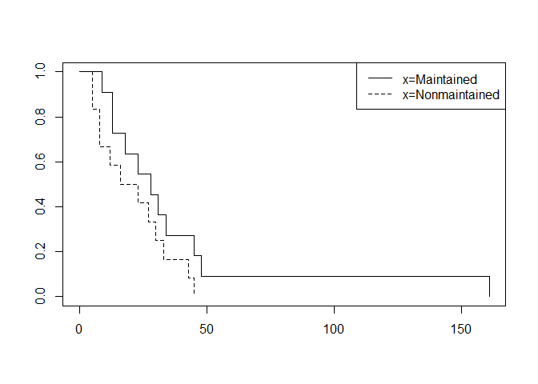
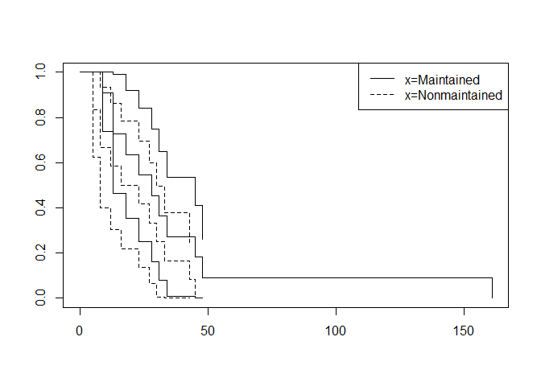

Survival analysis 2
================

``` r
library(survival)
data(aml)
```

    ## Warning in data(aml): data set 'aml' not found

``` r
View(aml)
```

``` r
survfit <- survfit(Surv(time)~x, data=aml)
survfit
```

    ## Call: survfit(formula = Surv(time) ~ x, data = aml)
    ## 
    ##                  n events median 0.95LCL 0.95UCL
    ## x=Maintained    11     11   28.0      18      NA
    ## x=Nonmaintained 12     12   19.5       8      NA

``` r
# maintained group 의 median survival 은 28.0 
# 95% 신뢰구간은 (18, ) 이므로 censoring 을 반영하여
# (18, 161) 로 보정.
```

``` r
K <- length(survfit$strata)
LEGEND <- attr(survfit$strata, "names")

plot(survfit, lty=1:K)
legend("topright", LEGEND, lty=1:K)
```



``` r
test <- survdiff(Surv(time)~x, data=aml)
test
```

    ## Call:
    ## survdiff(formula = Surv(time) ~ x, data = aml)
    ## 
    ##                  N Observed Expected (O-E)^2/E (O-E)^2/V
    ## x=Maintained    11       11    14.16     0.706      2.09
    ## x=Nonmaintained 12       12     8.84     1.130      2.09
    ## 
    ##  Chisq= 2.1  on 1 degrees of freedom, p= 0.1

``` r
# p-value =0.1 로, 두 그룹의 생존곡선은 유의수준 5%에서 동일하다
```

``` r
summary(survfit)
```

    ## Call: survfit(formula = Surv(time) ~ x, data = aml)
    ## 
    ##                 x=Maintained 
    ##  time n.risk n.event survival std.err lower 95% CI upper 95% CI
    ##     9     11       1   0.9091  0.0867       0.7541        1.000
    ##    13     10       2   0.7273  0.1343       0.5064        1.000
    ##    18      8       1   0.6364  0.1450       0.4071        0.995
    ##    23      7       1   0.5455  0.1501       0.3180        0.936
    ##    28      6       1   0.4545  0.1501       0.2379        0.868
    ##    31      5       1   0.3636  0.1450       0.1664        0.795
    ##    34      4       1   0.2727  0.1343       0.1039        0.716
    ##    45      3       1   0.1818  0.1163       0.0519        0.637
    ##    48      2       1   0.0909  0.0867       0.0140        0.589
    ##   161      1       1   0.0000     NaN           NA           NA
    ## 
    ##                 x=Nonmaintained 
    ##  time n.risk n.event survival std.err lower 95% CI upper 95% CI
    ##     5     12       2   0.8333  0.1076       0.6470        1.000
    ##     8     10       2   0.6667  0.1361       0.4468        0.995
    ##    12      8       1   0.5833  0.1423       0.3616        0.941
    ##    16      7       1   0.5000  0.1443       0.2840        0.880
    ##    23      6       1   0.4167  0.1423       0.2133        0.814
    ##    27      5       1   0.3333  0.1361       0.1498        0.742
    ##    30      4       1   0.2500  0.1250       0.0938        0.666
    ##    33      3       1   0.1667  0.1076       0.0470        0.591
    ##    43      2       1   0.0833  0.0798       0.0128        0.544
    ##    45      1       1   0.0000     NaN           NA           NA

``` r
survfit <- survfit(Surv(time)~x, conf.type="plain",
                   data=aml)
plot(survfit, lty=1:2, conf.int=TRUE)
LEGEND <- attr(survfit$strata, "names")
legend("topright", LEGEND, lty=1:2)
```


