Untitled
================

``` r
library(ggplot2)
library(tidyr)
library(dplyr)
```

    ## 
    ## Attaching package: 'dplyr'

    ## The following objects are masked from 'package:stats':
    ## 
    ##     filter, lag

    ## The following objects are masked from 'package:base':
    ## 
    ##     intersect, setdiff, setequal, union

``` r
library(ggsignif)
library(gplots)
```

    ## Warning: package 'gplots' was built under R version 4.0.3

    ## 
    ## Attaching package: 'gplots'

    ## The following object is masked from 'package:stats':
    ## 
    ##     lowess

``` r
data(iris)

ggplot(iris, aes(x=Species, y=Sepal.Length)) + 
  geom_boxplot() +
  geom_signif(comparisons = list(c("setosa","versicolor", "virginica")), 
              map_signif_level=TRUE)
```

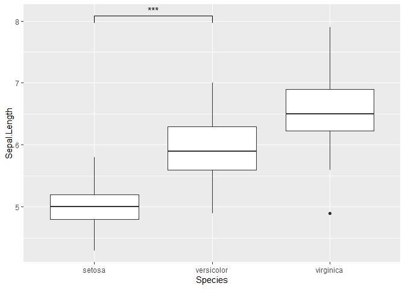

``` r
library(tidyverse)
```

    ## -- Attaching packages -------------------------------------- tidyverse 1.3.0 --

    ## √ tibble  3.0.3     √ stringr 1.4.0
    ## √ readr   1.3.1     √ forcats 0.5.0
    ## √ purrr   0.3.4

    ## -- Conflicts ----------------------------------------- tidyverse_conflicts() --
    ## x dplyr::filter() masks stats::filter()
    ## x dplyr::lag()    masks stats::lag()

``` r
glimpse(msleep, width = 50)
```

    ## Rows: 83
    ## Columns: 11
    ## $ name         <chr> "Cheetah", "Owl monkey",...
    ## $ genus        <chr> "Acinonyx", "Aotus", "Ap...
    ## $ vore         <chr> "carni", "omni", "herbi"...
    ## $ order        <chr> "Carnivora", "Primates",...
    ## $ conservation <chr> "lc", NA, "nt", "lc", "d...
    ## $ sleep_total  <dbl> 12.1, 17.0, 14.4, 14.9, ...
    ## $ sleep_rem    <dbl> NA, 1.8, 2.4, 2.3, 0.7, ...
    ## $ sleep_cycle  <dbl> NA, NA, NA, 0.1333333, 0...
    ## $ awake        <dbl> 11.9, 7.0, 9.6, 9.1, 20....
    ## $ brainwt      <dbl> NA, 0.01550, NA, 0.00029...
    ## $ bodywt       <dbl> 50.000, 0.480, 1.350, 0....

``` r
head(msleep)
```

    ## # A tibble: 6 x 11
    ##   name  genus vore  order conservation sleep_total sleep_rem sleep_cycle awake
    ##   <chr> <chr> <chr> <chr> <chr>              <dbl>     <dbl>       <dbl> <dbl>
    ## 1 Chee~ Acin~ carni Carn~ lc                  12.1      NA        NA      11.9
    ## 2 Owl ~ Aotus omni  Prim~ <NA>                17         1.8      NA       7  
    ## 3 Moun~ Aplo~ herbi Rode~ nt                  14.4       2.4      NA       9.6
    ## 4 Grea~ Blar~ omni  Sori~ lc                  14.9       2.3       0.133   9.1
    ## 5 Cow   Bos   herbi Arti~ domesticated         4         0.7       0.667  20  
    ## 6 Thre~ Brad~ herbi Pilo~ <NA>                14.4       2.2       0.767   9.6
    ## # ... with 2 more variables: brainwt <dbl>, bodywt <dbl>

``` r
msleep %>% 
  group_by(vore) %>% 
  summarise(
    mean_sleep = mean(sleep_total),
    sd_sleep   = sd(sleep_total)
  ) 
```

    ## `summarise()` ungrouping output (override with `.groups` argument)

    ## # A tibble: 5 x 3
    ##   vore    mean_sleep sd_sleep
    ##   <chr>        <dbl>    <dbl>
    ## 1 carni        10.4      4.67
    ## 2 herbi         9.51     4.88
    ## 3 insecti      14.9      5.92
    ## 4 omni         10.9      2.95
    ## 5 <NA>         10.2      3.00

``` r
(sleep_mean_values <- msleep %>% 
  group_by(vore) %>% 
  summarise(
    mean_sleep = mean(sleep_total),
    sd_sleep   = sd(sleep_total)
  ) %>% 
  drop_na() %>% 
  mutate(
    vore = case_when(
      vore == "insecti" ~ "insectivore",
      vore == "omni" ~ "omnivore",
      vore == "carni" ~ "carnivore",
      vore == "herbi" ~ "herbivore"
    ) %>% 
      as.factor %>% 
      fct_relevel("insectivore", "omnivore",
                  "carnivore", "herbivore")
  ))
```

    ## `summarise()` ungrouping output (override with `.groups` argument)

    ## # A tibble: 4 x 3
    ##   vore        mean_sleep sd_sleep
    ##   <fct>            <dbl>    <dbl>
    ## 1 carnivore        10.4      4.67
    ## 2 herbivore         9.51     4.88
    ## 3 insectivore      14.9      5.92
    ## 4 omnivore         10.9      2.95

``` r
sleep_mean_values %>% 
  ggplot(aes(vore, mean_sleep)) +
    geom_col(aes(fill = vore), color = "black", width = 0.85) +
    geom_errorbar(aes(ymin = mean_sleep - sd_sleep,
                      ymax = mean_sleep + sd_sleep),
                  color = "#22292F",
                  width = .1)
```

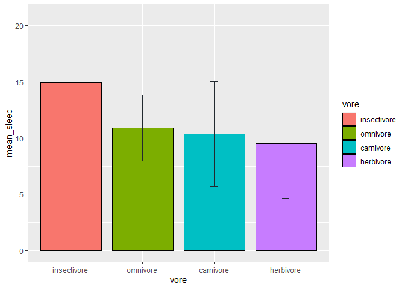

``` r
sleep_mean_values %>% 
  ggplot(aes(vore, mean_sleep)) +
  geom_col(aes(fill = vore), color = "black", width = 0.85) +
  geom_errorbar(aes(ymin = mean_sleep - sd_sleep,
                    ymax = mean_sleep + sd_sleep),
                color = "#22292F",
                width = .1) +
  scale_fill_grey(start = 0.3) +
  scale_y_continuous(limits = c(0, 26), expand = c(0, 0)) +
  guides(fill = FALSE) +
  theme_minimal() +
  labs(
    x = "Vore",
    y = "Mean Sleep",
    title = "Mean Sleep in Different Animals",
    caption = "Error bars indicate standard deviations"
  )
```

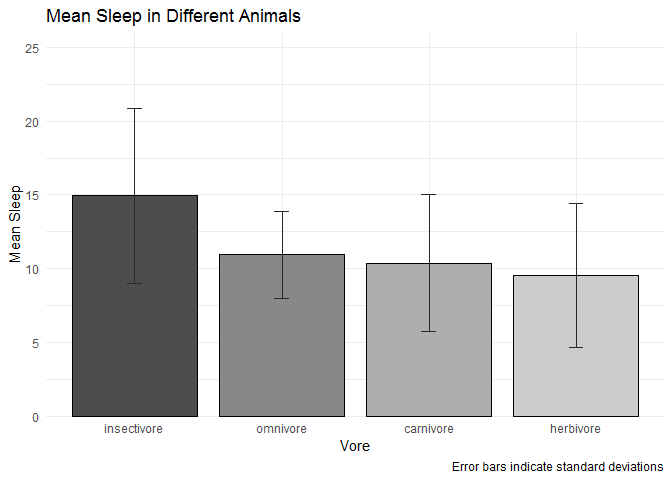

``` r
sleep_mean_values %>% 
  ggplot(aes(vore, mean_sleep)) +
  geom_col(aes(fill = vore), color = "black", width = 0.85) +
  geom_errorbar(aes(ymin = mean_sleep - sd_sleep,
                    ymax = mean_sleep + sd_sleep),
                color = "#22292F",
                width = .1) +
  scale_fill_grey(start = 0.3) +
  scale_y_continuous(limits = c(0, 26), expand = c(0, 0)) +
  guides(fill = FALSE) +
  theme_minimal() +
  labs(
    x = "Vore",
    y = "Mean Sleep",
    title = "Mean Sleep in Different Animals",
    caption = "Error bars indicate standard deviations"
  ) + 
  theme(
    plot.title = element_text(size = 20,
                              face = "bold",
                              margin = margin(b = 35)),
    plot.margin = unit(rep(1, 4), "cm"),
    axis.text = element_text(size = 16, color = "#22292F"),
    axis.title = element_text(size = 18, hjust = 1),
    axis.title.x = element_text(margin = margin(t = 15)),
    axis.title.y = element_text(margin = margin(r = 15)),
    axis.text.y = element_text(margin = margin(r = 5)),
    axis.text.x = element_text(margin = margin(t = 5)),
    plot.caption = element_text(size = 12, 
                                face = "italic",
                                color = "#606F7B",
                                margin = margin(t = 15))
  ) 
```

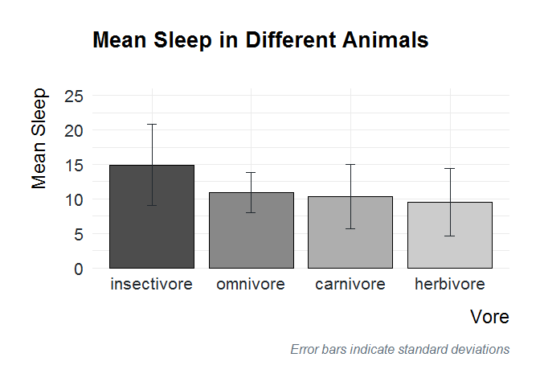

``` r
sleep_mean_values %>% 
  ggplot(aes(vore, mean_sleep)) +
  geom_col(aes(fill = vore), color = "black", width = 0.85) +
  geom_errorbar(aes(ymin = mean_sleep - sd_sleep,
                    ymax = mean_sleep + sd_sleep),
                color = "#22292F",
                width = .1) +
  scale_fill_grey(start = 0.3) +
  scale_y_continuous(limits = c(0, 26), expand = c(0, 0)) +
  guides(fill = FALSE) +
  theme(
    plot.title = element_text(size = 20,
                              face = "bold",
                              margin = margin(b = 35)),
    plot.margin = unit(rep(1, 4), "cm"),
    axis.text = element_text(size = 16, color = "#22292F"),
    axis.title = element_text(size = 18, hjust = 1),
    axis.title.x = element_text(margin = margin(t = 15)),
    axis.title.y = element_text(margin = margin(r = 15)),
    axis.text.y = element_text(margin = margin(r = 5)),
    axis.text.x = element_text(margin = margin(t = 5)),
    plot.caption = element_text(size = 12, 
                                face = "italic",
                                color = "#606F7B",
                                margin = margin(t = 15)),
    axis.line = element_line(color = "#3D4852"),
    axis.ticks = element_line(color = "#3D4852"),
    panel.grid.major.y = element_line(color = "#DAE1E7"),
    panel.grid.major.x = element_blank(),
    panel.grid.minor.y = element_blank()
  ) 
```

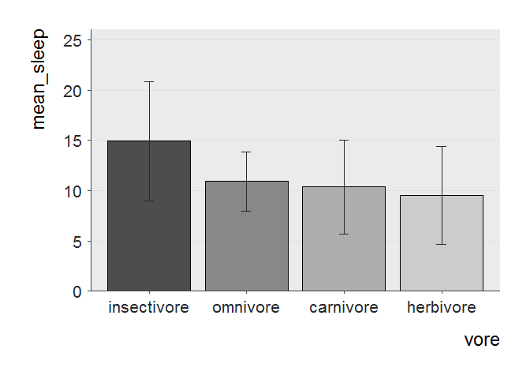

``` r
p_value_one <- tibble(
  x = c("insectivore", "insectivore", "omnivore", "omnivore"),
  y = c(22, 23, 23, 22)
)
```

``` r
p_value_two <- tibble(
  x = c("omnivore", "omnivore", "herbivore", "herbivore"),
  y = c(16, 17, 17, 16)
)
```

``` r
sleep_mean_values %>% 
  ggplot(aes(vore, mean_sleep)) +
  geom_col(aes(fill = vore), color = "black", width = 0.85) +
  geom_errorbar(aes(ymin = mean_sleep - sd_sleep,
                    ymax = mean_sleep + sd_sleep),
                color = "#22292F",
                width = .1) +
  geom_line(data = p_value_one, 
            aes(x = x, y = y, group = 1)) +
  geom_line(data = p_value_two, 
            aes(x = x, y = y, group = 1)) +
  annotate("text", x = 1.5, y = 23.5, 
           label = "***",
           size = 8, color = "#22292F") +
  annotate("text", x = 3, y = 17.5, 
           label = "*",
           size = 8, color = "#22292F") +
  scale_fill_grey(start = 0.3) +
  scale_y_continuous(limits = c(0, 26), expand = c(0, 0)) +
  guides(fill = FALSE) +
  theme_minimal() +
  labs(
    x = "Vore",
    y = "Mean Sleep",
    title = "Mean Sleep in Different Animals",
    caption = "Error bars indicate standard deviations"
  ) + 
  theme(
    plot.title = element_text(size = 20,
                              face = "bold",
                              margin = margin(b = 35)),
    plot.margin = unit(rep(1, 4), "cm"),
    axis.text = element_text(size = 16, color = "#22292F"),
    axis.title = element_text(size = 18, hjust = 1),
    axis.title.x = element_text(margin = margin(t = 15)),
    axis.title.y = element_text(margin = margin(r = 15)),
    axis.text.y = element_text(margin = margin(r = 5)),
    axis.text.x = element_text(margin = margin(t = 5)),
    plot.caption = element_text(size = 12, 
                                face = "italic",
                                color = "#606F7B",
                                margin = margin(t = 15))
  ) 
```

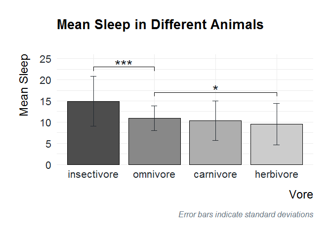

``` r
library(ggpubr)
data("ToothGrowth")
str(ToothGrowth)
```

    ## 'data.frame':    60 obs. of  3 variables:
    ##  $ len : num  4.2 11.5 7.3 5.8 6.4 10 11.2 11.2 5.2 7 ...
    ##  $ supp: Factor w/ 2 levels "OJ","VC": 2 2 2 2 2 2 2 2 2 2 ...
    ##  $ dose: num  0.5 0.5 0.5 0.5 0.5 0.5 0.5 0.5 0.5 0.5 ...

``` r
head(ToothGrowth)
```

    ##    len supp dose
    ## 1  4.2   VC  0.5
    ## 2 11.5   VC  0.5
    ## 3  7.3   VC  0.5
    ## 4  5.8   VC  0.5
    ## 5  6.4   VC  0.5
    ## 6 10.0   VC  0.5

``` r
compare_means(len ~ supp, data = ToothGrowth, method="wilcox.test")
```

    ## # A tibble: 1 x 8
    ##   .y.   group1 group2      p p.adj p.format p.signif method  
    ##   <chr> <chr>  <chr>   <dbl> <dbl> <chr>    <chr>    <chr>   
    ## 1 len   OJ     VC     0.0645 0.064 0.064    ns       Wilcoxon

``` r
p <- ggboxplot(ToothGrowth, x = "supp", y = "len",
               color="supp", add="jitter")
#  Add p-value
p + stat_compare_means()
```

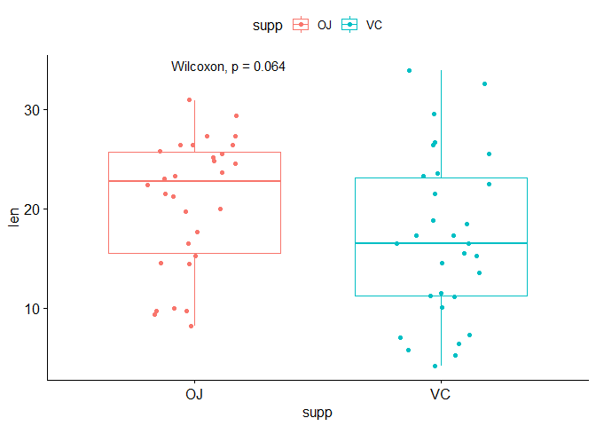

``` r
# Change method
p + stat_compare_means(method = "t.test")
```

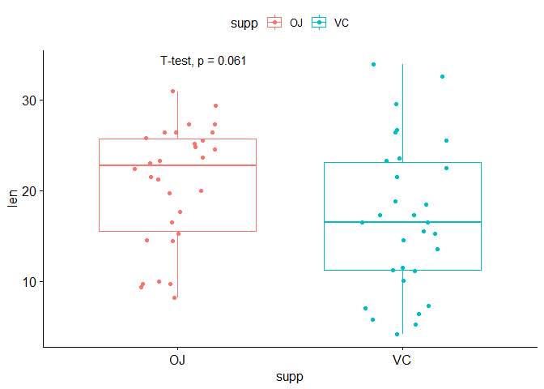

``` r
p + stat_compare_means(label = "p.signif", 
                        label.x = 1.5, label.y = 40)
```

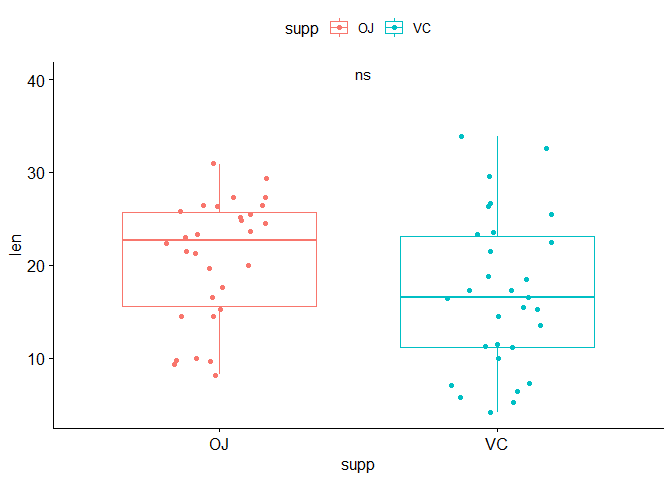

``` r
compare_means(len ~ supp, data = ToothGrowth, paired = TRUE)
```

    ## # A tibble: 1 x 8
    ##   .y.   group1 group2       p  p.adj p.format p.signif method  
    ##   <chr> <chr>  <chr>    <dbl>  <dbl> <chr>    <chr>    <chr>   
    ## 1 len   OJ     VC     0.00431 0.0043 0.0043   **       Wilcoxon

``` r
ggpaired(ToothGrowth, x = "supp", y = "len",
         color = "supp", line.color = "gray") +
  stat_compare_means(paired = TRUE)
```

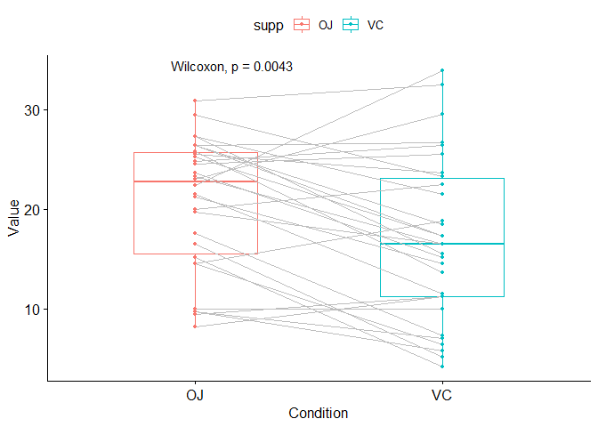

``` r
compare_means(len ~ dose,  data = ToothGrowth, method = "anova")
```

    ## # A tibble: 1 x 6
    ##   .y.          p    p.adj p.format p.signif method
    ##   <chr>    <dbl>    <dbl> <chr>    <chr>    <chr> 
    ## 1 len   9.53e-16 9.50e-16 9.5e-16  ****     Anova

``` r
ggboxplot(ToothGrowth, x = "dose", y = "len", color = "dose")+
  stat_compare_means()
```

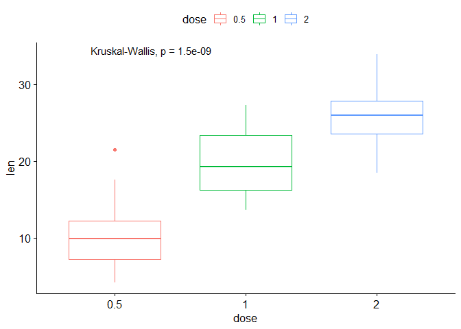

``` r
ggboxplot(ToothGrowth, x = "dose", y = "len", color = "dose")+
  stat_compare_means(method="anova")
```

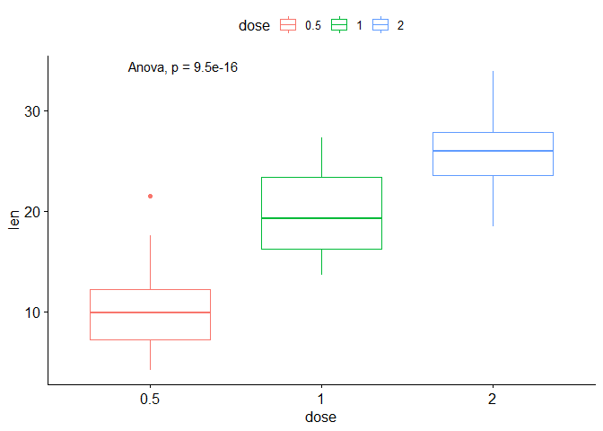

``` r
# Visualize: Specify the comparisons you want
my_comparisons <- list( c("0.5", "1"), c("1", "2"), c("0.5", "2") )
ggboxplot(ToothGrowth, x = "dose", y = "len", color = "dose")+ 
  stat_compare_means(comparisons = my_comparisons)+ # pairwise comparisons
  stat_compare_means(label.y = 50)     # global p-value
```

    ## Warning in wilcox.test.default(c(4.2, 11.5, 7.3, 5.8, 6.4, 10, 11.2, 11.2, :
    ## cannot compute exact p-value with ties

    ## Warning in wilcox.test.default(c(4.2, 11.5, 7.3, 5.8, 6.4, 10, 11.2, 11.2, :
    ## cannot compute exact p-value with ties

    ## Warning in wilcox.test.default(c(16.5, 16.5, 15.2, 17.3, 22.5, 17.3, 13.6, :
    ## cannot compute exact p-value with ties

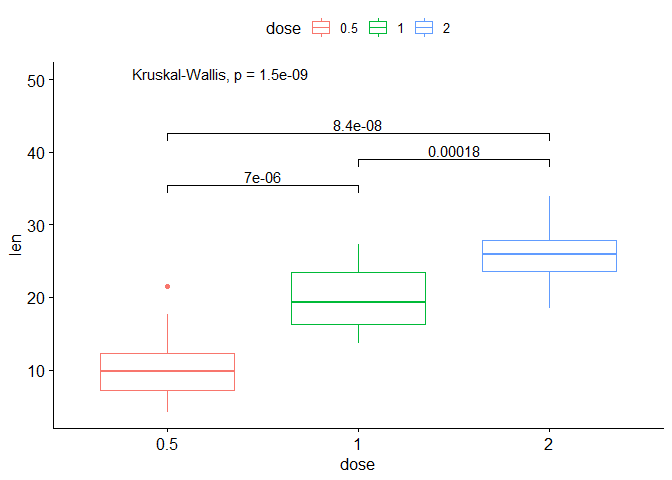

``` r
compare_means(len ~ dose,  data = ToothGrowth, ref.group = ".all.",
              method = "t.test")
```

    ## # A tibble: 3 x 8
    ##   .y.   group1 group2           p      p.adj p.format p.signif method
    ##   <chr> <chr>  <chr>        <dbl>      <dbl> <chr>    <chr>    <chr> 
    ## 1 len   .all.  0.5    0.000000290 0.00000087 2.9e-07  ****     T-test
    ## 2 len   .all.  1      0.512       0.51       0.51     ns       T-test
    ## 3 len   .all.  2      0.000000425 0.00000087 4.3e-07  ****     T-test

``` r
ggboxplot(ToothGrowth, x = "dose", y = "len",
          color = "dose", palette = "jco")+
  stat_compare_means(method = "anova", label.y = 40)+   # global p-value
  stat_compare_means(label = "p.signif", method = "t.test",
                     ref.group = ".all.") # Pairwise comparison against all
```

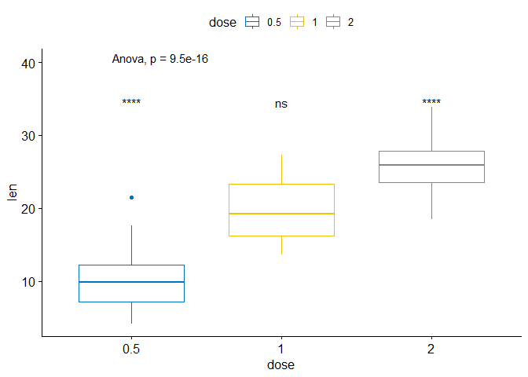

``` r
compare_means(len ~ supp, data = ToothGrowth, group.by = "dose")
```

    ## # A tibble: 3 x 9
    ##    dose .y.   group1 group2       p p.adj p.format p.signif method  
    ##   <dbl> <chr> <chr>  <chr>    <dbl> <dbl> <chr>    <chr>    <chr>   
    ## 1   0.5 len   OJ     VC     0.0232  0.046 0.023    *        Wilcoxon
    ## 2   1   len   OJ     VC     0.00403 0.012 0.004    **       Wilcoxon
    ## 3   2   len   OJ     VC     1       1     1.000    ns       Wilcoxon

``` r
p <- ggboxplot(ToothGrowth, x = "supp", y = "len",
          color = "supp", facet.by = "dose", short.panel.labs = FALSE)

# Use only p.format as label. Remove method name.
p + stat_compare_means(label = "p.format")
```

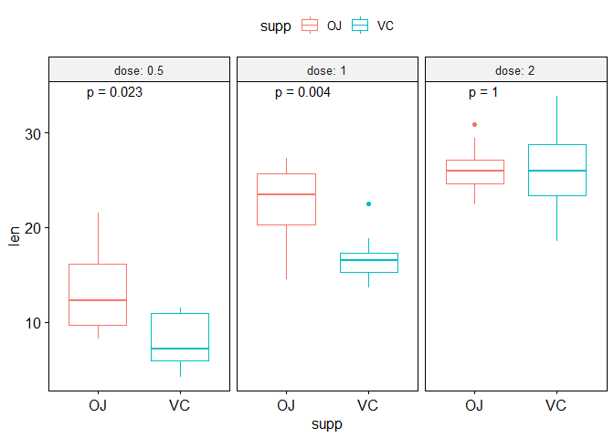

``` r
p + stat_compare_means(label =  "p.signif", label.x = 1.5)
```

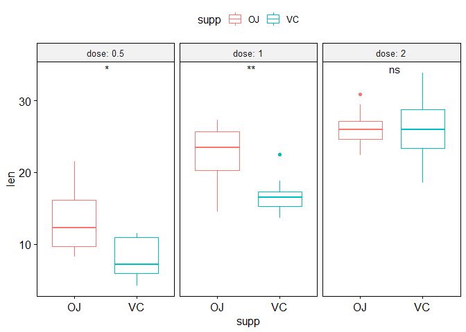

``` r
p <- ggboxplot(ToothGrowth, x = "dose", y = "len", color = "supp")
p + stat_compare_means(aes(group = supp), label="p.format")
```

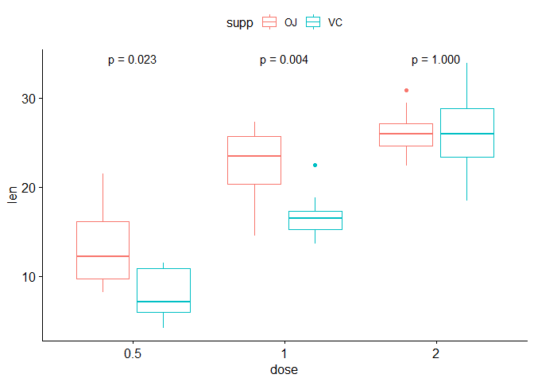

``` r
# Bar plot of mean +/-se
ggbarplot(ToothGrowth, x = "dose", y = "len", add = "mean_se")+
  stat_compare_means() +                                         # Global p-value
  stat_compare_means(ref.group = "0.5", label = "p.signif",
                     label.y = c(22, 29))                   # compare to ref.group  
```

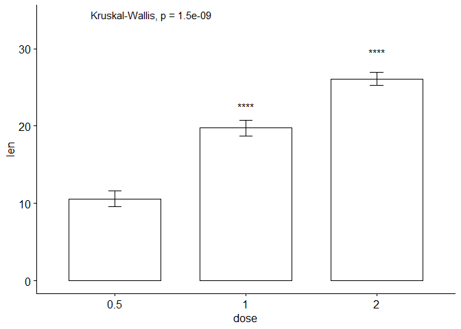

``` r
# Line plot of mean +/-se
ggline(ToothGrowth, x = "dose", y = "len", add = "mean_se")+
  stat_compare_means() +                                         # Global p-value
  stat_compare_means(ref.group = "0.5", label = "p.signif",
                     label.y = c(22, 29))   
```

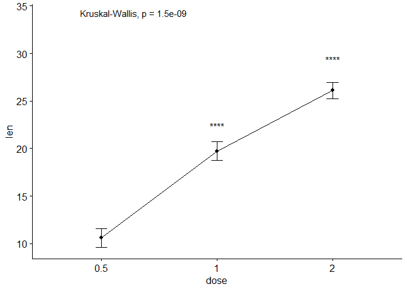

``` r
ggbarplot(ToothGrowth, x = "dose", y = "len", add = "mean_se",
          color = "supp", position = position_dodge(0.8))+
  stat_compare_means(aes(group = supp), label = "p.signif", label.y = 29)
```

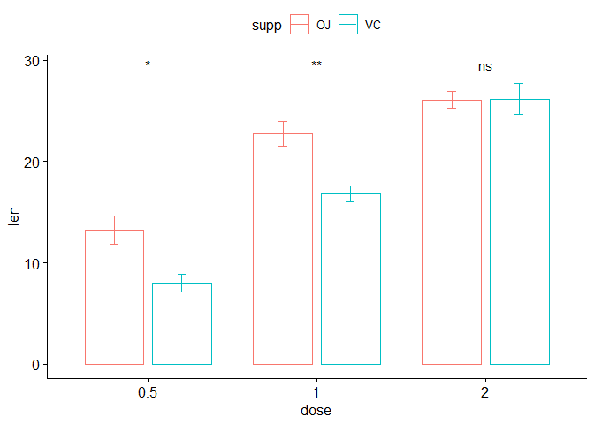

``` r
ggline(ToothGrowth, x = "dose", y = "len", add = "mean_se", color="supp")+
  stat_compare_means(aes(group = supp), label = "p.signif", 
                     label.y = c(16, 25, 29))
```

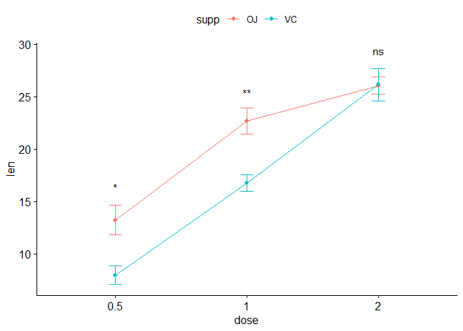
