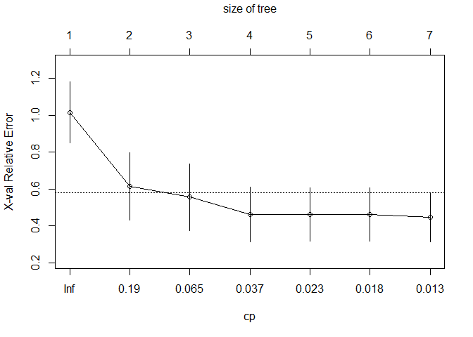

Big data analysis hw 5
================

``` r
data(airquality)
head(airquality)
```

    ##   Ozone Solar.R Wind Temp Month Day
    ## 1    41     190  7.4   67     5   1
    ## 2    36     118  8.0   72     5   2
    ## 3    12     149 12.6   74     5   3
    ## 4    18     313 11.5   62     5   4
    ## 5    NA      NA 14.3   56     5   5
    ## 6    28      NA 14.9   66     5   6

``` r
str(airquality)
```

    ## 'data.frame':    153 obs. of  6 variables:
    ##  $ Ozone  : int  41 36 12 18 NA 28 23 19 8 NA ...
    ##  $ Solar.R: int  190 118 149 313 NA NA 299 99 19 194 ...
    ##  $ Wind   : num  7.4 8 12.6 11.5 14.3 14.9 8.6 13.8 20.1 8.6 ...
    ##  $ Temp   : int  67 72 74 62 56 66 65 59 61 69 ...
    ##  $ Month  : int  5 5 5 5 5 5 5 5 5 5 ...
    ##  $ Day    : int  1 2 3 4 5 6 7 8 9 10 ...

``` r
library(rpart)
tree <- rpart(Ozone~Solar.R+Wind+Temp, airquality)
tree
```

    ## n=116 (37 observations deleted due to missingness)
    ## 
    ## node), split, n, deviance, yval
    ##       * denotes terminal node
    ## 
    ##  1) root 116 125143.1000 42.12931  
    ##    2) Temp< 82.5 79  42531.5900 26.54430  
    ##      4) Wind>=7.15 69  10919.3300 22.33333  
    ##        8) Solar.R< 79.5 18    777.1111 12.22222 *
    ##        9) Solar.R>=79.5 51   7652.5100 25.90196  
    ##         18) Temp< 77.5 33   2460.9090 21.18182 *
    ##         19) Temp>=77.5 18   3108.4440 34.55556 *
    ##      5) Wind< 7.15 10  21946.4000 55.60000 *
    ##    3) Temp>=82.5 37  22452.9200 75.40541  
    ##      6) Temp< 87.5 20  12046.9500 62.95000  
    ##       12) Wind>=8.9 7    617.7143 45.57143 *
    ##       13) Wind< 8.9 13   8176.7690 72.30769 *
    ##      7) Temp>=87.5 17   3652.9410 90.05882 *

``` r
library(rattle)
```

    ## Warning: package 'rattle' was built under R version 4.0.3

    ## Loading required package: tibble

    ## Loading required package: bitops

    ## Rattle: A free graphical interface for data science with R.
    ## Version 5.4.0 Copyright (c) 2006-2020 Togaware Pty Ltd.
    ## Type 'rattle()' to shake, rattle, and roll your data.

``` r
library(rpart.plot)
```

    ## Warning: package 'rpart.plot' was built under R version 4.0.3

``` r
library(RColorBrewer)
```

``` r
rpart.plot(tree)
```


``` r
printcp(tree)
```

    ## 
    ## Regression tree:
    ## rpart(formula = Ozone ~ Solar.R + Wind + Temp, data = airquality)
    ## 
    ## Variables actually used in tree construction:
    ## [1] Solar.R Temp    Wind   
    ## 
    ## Root node error: 125143/116 = 1078.8
    ## 
    ## n=116 (37 observations deleted due to missingness)
    ## 
    ##         CP nsplit rel error  xerror    xstd
    ## 1 0.480718      0   1.00000 1.01671 0.16729
    ## 2 0.077238      1   0.51928 0.61426 0.18178
    ## 3 0.053962      2   0.44204 0.55596 0.17944
    ## 4 0.025990      3   0.38808 0.46382 0.14874
    ## 5 0.019895      4   0.36209 0.46280 0.14467
    ## 6 0.016646      5   0.34220 0.46089 0.14438
    ## 7 0.010000      6   0.32555 0.44709 0.13390

``` r
plotcp(tree)
```



``` r
tree$cptable[which.min(tree$cptable[,"xerror"]),"CP"]
```

    ## [1] 0.01

``` r
prune <- prune(tree, cp=0.017)
prune
```

    ## n=116 (37 observations deleted due to missingness)
    ## 
    ## node), split, n, deviance, yval
    ##       * denotes terminal node
    ## 
    ##  1) root 116 125143.1000 42.12931  
    ##    2) Temp< 82.5 79  42531.5900 26.54430  
    ##      4) Wind>=7.15 69  10919.3300 22.33333  
    ##        8) Solar.R< 79.5 18    777.1111 12.22222 *
    ##        9) Solar.R>=79.5 51   7652.5100 25.90196 *
    ##      5) Wind< 7.15 10  21946.4000 55.60000 *
    ##    3) Temp>=82.5 37  22452.9200 75.40541  
    ##      6) Temp< 87.5 20  12046.9500 62.95000  
    ##       12) Wind>=8.9 7    617.7143 45.57143 *
    ##       13) Wind< 8.9 13   8176.7690 72.30769 *
    ##      7) Temp>=87.5 17   3652.9410 90.05882 *

``` r
rpart.plot(prune)
```


