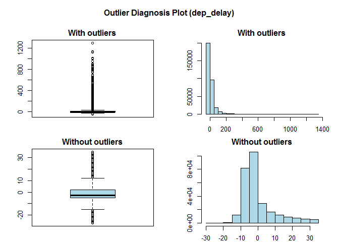

dlookr for Data diagnosis and exploration
================

Data diagnosis

``` r
library(dlookr)
```

    ## Loading required package: mice

    ## 
    ## Attaching package: 'mice'

    ## The following objects are masked from 'package:base':
    ## 
    ##     cbind, rbind

    ## Registered S3 method overwritten by 'quantmod':
    ##   method            from
    ##   as.zoo.data.frame zoo

    ## 
    ## Attaching package: 'dlookr'

    ## The following object is masked from 'package:base':
    ## 
    ##     transform

``` r
browseVignettes(package="dlookr")
```

    ## starting httpd help server ...

    ##  done

``` r
library(nycflights13)
dim(flights)
```

    ## [1] 336776     19

``` r
flights
```

    ## # A tibble: 336,776 x 19
    ##     year month   day dep_time sched_dep_time dep_delay arr_time sched_arr_time
    ##    <int> <int> <int>    <int>          <int>     <dbl>    <int>          <int>
    ##  1  2013     1     1      517            515         2      830            819
    ##  2  2013     1     1      533            529         4      850            830
    ##  3  2013     1     1      542            540         2      923            850
    ##  4  2013     1     1      544            545        -1     1004           1022
    ##  5  2013     1     1      554            600        -6      812            837
    ##  6  2013     1     1      554            558        -4      740            728
    ##  7  2013     1     1      555            600        -5      913            854
    ##  8  2013     1     1      557            600        -3      709            723
    ##  9  2013     1     1      557            600        -3      838            846
    ## 10  2013     1     1      558            600        -2      753            745
    ## # ... with 336,766 more rows, and 11 more variables: arr_delay <dbl>,
    ## #   carrier <chr>, flight <int>, tailnum <chr>, origin <chr>, dest <chr>,
    ## #   air_time <dbl>, distance <dbl>, hour <dbl>, minute <dbl>, time_hour <dttm>

``` r
diagnose(flights)
```

    ## # A tibble: 19 x 6
    ##    variables     types    missing_count missing_percent unique_count unique_rate
    ##    <chr>         <chr>            <int>           <dbl>        <int>       <dbl>
    ##  1 year          integer              0           0                1  0.00000297
    ##  2 month         integer              0           0               12  0.0000356 
    ##  3 day           integer              0           0               31  0.0000920 
    ##  4 dep_time      integer           8255           2.45          1319  0.00392   
    ##  5 sched_dep_ti~ integer              0           0             1021  0.00303   
    ##  6 dep_delay     numeric           8255           2.45           528  0.00157   
    ##  7 arr_time      integer           8713           2.59          1412  0.00419   
    ##  8 sched_arr_ti~ integer              0           0             1163  0.00345   
    ##  9 arr_delay     numeric           9430           2.80           578  0.00172   
    ## 10 carrier       charact~             0           0               16  0.0000475 
    ## 11 flight        integer              0           0             3844  0.0114    
    ## 12 tailnum       charact~          2512           0.746         4044  0.0120    
    ## 13 origin        charact~             0           0                3  0.00000891
    ## 14 dest          charact~             0           0              105  0.000312  
    ## 15 air_time      numeric           9430           2.80           510  0.00151   
    ## 16 distance      numeric              0           0              214  0.000635  
    ## 17 hour          numeric              0           0               20  0.0000594 
    ## 18 minute        numeric              0           0               60  0.000178  
    ## 19 time_hour     POSIXct              0           0             6936  0.0206

``` r
diagnose(flights, year:day)
```

    ## # A tibble: 3 x 6
    ##   variables types   missing_count missing_percent unique_count unique_rate
    ##   <chr>     <chr>           <int>           <dbl>        <int>       <dbl>
    ## 1 year      integer             0               0            1  0.00000297
    ## 2 month     integer             0               0           12  0.0000356 
    ## 3 day       integer             0               0           31  0.0000920

``` r
diagnose(flights, -(year:day))
```

    ## # A tibble: 16 x 6
    ##    variables     types    missing_count missing_percent unique_count unique_rate
    ##    <chr>         <chr>            <int>           <dbl>        <int>       <dbl>
    ##  1 dep_time      integer           8255           2.45          1319  0.00392   
    ##  2 sched_dep_ti~ integer              0           0             1021  0.00303   
    ##  3 dep_delay     numeric           8255           2.45           528  0.00157   
    ##  4 arr_time      integer           8713           2.59          1412  0.00419   
    ##  5 sched_arr_ti~ integer              0           0             1163  0.00345   
    ##  6 arr_delay     numeric           9430           2.80           578  0.00172   
    ##  7 carrier       charact~             0           0               16  0.0000475 
    ##  8 flight        integer              0           0             3844  0.0114    
    ##  9 tailnum       charact~          2512           0.746         4044  0.0120    
    ## 10 origin        charact~             0           0                3  0.00000891
    ## 11 dest          charact~             0           0              105  0.000312  
    ## 12 air_time      numeric           9430           2.80           510  0.00151   
    ## 13 distance      numeric              0           0              214  0.000635  
    ## 14 hour          numeric              0           0               20  0.0000594 
    ## 15 minute        numeric              0           0               60  0.000178  
    ## 16 time_hour     POSIXct              0           0             6936  0.0206

``` r
library(dplyr)
```

    ## 
    ## Attaching package: 'dplyr'

    ## The following objects are masked from 'package:stats':
    ## 
    ##     filter, lag

    ## The following objects are masked from 'package:base':
    ## 
    ##     intersect, setdiff, setequal, union

``` r
flights %>%
  diagnose() %>%
  select(-unique_count, -unique_rate) %>%
  filter(missing_count > 0) %>%
  arrange(desc(missing_count))
```

    ## # A tibble: 6 x 4
    ##   variables types     missing_count missing_percent
    ##   <chr>     <chr>             <int>           <dbl>
    ## 1 arr_delay numeric            9430           2.80 
    ## 2 air_time  numeric            9430           2.80 
    ## 3 arr_time  integer            8713           2.59 
    ## 4 dep_time  integer            8255           2.45 
    ## 5 dep_delay numeric            8255           2.45 
    ## 6 tailnum   character          2512           0.746

``` r
diagnose_numeric(flights)
```

    ## # A tibble: 14 x 10
    ##    variables        min    Q1    mean median    Q3   max  zero  minus outlier
    ##    <chr>          <dbl> <dbl>   <dbl>  <dbl> <dbl> <dbl> <int>  <int>   <int>
    ##  1 year            2013  2013 2013      2013  2013  2013     0      0       0
    ##  2 month              1     4    6.55      7    10    12     0      0       0
    ##  3 day                1     8   15.7      16    23    31     0      0       0
    ##  4 dep_time           1   907 1349.     1401  1744  2400     0      0       0
    ##  5 sched_dep_time   106   906 1344.     1359  1729  2359     0      0       0
    ##  6 dep_delay        -43    -5   12.6      -2    11  1301 16514 183575   43216
    ##  7 arr_time           1  1104 1502.     1535  1940  2400     0      0       0
    ##  8 sched_arr_time     1  1124 1536.     1556  1945  2359     0      0       0
    ##  9 arr_delay        -86   -17    6.90     -5    14  1272  5409 188933   27880
    ## 10 flight             1   553 1972.     1496  3465  8500     0      0       1
    ## 11 air_time          20    82  151.      129   192   695     0      0    5448
    ## 12 distance          17   502 1040.      872  1389  4983     0      0     715
    ## 13 hour               1     9   13.2      13    17    23     0      0       0
    ## 14 minute             0     8   26.2      29    44    59 60696      0       0

``` r
diagnose_numeric(flights) %>%
  filter(minus>0 | zero>0)
```

    ## # A tibble: 3 x 10
    ##   variables   min    Q1  mean median    Q3   max  zero  minus outlier
    ##   <chr>     <dbl> <dbl> <dbl>  <dbl> <dbl> <dbl> <int>  <int>   <int>
    ## 1 dep_delay   -43    -5 12.6      -2    11  1301 16514 183575   43216
    ## 2 arr_delay   -86   -17  6.90     -5    14  1272  5409 188933   27880
    ## 3 minute        0     8 26.2      29    44    59 60696      0       0

``` r
diagnose_category(flights)
```

    ## # A tibble: 33 x 6
    ##    variables levels      N  freq ratio  rank
    ##    <chr>     <chr>   <int> <int> <dbl> <int>
    ##  1 carrier   UA     336776 58665 17.4      1
    ##  2 carrier   B6     336776 54635 16.2      2
    ##  3 carrier   EV     336776 54173 16.1      3
    ##  4 carrier   DL     336776 48110 14.3      4
    ##  5 carrier   AA     336776 32729  9.72     5
    ##  6 carrier   MQ     336776 26397  7.84     6
    ##  7 carrier   US     336776 20536  6.10     7
    ##  8 carrier   9E     336776 18460  5.48     8
    ##  9 carrier   WN     336776 12275  3.64     9
    ## 10 carrier   VX     336776  5162  1.53    10
    ## # ... with 23 more rows

``` r
diagnose_category(flights) %>%
  filter(is.na(levels))
```

    ## # A tibble: 1 x 6
    ##   variables levels      N  freq ratio  rank
    ##   <chr>     <chr>   <int> <int> <dbl> <int>
    ## 1 tailnum   <NA>   336776  2512 0.746     1

``` r
flights %>%
  diagnose_category(top=500) %>%
  filter(ratio <= 0.01)
```

    ## # A tibble: 10 x 6
    ##    variables levels      N  freq    ratio  rank
    ##    <chr>     <chr>   <int> <int>    <dbl> <int>
    ##  1 carrier   OO     336776    32 0.00950     16
    ##  2 dest      JAC    336776    25 0.00742     97
    ##  3 dest      PSP    336776    19 0.00564     98
    ##  4 dest      EYW    336776    17 0.00505     99
    ##  5 dest      HDN    336776    15 0.00445    100
    ##  6 dest      MTJ    336776    15 0.00445    101
    ##  7 dest      SBN    336776    10 0.00297    102
    ##  8 dest      ANC    336776     8 0.00238    103
    ##  9 dest      LEX    336776     1 0.000297   104
    ## 10 dest      LGA    336776     1 0.000297   105

``` r
diagnose_outlier(flights)
```

    ## # A tibble: 14 x 6
    ##    variables    outliers_cnt outliers_ratio outliers_mean with_mean without_mean
    ##    <chr>               <int>          <dbl>         <dbl>     <dbl>        <dbl>
    ##  1 year                    0       0                NaN     2013        2013    
    ##  2 month                   0       0                NaN        6.55        6.55 
    ##  3 day                     0       0                NaN       15.7        15.7  
    ##  4 dep_time                0       0                NaN     1349.       1349.   
    ##  5 sched_dep_t~            0       0                NaN     1344.       1344.   
    ##  6 dep_delay           43216      12.8               93.1     12.6         0.444
    ##  7 arr_time                0       0                NaN     1502.       1502.   
    ##  8 sched_arr_t~            0       0                NaN     1536.       1536.   
    ##  9 arr_delay           27880       8.28             121.       6.90       -3.69 
    ## 10 flight                  1       0.000297        8500     1972.       1972.   
    ## 11 air_time             5448       1.62             400.     151.        146.   
    ## 12 distance              715       0.212           4955.    1040.       1032.   
    ## 13 hour                    0       0                NaN       13.2        13.2  
    ## 14 minute                  0       0                NaN       26.2        26.2

``` r
diagnose_outlier(flights) %>%
  filter(outliers_cnt > 0)
```

    ## # A tibble: 5 x 6
    ##   variables outliers_cnt outliers_ratio outliers_mean with_mean without_mean
    ##   <chr>            <int>          <dbl>         <dbl>     <dbl>        <dbl>
    ## 1 dep_delay        43216      12.8               93.1     12.6         0.444
    ## 2 arr_delay        27880       8.28             121.       6.90       -3.69 
    ## 3 flight               1       0.000297        8500     1972.       1972.   
    ## 4 air_time          5448       1.62             400.     151.        146.   
    ## 5 distance           715       0.212           4955.    1040.       1032.

``` r
diagnose_outlier(flights) %>%
  filter(outliers_ratio>5) %>%
  mutate(rate = outliers_mean / with_mean) %>%
  arrange(desc(rate)) %>%
  select(-outliers_cnt)
```

    ## # A tibble: 2 x 6
    ##   variables outliers_ratio outliers_mean with_mean without_mean  rate
    ##   <chr>              <dbl>         <dbl>     <dbl>        <dbl> <dbl>
    ## 1 arr_delay           8.28         121.       6.90       -3.69  17.5 
    ## 2 dep_delay          12.8           93.1     12.6         0.444  7.37

``` r
flights %>%
  plot_outlier(diagnose_outlier(flights) %>%
                 filter(outliers_ratio>=0.5) %>%
                 select(variables) %>%
                 unlist())
```



EDA

``` r
library(ISLR)
str(Carseats)
```

    ## 'data.frame':    400 obs. of  11 variables:
    ##  $ Sales      : num  9.5 11.22 10.06 7.4 4.15 ...
    ##  $ CompPrice  : num  138 111 113 117 141 124 115 136 132 132 ...
    ##  $ Income     : num  73 48 35 100 64 113 105 81 110 113 ...
    ##  $ Advertising: num  11 16 10 4 3 13 0 15 0 0 ...
    ##  $ Population : num  276 260 269 466 340 501 45 425 108 131 ...
    ##  $ Price      : num  120 83 80 97 128 72 108 120 124 124 ...
    ##  $ ShelveLoc  : Factor w/ 3 levels "Bad","Good","Medium": 1 2 3 3 1 1 3 2 3 3 ...
    ##  $ Age        : num  42 65 59 55 38 78 71 67 76 76 ...
    ##  $ Education  : num  17 10 12 14 13 16 15 10 10 17 ...
    ##  $ Urban      : Factor w/ 2 levels "No","Yes": 2 2 2 2 2 1 2 2 1 1 ...
    ##  $ US         : Factor w/ 2 levels "No","Yes": 2 2 2 2 1 2 1 2 1 2 ...

``` r
carseats <- ISLR::Carseats

suppressWarnings(RNGversion("4.0.2"))
set.seed(123)
carseats[sample(seq(NROW(carseats)),20),"Income"] <- NA

suppressWarnings(RNGversion("4.0.2"))
set.seed(456)
carseats[sample(seq(NROW(carseats)),10),"Urban"] <- NA
```

``` r
describe(carseats)
```

    ## Warning: The `x` argument of `as_tibble.matrix()` must have unique column names if `.name_repair` is omitted as of tibble 2.0.0.
    ## Using compatibility `.name_repair`.
    ## This warning is displayed once every 8 hours.
    ## Call `lifecycle::last_warnings()` to see where this warning was generated.

    ## Warning: `cols` is now required when using unnest().
    ## Please use `cols = c(statistic)`

    ## # A tibble: 8 x 26
    ##   variable     n    na   mean     sd se_mean    IQR skewness kurtosis   p00
    ##   <chr>    <int> <int>  <dbl>  <dbl>   <dbl>  <dbl>    <dbl>    <dbl> <dbl>
    ## 1 Sales      400     0   7.50   2.82   0.141   3.93   0.186   -0.0809     0
    ## 2 CompPri~   400     0 125.    15.3    0.767  20     -0.0428   0.0417    77
    ## 3 Income     380    20  69.3   28.1    1.44   48      0.0360  -1.10      21
    ## 4 Adverti~   400     0   6.64   6.65   0.333  12      0.640   -0.545      0
    ## 5 Populat~   400     0 265.   147.     7.37  260.    -0.0512  -1.20      10
    ## 6 Price      400     0 116.    23.7    1.18   31     -0.125    0.452     24
    ## 7 Age        400     0  53.3   16.2    0.810  26.2   -0.0772  -1.13      25
    ## 8 Educati~   400     0  13.9    2.62   0.131   4      0.0440  -1.30      10
    ## # ... with 16 more variables: p01 <dbl>, p05 <dbl>, p10 <dbl>, p20 <dbl>,
    ## #   p25 <dbl>, p30 <dbl>, p40 <dbl>, p50 <dbl>, p60 <dbl>, p70 <dbl>,
    ## #   p75 <dbl>, p80 <dbl>, p90 <dbl>, p95 <dbl>, p99 <dbl>, p100 <dbl>

``` r
carseats %>%
  describe() %>%
  select(variable, skewness, mean, p25, p50, p75) %>%
  filter(!is.na(skewness)) %>%
  arrange(desc(abs(skewness)))
```

    ## Warning: `cols` is now required when using unnest().
    ## Please use `cols = c(statistic)`

    ## # A tibble: 8 x 6
    ##   variable    skewness   mean    p25    p50    p75
    ##   <chr>          <dbl>  <dbl>  <dbl>  <dbl>  <dbl>
    ## 1 Advertising   0.640    6.64   0      5     12   
    ## 2 Sales         0.186    7.50   5.39   7.49   9.32
    ## 3 Price        -0.125  116.   100    117    131   
    ## 4 Age          -0.0772  53.3   39.8   54.5   66   
    ## 5 Population   -0.0512 265.   139    272    398.  
    ## 6 Education     0.0440  13.9   12     14     16   
    ## 7 CompPrice    -0.0428 125.   115    125    135   
    ## 8 Income        0.0360  69.3   44     69     92

``` r
carseats %>%
  group_by(US, Urban) %>%
  describe(Sales, Income)
```

    ## Warning: `cols` is now required when using unnest().
    ## Please use `cols = c(statistic)`

    ## # A tibble: 12 x 28
    ##    variable US    Urban     n    na  mean    sd se_mean   IQR skewness kurtosis
    ##    <chr>    <fct> <fct> <dbl> <dbl> <dbl> <dbl>   <dbl> <dbl>    <dbl>    <dbl>
    ##  1 Sales    No    No       44     0  6.42  2.78   0.418  3.29   0.132     1.41 
    ##  2 Sales    No    Yes      94     0  7.00  2.56   0.264  3.49   0.491     0.347
    ##  3 Sales    No    <NA>      4     0  7.04  1.04   0.518  1.26  -0.887    -0.834
    ##  4 Sales    Yes   No       71     0  8.21  2.61   0.310  4.08  -0.0453   -0.778
    ##  5 Sales    Yes   Yes     181     0  7.77  2.95   0.219  3.99   0.134    -0.166
    ##  6 Sales    Yes   <NA>      6     0  6.84  3.70   1.51   4.87   0.599    -0.822
    ##  7 Income   No    No       40     4 62.1  29.8    4.72  51.8    0.367    -1.14 
    ##  8 Income   No    Yes      91     3 67.5  27.4    2.87  48      0.0518   -1.12 
    ##  9 Income   No    <NA>      3     1 59.7  37.0   21.4   37     -0.162    NA    
    ## 10 Income   Yes   No       68     3 70.2  30.7    3.72  53      0.0414   -1.19 
    ## 11 Income   Yes   Yes     172     9 71.4  26.5    2.02  45     -0.0201   -0.989
    ## 12 Income   Yes   <NA>      6     0 79.8  34.9   14.3   53.5   -0.506    -1.76 
    ## # ... with 17 more variables: p00 <dbl>, p01 <dbl>, p05 <dbl>, p10 <dbl>,
    ## #   p20 <dbl>, p25 <dbl>, p30 <dbl>, p40 <dbl>, p50 <dbl>, p60 <dbl>,
    ## #   p70 <dbl>, p75 <dbl>, p80 <dbl>, p90 <dbl>, p95 <dbl>, p99 <dbl>,
    ## #   p100 <dbl>

``` r
normality(carseats)
```

    ## Warning: `cols` is now required when using unnest().
    ## Please use `cols = c(statistic)`

    ## # A tibble: 8 x 4
    ##   vars        statistic  p_value sample
    ##   <chr>           <dbl>    <dbl>  <dbl>
    ## 1 Sales           0.995 2.54e- 1    400
    ## 2 CompPrice       0.998 9.77e- 1    400
    ## 3 Income          0.961 1.55e- 8    400
    ## 4 Advertising     0.874 1.49e-17    400
    ## 5 Population      0.952 4.08e-10    400
    ## 6 Price           0.996 3.90e- 1    400
    ## 7 Age             0.957 1.86e- 9    400
    ## 8 Education       0.924 2.43e-13    400

``` r
carseats %>%
  normality() %>%
  filter(p_value <= 0.01) %>%
  arrange(abs(p_value))
```

    ## Warning: `cols` is now required when using unnest().
    ## Please use `cols = c(statistic)`

    ## # A tibble: 5 x 4
    ##   vars        statistic  p_value sample
    ##   <chr>           <dbl>    <dbl>  <dbl>
    ## 1 Advertising     0.874 1.49e-17    400
    ## 2 Education       0.924 2.43e-13    400
    ## 3 Population      0.952 4.08e-10    400
    ## 4 Age             0.957 1.86e- 9    400
    ## 5 Income          0.961 1.55e- 8    400

``` r
carseats %>%
  group_by(ShelveLoc, US) %>%
  normality(Income) %>%
  arrange(desc(p_value))
```

    ## Warning: `cols` is now required when using unnest().
    ## Please use `cols = c(statistic)`

    ## # A tibble: 6 x 6
    ##   variable ShelveLoc US    statistic p_value sample
    ##   <chr>    <fct>     <fct>     <dbl>   <dbl>  <dbl>
    ## 1 Income   Bad       No        0.965 0.350       34
    ## 2 Income   Good      Yes       0.958 0.0359      61
    ## 3 Income   Bad       Yes       0.952 0.0236      62
    ## 4 Income   Good      No        0.879 0.0140      24
    ## 5 Income   Medium    Yes       0.964 0.00190    135
    ## 6 Income   Medium    No        0.944 0.00161     84

``` r
carseats %>%
  mutate(log_income = log(Income)) %>%
  group_by(ShelveLoc, US) %>%
  normality(log_income) %>%
  filter(p_value > 0.01)
```

    ## Warning: `cols` is now required when using unnest().
    ## Please use `cols = c(statistic)`

    ## # A tibble: 1 x 6
    ##   variable   ShelveLoc US    statistic p_value sample
    ##   <chr>      <fct>     <fct>     <dbl>   <dbl>  <dbl>
    ## 1 log_income Bad       No        0.946   0.100     34

``` r
plot_normality(carseats, Sales, CompPrice)
```


``` r
carseats %>%
  filter(ShelveLoc=="Good") %>%
  group_by(US) %>%
  plot_normality(Income)
```


``` r
correlate(carseats)
```

    ## # A tibble: 56 x 3
    ##    var1        var2      coef_corr
    ##    <fct>       <fct>         <dbl>
    ##  1 CompPrice   Sales        0.0641
    ##  2 Income      Sales        0.153 
    ##  3 Advertising Sales        0.270 
    ##  4 Population  Sales        0.0505
    ##  5 Price       Sales       -0.445 
    ##  6 Age         Sales       -0.232 
    ##  7 Education   Sales       -0.0520
    ##  8 Sales       CompPrice    0.0641
    ##  9 Income      CompPrice   -0.0918
    ## 10 Advertising CompPrice   -0.0242
    ## # ... with 46 more rows

``` r
correlate(carseats, Sales, CompPrice, Income)
```

    ## # A tibble: 21 x 3
    ##    var1      var2        coef_corr
    ##    <fct>     <fct>           <dbl>
    ##  1 CompPrice Sales          0.0641
    ##  2 Income    Sales          0.153 
    ##  3 Sales     CompPrice      0.0641
    ##  4 Income    CompPrice     -0.0918
    ##  5 Sales     Income         0.153 
    ##  6 CompPrice Income        -0.0918
    ##  7 Sales     Advertising    0.270 
    ##  8 CompPrice Advertising   -0.0242
    ##  9 Income    Advertising    0.0674
    ## 10 Sales     Population     0.0505
    ## # ... with 11 more rows

``` r
carseats %>%
  filter(ShelveLoc=="Good") %>%
  group_by(Urban, US) %>%
  correlate(Sales) %>%
  filter(abs(coef_corr) > 0.5)
```

    ## # A tibble: 6 x 5
    ##   Urban US    var1  var2       coef_corr
    ##   <fct> <fct> <fct> <fct>          <dbl>
    ## 1 No    No    Sales Population    -0.530
    ## 2 No    No    Sales Price         -0.838
    ## 3 No    Yes   Sales Price         -0.655
    ## 4 Yes   No    Sales Price         -0.837
    ## 5 Yes   No    Sales Age           -0.644
    ## 6 Yes   Yes   Sales Price         -0.604

``` r
plot_correlate(carseats)
```


``` r
carseats %>%
  filter(ShelveLoc=="Good") %>%
  group_by(Urban, US) %>%
  plot_correlate(Sales)
```

    ## Warning in cor(df[idx, names(df)[idx_numeric]], use = "pairwise.complete.obs"):
    ## 표준편차가 0입니다


    ## Warning: Passed a group with no more than five observations.
    ## (Urban == NA and US == No)

    ## Warning: Passed a group with no more than five observations.
    ## (Urban == NA and US == Yes)


``` r
categ <- target_by(carseats, US)
```

    ## Warning: Unquoting language objects with `!!!` is deprecated as of rlang 0.4.0.
    ## Please use `!!` instead.
    ## 
    ##   # Bad:
    ##   dplyr::select(data, !!!enquo(x))
    ## 
    ##   # Good:
    ##   dplyr::select(data, !!enquo(x))    # Unquote single quosure
    ##   dplyr::select(data, !!!enquos(x))  # Splice list of quosures
    ## 
    ## This warning is displayed once per session.

``` r
cat_num <- relate(categ, Sales)
cat_num
```

    ## # A tibble: 3 x 27
    ##   variable US        n    na  mean    sd se_mean   IQR skewness kurtosis   p00
    ##   <chr>    <fct> <dbl> <dbl> <dbl> <dbl>   <dbl> <dbl>    <dbl>    <dbl> <dbl>
    ## 1 Sales    No      142     0  6.82  2.60   0.218  3.44   0.323    0.808   0   
    ## 2 Sales    Yes     258     0  7.87  2.88   0.179  4.23   0.0760  -0.326   0.37
    ## 3 Sales    total   400     0  7.50  2.82   0.141  3.93   0.186   -0.0809  0   
    ## # ... with 16 more variables: p01 <dbl>, p05 <dbl>, p10 <dbl>, p20 <dbl>,
    ## #   p25 <dbl>, p30 <dbl>, p40 <dbl>, p50 <dbl>, p60 <dbl>, p70 <dbl>,
    ## #   p75 <dbl>, p80 <dbl>, p90 <dbl>, p95 <dbl>, p99 <dbl>, p100 <dbl>

``` r
plot(cat_num)
```


``` r
cat_cat <- relate(categ, ShelveLoc)
cat_cat
```

    ##      ShelveLoc
    ## US    Bad Good Medium
    ##   No   34   24     84
    ##   Yes  62   61    135

``` r
summary(cat_cat)
```

    ## Call: xtabs(formula = formula_str, data = data, addNA = TRUE)
    ## Number of cases in table: 400 
    ## Number of factors: 2 
    ## Test for independence of all factors:
    ##  Chisq = 2.7397, df = 2, p-value = 0.2541

``` r
plot(cat_cat)
```


``` r
num <- target_by(carseats, Sales)
```

``` r
num_num <- relate(num, Price)
num_num
```

    ## 
    ## Call:
    ## lm(formula = formula_str, data = data)
    ## 
    ## Coefficients:
    ## (Intercept)        Price  
    ##    13.64192     -0.05307

``` r
summary(num_num)
```

    ## 
    ## Call:
    ## lm(formula = formula_str, data = data)
    ## 
    ## Residuals:
    ##     Min      1Q  Median      3Q     Max 
    ## -6.5224 -1.8442 -0.1459  1.6503  7.5108 
    ## 
    ## Coefficients:
    ##              Estimate Std. Error t value Pr(>|t|)    
    ## (Intercept) 13.641915   0.632812  21.558   <2e-16 ***
    ## Price       -0.053073   0.005354  -9.912   <2e-16 ***
    ## ---
    ## Signif. codes:  0 '***' 0.001 '**' 0.01 '*' 0.05 '.' 0.1 ' ' 1
    ## 
    ## Residual standard error: 2.532 on 398 degrees of freedom
    ## Multiple R-squared:  0.198,  Adjusted R-squared:  0.196 
    ## F-statistic: 98.25 on 1 and 398 DF,  p-value: < 2.2e-16

``` r
plot(num_num)
```

    ## `geom_smooth()` using formula 'y ~ x'


``` r
num_cat <- relate(num, ShelveLoc)
num_cat
```

    ## Analysis of Variance Table
    ## 
    ## Response: Sales
    ##            Df Sum Sq Mean Sq F value    Pr(>F)    
    ## ShelveLoc   2 1009.5  504.77   92.23 < 2.2e-16 ***
    ## Residuals 397 2172.7    5.47                      
    ## ---
    ## Signif. codes:  0 '***' 0.001 '**' 0.01 '*' 0.05 '.' 0.1 ' ' 1

``` r
summary(num_cat)
```

    ## 
    ## Call:
    ## lm(formula = formula(formula_str), data = data)
    ## 
    ## Residuals:
    ##     Min      1Q  Median      3Q     Max 
    ## -7.3066 -1.6282 -0.0416  1.5666  6.1471 
    ## 
    ## Coefficients:
    ##                 Estimate Std. Error t value Pr(>|t|)    
    ## (Intercept)       5.5229     0.2388  23.131  < 2e-16 ***
    ## ShelveLocGood     4.6911     0.3484  13.464  < 2e-16 ***
    ## ShelveLocMedium   1.7837     0.2864   6.229  1.2e-09 ***
    ## ---
    ## Signif. codes:  0 '***' 0.001 '**' 0.01 '*' 0.05 '.' 0.1 ' ' 1
    ## 
    ## Residual standard error: 2.339 on 397 degrees of freedom
    ## Multiple R-squared:  0.3172, Adjusted R-squared:  0.3138 
    ## F-statistic: 92.23 on 2 and 397 DF,  p-value: < 2.2e-16

``` r
plot(num_cat)
```


Data Transformation

``` r
income <- imputate_na(carseats, Income,
                      US, method="rpart")
income
```

    ##   [1]  73.00000  48.00000  35.00000 100.00000  64.00000 113.00000 105.00000
    ##   [8]  81.00000 110.00000 113.00000  78.00000  94.00000  35.00000  58.63636
    ##  [15] 117.00000  95.00000  32.00000  74.00000 110.00000  76.00000  90.00000
    ##  [22]  29.00000  46.00000  31.00000 119.00000  32.00000 115.00000 118.00000
    ##  [29]  74.00000  99.00000  94.00000  58.00000  32.00000  38.00000  54.00000
    ##  [36]  84.00000  76.00000  41.00000  73.00000  60.00000  98.00000  53.00000
    ##  [43]  69.00000  42.00000  79.00000  63.00000  90.00000  98.00000  52.00000
    ##  [50]  93.00000  32.00000  90.00000  40.00000  64.00000 103.00000  81.00000
    ##  [57]  82.00000  91.00000  93.00000  71.00000 102.00000  32.00000  45.00000
    ##  [64]  88.00000  67.00000  26.00000  92.00000  61.00000  69.00000  59.00000
    ##  [71]  81.00000  51.00000  45.00000  90.00000  68.00000 111.00000  87.00000
    ##  [78]  71.00000  48.00000  67.00000 100.00000  72.00000  83.00000  36.00000
    ##  [85]  25.00000 103.00000  84.00000  67.00000  42.00000  56.07143  67.14286
    ##  [92]  46.00000 113.00000  30.00000  97.00000  25.00000  42.00000  82.00000
    ##  [99]  77.00000  47.00000  69.00000  93.00000  22.00000  91.00000  96.00000
    ## [106] 100.00000  33.00000 107.00000  79.00000  65.00000  62.00000 118.00000
    ## [113]  99.00000  29.00000  87.00000  35.00000  75.00000  75.34722  88.00000
    ## [120]  94.00000 105.00000  89.00000 100.00000 103.00000 113.00000  78.00000
    ## [127]  68.00000  48.00000 100.00000 120.00000  84.00000  69.00000  87.00000
    ## [134]  98.00000  31.00000  94.00000  68.81481  42.00000 103.00000  62.00000
    ## [141]  60.00000  42.00000  84.00000  88.00000  68.00000  63.00000  83.00000
    ## [148]  54.00000 119.00000 120.00000  84.00000  58.00000  67.77778  36.00000
    ## [155]  69.00000  72.00000  34.00000  58.00000  90.00000  60.00000  28.00000
    ## [162]  21.00000  74.00000  64.00000  64.00000  58.00000  67.00000  73.00000
    ## [169]  89.00000  41.00000  39.00000 106.00000 102.00000  91.00000  24.00000
    ## [176]  89.00000 107.00000  72.00000  89.86364  25.00000 112.00000  83.00000
    ## [183]  60.00000  74.00000  33.00000 100.00000  51.00000  32.00000  37.00000
    ## [190] 117.00000  37.00000  42.00000  26.00000  70.00000  56.07143  93.00000
    ## [197]  65.50000  61.00000  80.00000  88.00000  92.00000  83.00000  78.00000
    ## [204]  82.00000  80.00000  22.00000  67.00000 105.00000  54.00000  21.00000
    ## [211]  41.00000 118.00000  69.00000  84.00000 115.00000  83.00000  33.00000
    ## [218]  44.00000  61.00000  79.00000 120.00000  44.00000 119.00000  45.00000
    ## [225]  82.00000  25.00000  33.00000  64.00000  67.50000 104.00000  60.00000
    ## [232]  69.00000  80.00000  76.00000  62.00000  32.00000  34.00000  28.00000
    ## [239]  24.00000 105.00000  80.00000  63.00000  46.00000  68.81481  30.00000
    ## [246]  43.00000  56.00000 114.00000  52.00000  67.00000 105.00000 111.00000
    ## [253]  97.00000  24.00000 104.00000  55.55556  40.00000  62.00000  38.00000
    ## [260]  36.00000 117.00000  42.00000  77.00000  26.00000  29.00000  35.00000
    ## [267]  93.00000  82.00000  57.00000  69.00000  26.00000  56.00000  33.00000
    ## [274] 106.00000  93.00000 119.00000  69.00000  48.00000 113.00000  57.00000
    ## [281]  86.00000  69.00000  96.00000 110.00000  46.00000  26.00000 118.00000
    ## [288]  44.00000  40.00000  77.00000 111.00000  70.00000  66.00000  84.00000
    ## [295]  76.00000  35.00000  44.00000  83.00000  75.34722  40.00000  78.00000
    ## [302]  93.00000  77.00000  52.00000  98.00000  67.77778  32.00000  92.00000
    ## [309]  80.00000 111.00000  65.00000  68.00000 117.00000  81.00000  33.00000
    ## [316]  21.00000  36.00000  30.00000  72.00000  45.00000  70.00000  39.00000
    ## [323]  50.00000 105.00000  65.00000  69.00000  30.00000  41.72727  66.00000
    ## [330]  54.00000  59.00000  63.00000  33.00000  60.00000 117.00000  70.00000
    ## [337]  35.00000  38.00000  24.00000  44.00000  29.00000 120.00000 102.00000
    ## [344]  42.00000  80.00000  68.00000 107.00000  31.85714 102.00000  27.00000
    ## [351] 101.00000 115.00000 103.00000  67.00000  68.81481 100.00000 109.00000
    ## [358]  73.00000  96.00000  62.00000  86.00000  25.00000  55.00000  75.00000
    ## [365]  21.00000  30.00000  56.00000 106.00000  22.00000 100.00000  41.00000
    ## [372]  81.00000  50.00000  83.77778  47.00000  46.00000  60.00000  61.00000
    ## [379]  88.00000 111.00000  64.00000  65.00000  28.00000 117.00000  37.00000
    ## [386]  73.00000 116.00000  75.34722  89.00000  42.00000  75.00000  63.00000
    ## [393]  42.00000  51.00000  58.00000 108.00000  23.00000  26.00000  47.50000
    ## [400]  37.00000
    ## attr(,"var_type")
    ## [1] "numerical"
    ## attr(,"method")
    ## [1] "rpart"
    ## attr(,"na_pos")
    ##  [1]  14  90  91 118 137 153 179 195 197 229 244 256 299 306 328 348 355 374 388
    ## [20] 399
    ## attr(,"type")
    ## [1] "missing values"
    ## attr(,"message")
    ## [1] "complete imputation"
    ## attr(,"success")
    ## [1] TRUE
    ## attr(,"class")
    ## [1] "imputation" "numeric"

``` r
summary(income)
```

    ## Warning: `cols` is now required when using unnest().
    ## Please use `cols = c(statistic)`

    ## * Impute missing values based on Recursive Partitioning and Regression Trees
    ##  - method : rpart
    ## 
    ## * Information of Imputation (before vs after)
    ##              Original   Imputation
    ## n        380.00000000 400.00000000
    ## na        20.00000000   0.00000000
    ## mean      69.32105263  69.07811282
    ## sd        28.06686473  27.53886441
    ## se_mean    1.43979978   1.37694322
    ## IQR       48.00000000  45.50000000
    ## skewness   0.03601821   0.05313579
    ## kurtosis  -1.10286001  -1.04030028
    ## p00       21.00000000  21.00000000
    ## p01       21.79000000  21.99000000
    ## p05       26.00000000  26.00000000
    ## p10       31.90000000  32.00000000
    ## p20       40.00000000  41.00000000
    ## p25       44.00000000  44.75000000
    ## p30       50.00000000  51.00000000
    ## p40       62.00000000  62.00000000
    ## p50       69.00000000  69.00000000
    ## p60       78.00000000  77.00000000
    ## p70       87.30000000  84.60000000
    ## p75       92.00000000  90.25000000
    ## p80       98.00000000  96.00000000
    ## p90      108.10000000 107.00000000
    ## p95      115.05000000 115.00000000
    ## p99      119.21000000 119.01000000
    ## p100     120.00000000 120.00000000

``` r
plot(income)
```


``` r
library(mice)
urban <- imputate_na(carseats, Urban,
                     US, method="mice")
```

    ## 
    ##  iter imp variable
    ##   1   1  Income  Urban
    ##   1   2  Income  Urban
    ##   1   3  Income  Urban
    ##   1   4  Income  Urban
    ##   1   5  Income  Urban
    ##   2   1  Income  Urban
    ##   2   2  Income  Urban
    ##   2   3  Income  Urban
    ##   2   4  Income  Urban
    ##   2   5  Income  Urban
    ##   3   1  Income  Urban
    ##   3   2  Income  Urban
    ##   3   3  Income  Urban
    ##   3   4  Income  Urban
    ##   3   5  Income  Urban
    ##   4   1  Income  Urban
    ##   4   2  Income  Urban
    ##   4   3  Income  Urban
    ##   4   4  Income  Urban
    ##   4   5  Income  Urban
    ##   5   1  Income  Urban
    ##   5   2  Income  Urban
    ##   5   3  Income  Urban
    ##   5   4  Income  Urban
    ##   5   5  Income  Urban

``` r
urban
```

    ##   [1] Yes Yes Yes Yes Yes No  Yes Yes No  No  No  Yes Yes Yes Yes No  Yes Yes
    ##  [19] No  Yes Yes No  Yes Yes Yes No  No  Yes Yes Yes Yes Yes No  Yes Yes No 
    ##  [37] No  No  Yes No  No  Yes Yes Yes Yes Yes No  Yes Yes Yes Yes Yes Yes Yes
    ##  [55] No  Yes Yes Yes Yes Yes Yes No  Yes Yes No  No  Yes Yes Yes Yes Yes No 
    ##  [73] Yes No  No  No  Yes No  Yes Yes Yes Yes Yes Yes No  No  Yes No  Yes No 
    ##  [91] No  Yes Yes Yes Yes Yes No  Yes No  No  No  Yes No  Yes Yes Yes No  Yes
    ## [109] Yes No  Yes Yes Yes Yes Yes Yes No  Yes Yes Yes Yes Yes Yes No  Yes No 
    ## [127] Yes Yes Yes No  Yes Yes Yes Yes Yes No  No  Yes Yes No  Yes Yes Yes Yes
    ## [145] No  Yes Yes No  No  Yes No  No  No  No  No  Yes Yes No  No  No  No  No 
    ## [163] Yes No  No  Yes Yes Yes Yes Yes Yes Yes Yes Yes No  Yes No  Yes No  Yes
    ## [181] Yes Yes Yes Yes No  Yes No  Yes Yes No  No  Yes No  Yes Yes Yes Yes Yes
    ## [199] Yes Yes No  Yes No  Yes Yes No  Yes No  Yes No  No  Yes Yes Yes Yes Yes
    ## [217] Yes No  Yes Yes Yes Yes Yes Yes No  Yes Yes Yes No  No  No  No  Yes No 
    ## [235] No  Yes Yes Yes Yes Yes Yes Yes No  Yes Yes No  Yes Yes Yes Yes Yes No 
    ## [253] Yes No  Yes Yes Yes Yes No  No  Yes Yes Yes Yes Yes Yes No  No  Yes Yes
    ## [271] Yes Yes Yes Yes Yes Yes Yes Yes No  Yes No  No  Yes No  No  Yes No  Yes
    ## [289] No  Yes No  Yes Yes Yes Yes No  Yes Yes Yes No  Yes Yes Yes Yes Yes Yes
    ## [307] Yes Yes Yes Yes Yes Yes Yes Yes Yes Yes Yes No  No  No  Yes Yes Yes Yes
    ## [325] Yes Yes Yes Yes Yes Yes No  Yes Yes Yes Yes Yes Yes Yes Yes Yes Yes No 
    ## [343] No  Yes No  Yes No  No  Yes No  No  No  Yes No  Yes Yes Yes Yes Yes Yes
    ## [361] No  No  Yes Yes Yes No  No  Yes No  Yes Yes Yes No  Yes Yes Yes Yes Yes
    ## [379] Yes Yes Yes Yes Yes Yes Yes Yes Yes No  Yes Yes Yes Yes Yes No  Yes Yes
    ## [397] No  Yes Yes Yes
    ## attr(,"var_type")
    ## [1] categorical
    ## attr(,"method")
    ## [1] mice
    ## attr(,"na_pos")
    ##  [1]  38  90 159 206 237 252 281 283 335 378
    ## attr(,"type")
    ## [1] missing values
    ## attr(,"message")
    ## [1] complete imputation
    ## attr(,"success")
    ## [1] TRUE
    ## Levels: No Yes

``` r
summary(urban)
```

    ## * Information of Imputation (before vs after)
    ##      original imputation original_percent imputation_percent
    ## No        115        121            28.75              30.25
    ## Yes       275        279            68.75              69.75
    ## <NA>       10          0             2.50               0.00

``` r
plot(urban)
```


``` r
carseats %>%
  mutate(Income_imp = imputate_na(carseats, Income, US, method="knn")) %>%
  group_by(US) %>%
  summarise(orig=mean(Income, na.rm=TRUE), imputation=mean(Income_imp))
```

    ## `summarise()` ungrouping output (override with `.groups` argument)

    ## # A tibble: 2 x 3
    ##   US     orig imputation
    ##   <fct> <dbl>      <dbl>
    ## 1 No     65.7       65.5
    ## 2 Yes    71.3       71.5

``` r
price <- imputate_outlier(carseats, Price,
                          method="capping")
price
```

    ##   [1] 120.00  83.00  80.00  97.00 128.00  72.00 108.00 120.00 124.00 124.00
    ##  [11] 100.00  94.00 136.00  86.00 118.00 144.00 110.00 131.00  68.00 121.00
    ##  [21] 131.00 109.00 138.00 109.00 113.00  82.00 131.00 107.00  97.00 102.00
    ##  [31]  89.00 131.00 137.00 128.00 128.00  96.00 100.00 110.00 102.00 138.00
    ##  [41] 126.00 124.00  77.00 134.00  95.00 135.00  70.00 108.00  98.00 149.00
    ##  [51] 108.00 108.00 129.00 119.00 144.00 154.00  84.00 117.00 103.00 114.00
    ##  [61] 123.00 107.00 133.00 101.00 104.00 128.00  91.00 115.00 134.00  99.00
    ##  [71]  99.00 150.00 116.00 104.00 136.00  92.00  70.00  89.00 145.00  90.00
    ##  [81]  79.00 128.00 139.00  94.00 121.00 112.00 134.00 126.00 111.00 119.00
    ##  [91] 103.00 107.00 125.00 104.00  84.00 148.00 132.00 129.00 127.00 107.00
    ## [101] 106.00 118.00  97.00  96.00 138.00  97.00 139.00 108.00 103.00  90.00
    ## [111] 116.00 151.00 125.00 127.00 106.00 129.00 128.00 119.00  99.00 128.00
    ## [121] 131.00  87.00 108.00 155.00 120.00  77.00 133.00 116.00 126.00 147.00
    ## [131]  77.00  94.00 136.00  97.00 131.00 120.00 120.00 118.00 109.00  94.00
    ## [141] 129.00 131.00 104.00 159.00 123.00 117.00 131.00 119.00  97.00  87.00
    ## [151] 114.00 103.00 128.00 150.00 110.00  69.00 157.00  90.00 112.00  70.00
    ## [161] 111.00 160.00 149.00 106.00 141.00 155.05 137.00  93.00 117.00  77.00
    ## [171] 118.00  55.00 110.00 128.00 155.05 122.00 154.00  94.00  81.00 116.00
    ## [181] 149.00  91.00 140.00 102.00  97.00 107.00  86.00  96.00  90.00 104.00
    ## [191] 101.00 173.00  93.00  96.00 128.00 112.00 133.00 138.00 128.00 126.00
    ## [201] 146.00 134.00 130.00 157.00 124.00 132.00 160.00  97.00  64.00  90.00
    ## [211] 123.00 120.00 105.00 139.00 107.00 144.00 144.00 111.00 120.00 116.00
    ## [221] 124.00 107.00 145.00 125.00 141.00  82.00 122.00 101.00 163.00  72.00
    ## [231] 114.00 122.00 105.00 120.00 129.00 132.00 108.00 135.00 133.00 118.00
    ## [241] 121.00  94.00 135.00 110.00 100.00  88.00  90.00 151.00 101.00 117.00
    ## [251] 156.00 132.00 117.00 122.00 129.00  81.00 144.00 112.00  81.00 100.00
    ## [261] 101.00 118.00 132.00 115.00 159.00 129.00 112.00 112.00 105.00 166.00
    ## [271]  89.00 110.00  63.00  86.00 119.00 132.00 130.00 125.00 151.00 158.00
    ## [281] 145.00 105.00 154.00 117.00  96.00 131.00 113.00  72.00  97.00 156.00
    ## [291] 103.00  89.00  74.00  89.00  99.00 137.00 123.00 104.00 130.00  96.00
    ## [301]  99.00  87.00 110.00  99.00 134.00 132.00 133.00 120.00 126.00  80.00
    ## [311] 166.00 132.00 135.00  54.00 129.00 171.00  72.00 136.00 130.00 129.00
    ## [321] 152.00  98.00 139.00 103.00 150.00 104.00 122.00 104.00 111.00  89.00
    ## [331] 112.00 134.00 104.00 147.00  83.00 110.00 143.00 102.00 101.00 126.00
    ## [341]  91.00  93.00 118.00 121.00 126.00 149.00 125.00 112.00 107.00  96.00
    ## [351]  91.00 105.00 122.00  92.00 145.00 146.00 164.00  72.00 118.00 130.00
    ## [361] 114.00 104.00 110.00 108.00 131.00 162.00 134.00  77.00  79.00 122.00
    ## [371] 119.00 126.00  98.00 116.00 118.00 124.00  92.00 125.00 119.00 107.00
    ## [381]  89.00 151.00 121.00  68.00 112.00 132.00 160.00 115.00  78.00 107.00
    ## [391] 111.00 124.00 130.00 120.00 139.00 128.00 120.00 159.00  95.00 120.00
    ## attr(,"method")
    ## [1] "capping"
    ## attr(,"var_type")
    ## [1] "numerical"
    ## attr(,"outlier_pos")
    ## [1]  43 126 166 175 368
    ## attr(,"outliers")
    ## [1]  24  49 191 185  53
    ## attr(,"type")
    ## [1] "outliers"
    ## attr(,"message")
    ## [1] "complete imputation"
    ## attr(,"success")
    ## [1] TRUE
    ## attr(,"class")
    ## [1] "imputation" "numeric"

``` r
summary(price)
```

    ## Warning: `cols` is now required when using unnest().
    ## Please use `cols = c(statistic)`

    ## Impute outliers with capping
    ## 
    ## * Information of Imputation (before vs after)
    ##             Original  Imputation
    ## n        400.0000000 400.0000000
    ## na         0.0000000   0.0000000
    ## mean     115.7950000 115.8927500
    ## sd        23.6766644  22.6109187
    ## se_mean    1.1838332   1.1305459
    ## IQR       31.0000000  31.0000000
    ## skewness  -0.1252862  -0.0461621
    ## kurtosis   0.4518850  -0.3030578
    ## p00       24.0000000  54.0000000
    ## p01       54.9900000  67.9600000
    ## p05       77.0000000  77.0000000
    ## p10       87.0000000  87.0000000
    ## p20       96.8000000  96.8000000
    ## p25      100.0000000 100.0000000
    ## p30      104.0000000 104.0000000
    ## p40      110.0000000 110.0000000
    ## p50      117.0000000 117.0000000
    ## p60      122.0000000 122.0000000
    ## p70      128.3000000 128.3000000
    ## p75      131.0000000 131.0000000
    ## p80      134.0000000 134.0000000
    ## p90      146.0000000 146.0000000
    ## p95      155.0500000 155.0025000
    ## p99      166.0500000 164.0200000
    ## p100     191.0000000 173.0000000

``` r
plot(price)
```


``` r
carseats %>%
  mutate(Price_imp=imputate_outlier(carseats, Price, method="capping")) %>%
  group_by(US) %>%
  summarise(orig=mean(Price, na.rm=TRUE),
            imputation=mean(Price_imp, na.rm=TRUE))
```

    ## `summarise()` ungrouping output (override with `.groups` argument)

    ## # A tibble: 2 x 3
    ##   US     orig imputation
    ##   <fct> <dbl>      <dbl>
    ## 1 No     114.       114.
    ## 2 Yes    117.       117.

``` r
carseats %>%
  mutate(Income_minmax=transform(carseats$Income, method="minmax"), Sales_minmax=transform(carseats$Sales, method="minmax")) %>%
  select(Income_minmax, Sales_minmax) %>%
  boxplot()
```


``` r
find_skewness(carseats)
```

    ## [1] 4

``` r
find_skewness(carseats, index=FALSE)
```

    ## [1] "Advertising"

``` r
find_skewness(carseats, value=TRUE)
```

    ##       Sales   CompPrice      Income Advertising  Population       Price 
    ##       0.185      -0.043          NA       0.637      -0.051      -0.125 
    ##         Age   Education 
    ##      -0.077       0.044

``` r
find_skewness(carseats, value=TRUE, thres=0.1)
```

    ##       Sales Advertising       Price 
    ##       0.185       0.637      -0.125

``` r
Advertising_log = transform(carseats$Advertising, method="log")

head(Advertising_log)
```

    ## [1] 2.397895 2.772589 2.302585 1.386294 1.098612 2.564949

``` r
summary(Advertising_log)
```

    ## Warning: `cols` is now required when using unnest().
    ## Please use `cols = c(statistic)`

    ## * Resolving Skewness with log
    ## 
    ## * Information of Transformation (before vs after)
    ##             Original Transformation
    ## n        400.0000000    400.0000000
    ## na         0.0000000      0.0000000
    ## mean       6.6350000           -Inf
    ## sd         6.6503642            NaN
    ## se_mean    0.3325182            NaN
    ## IQR       12.0000000            Inf
    ## skewness   0.6395858            NaN
    ## kurtosis  -0.5451178            NaN
    ## p00        0.0000000           -Inf
    ## p01        0.0000000           -Inf
    ## p05        0.0000000           -Inf
    ## p10        0.0000000           -Inf
    ## p20        0.0000000           -Inf
    ## p25        0.0000000           -Inf
    ## p30        0.0000000           -Inf
    ## p40        2.0000000      0.6931472
    ## p50        5.0000000      1.6094379
    ## p60        8.4000000      2.1265548
    ## p70       11.0000000      2.3978953
    ## p75       12.0000000      2.4849066
    ## p80       13.0000000      2.5649494
    ## p90       16.0000000      2.7725887
    ## p95       19.0000000      2.9444390
    ## p99       23.0100000      3.1359198
    ## p100      29.0000000      3.3672958

``` r
plot(Advertising_log)
```


``` r
Advertising_log <- transform(carseats$Advertising, method="log+1")
head(Advertising_log)
```

    ## [1] 2.484907 2.833213 2.397895 1.609438 1.386294 2.639057

``` r
summary(Advertising_log)
```

    ## Warning: `cols` is now required when using unnest().
    ## Please use `cols = c(statistic)`

    ## * Resolving Skewness with log+1
    ## 
    ## * Information of Transformation (before vs after)
    ##             Original Transformation
    ## n        400.0000000   400.00000000
    ## na         0.0000000     0.00000000
    ## mean       6.6350000     1.46247709
    ## sd         6.6503642     1.19436323
    ## se_mean    0.3325182     0.05971816
    ## IQR       12.0000000     2.56494936
    ## skewness   0.6395858    -0.19852549
    ## kurtosis  -0.5451178    -1.66342876
    ## p00        0.0000000     0.00000000
    ## p01        0.0000000     0.00000000
    ## p05        0.0000000     0.00000000
    ## p10        0.0000000     0.00000000
    ## p20        0.0000000     0.00000000
    ## p25        0.0000000     0.00000000
    ## p30        0.0000000     0.00000000
    ## p40        2.0000000     1.09861229
    ## p50        5.0000000     1.79175947
    ## p60        8.4000000     2.23936878
    ## p70       11.0000000     2.48490665
    ## p75       12.0000000     2.56494936
    ## p80       13.0000000     2.63905733
    ## p90       16.0000000     2.83321334
    ## p95       19.0000000     2.99573227
    ## p99       23.0100000     3.17846205
    ## p100      29.0000000     3.40119738

``` r
plot(Advertising_log)
```


``` r
## flights %>%
##  diagnose_report(output_format="html")
```

``` r
## carseats %>%
##  eda_report(target=Sales,
##             output_format="html",
##             output_file="EDA_carseats.html")
```
