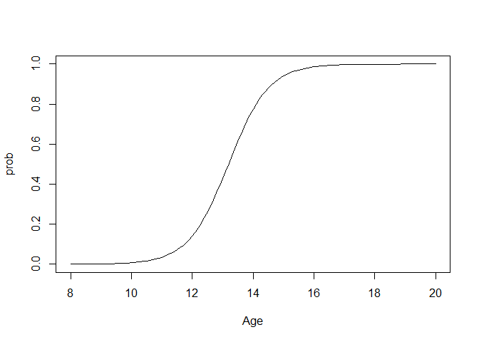

juul - glm
================

``` r
library(ISwR)
```

    ## Warning: package 'ISwR' was built under R version 3.6.3

``` r
data(juul)
head(juul, 10)
```

    ##     age menarche sex igf1 tanner testvol
    ## 1    NA       NA  NA   90     NA      NA
    ## 2    NA       NA  NA   88     NA      NA
    ## 3    NA       NA  NA  164     NA      NA
    ## 4    NA       NA  NA  166     NA      NA
    ## 5    NA       NA  NA  131     NA      NA
    ## 6  0.17       NA   1  101      1      NA
    ## 7  0.17       NA   1   97      1      NA
    ## 8  0.17       NA   1  106      1      NA
    ## 9  0.17       NA   1  111      1      NA
    ## 10 0.17       NA   1   79      1      NA

``` r
str(juul)
```

    ## 'data.frame':    1339 obs. of  6 variables:
    ##  $ age     : num  NA NA NA NA NA 0.17 0.17 0.17 0.17 0.17 ...
    ##  $ menarche: int  NA NA NA NA NA NA NA NA NA NA ...
    ##  $ sex     : num  NA NA NA NA NA 1 1 1 1 1 ...
    ##  $ igf1    : num  90 88 164 166 131 101 97 106 111 79 ...
    ##  $ tanner  : int  NA NA NA NA NA 1 1 1 1 1 ...
    ##  $ testvol : int  NA NA NA NA NA NA NA NA NA NA ...

``` r
juul$menarche <- factor(juul$menarche,
                        labels=c("No","Yes"))
juul$tanner <- factor(juul$tanner)
str(juul)
```

    ## 'data.frame':    1339 obs. of  6 variables:
    ##  $ age     : num  NA NA NA NA NA 0.17 0.17 0.17 0.17 0.17 ...
    ##  $ menarche: Factor w/ 2 levels "No","Yes": NA NA NA NA NA NA NA NA NA NA ...
    ##  $ sex     : num  NA NA NA NA NA 1 1 1 1 1 ...
    ##  $ igf1    : num  90 88 164 166 131 101 97 106 111 79 ...
    ##  $ tanner  : Factor w/ 5 levels "1","2","3","4",..: NA NA NA NA NA 1 1 1 1 1 ...
    ##  $ testvol : int  NA NA NA NA NA NA NA NA NA NA ...

``` r
juul.girl <- subset(juul, age>8 & age<20
                    & complete.cases(menarche))
menarche.glm <- glm(menarche~age, family=binomial,
                    data=juul.girl)
summary(menarche.glm)
```

    ## 
    ## Call:
    ## glm(formula = menarche ~ age, family = binomial, data = juul.girl)
    ## 
    ## Deviance Residuals: 
    ##      Min        1Q    Median        3Q       Max  
    ## -2.32759  -0.18998   0.01253   0.12132   2.45922  
    ## 
    ## Coefficients:
    ##             Estimate Std. Error z value Pr(>|z|)    
    ## (Intercept) -20.0132     2.0284  -9.867   <2e-16 ***
    ## age           1.5173     0.1544   9.829   <2e-16 ***
    ## ---
    ## Signif. codes:  0 '***' 0.001 '**' 0.01 '*' 0.05 '.' 0.1 ' ' 1
    ## 
    ## (Dispersion parameter for binomial family taken to be 1)
    ## 
    ##     Null deviance: 719.39  on 518  degrees of freedom
    ## Residual deviance: 200.66  on 517  degrees of freedom
    ## AIC: 204.66
    ## 
    ## Number of Fisher Scoring iterations: 7

``` r
Age <- seq(8,20, .1)
head(Age);tail(Age)
```

    ## [1] 8.0 8.1 8.2 8.3 8.4 8.5

    ## [1] 19.5 19.6 19.7 19.8 19.9 20.0

``` r
newages <- data.frame(age=Age)
head(newages) ; tail(newages)
```

    ##   age
    ## 1 8.0
    ## 2 8.1
    ## 3 8.2
    ## 4 8.3
    ## 5 8.4
    ## 6 8.5

    ##      age
    ## 116 19.5
    ## 117 19.6
    ## 118 19.7
    ## 119 19.8
    ## 120 19.9
    ## 121 20.0

``` r
prob <- predict(menarche.glm, newages, type="resp")
matplot(Age, prob, type="l")
```


