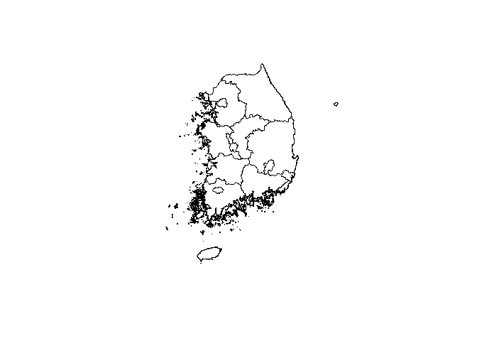
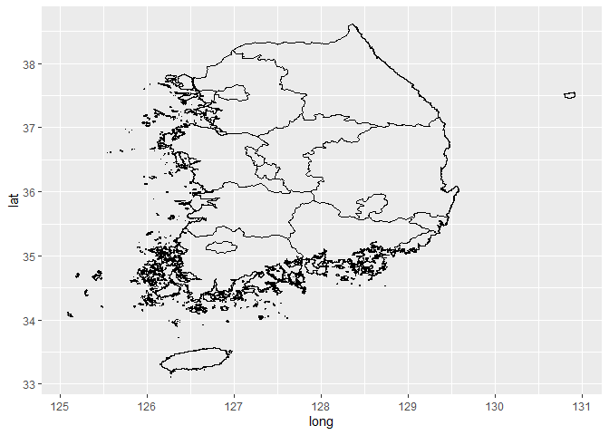
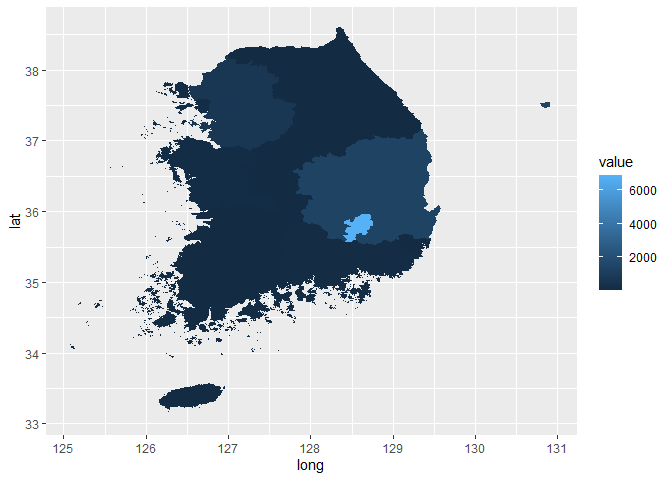

COVID-19 GIS
================

``` r
data <- read.csv("covid19.csv", header=TRUE)
```

``` r
View(data)
```

``` r
head(data)
```

    ##   num region covid_19  X
    ## 1   1   부산      144 NA
    ## 2   2   충북       56 NA
    ## 3   3   충남      144 NA
    ## 4   4   대구     6870 NA
    ## 5   5   대전       44 NA
    ## 6   6   강원       55 NA

``` r
str(data)
```

    ## 'data.frame':    17 obs. of  4 variables:
    ##  $ num     : int  1 2 3 4 5 6 7 8 9 10 ...
    ##  $ region  : Factor w/ 17 levels "강원","경기",..: 8 17 16 6 7 1 5 2 4 3 ...
    ##  $ covid_19: int  144 56 144 6870 44 55 30 721 1368 121 ...
    ##  $ X       : logi  NA NA NA NA NA NA ...

``` r
library(ggmap)
```

    ## Warning: package 'ggmap' was built under R version 3.6.2

    ## Loading required package: ggplot2

    ## Google's Terms of Service: https://cloud.google.com/maps-platform/terms/.

    ## Please cite ggmap if you use it! See citation("ggmap") for details.

``` r
library(maptools)
```

    ## Warning: package 'maptools' was built under R version 3.6.2

    ## Loading required package: sp

    ## Warning: package 'sp' was built under R version 3.6.3

    ## Checking rgeos availability: TRUE

``` r
library(sp)
library(ggplot2)
```

``` r
library(raster)
```

    ## Warning: package 'raster' was built under R version 3.6.3

``` r
library(rgeos)
```

    ## Warning: package 'rgeos' was built under R version 3.6.3

    ## rgeos version: 0.5-3, (SVN revision 634)
    ##  GEOS runtime version: 3.8.0-CAPI-1.13.1 
    ##  Linking to sp version: 1.4-2 
    ##  Polygon checking: TRUE

``` r
library(rgdal)
```

    ## Warning: package 'rgdal' was built under R version 3.6.3

    ## rgdal: version: 1.5-8, (SVN revision 990)
    ## Geospatial Data Abstraction Library extensions to R successfully loaded
    ## Loaded GDAL runtime: GDAL 3.0.4, released 2020/01/28
    ## Path to GDAL shared files: C:/Users/Choi Sung Wook/Documents/R/win-library/3.6/rgdal/gdal
    ## GDAL binary built with GEOS: TRUE 
    ## Loaded PROJ runtime: Rel. 6.3.1, February 10th, 2020, [PJ_VERSION: 631]
    ## Path to PROJ shared files: C:/Users/Choi Sung Wook/Documents/R/win-library/3.6/rgdal/proj
    ## Linking to sp version:1.4-2
    ## To mute warnings of possible GDAL/OSR exportToProj4() degradation,
    ## use options("rgdal_show_exportToProj4_warnings"="none") before loading rgdal.

``` r
korea <- readOGR("KOR_adm1.shp")
```

    ## OGR data source with driver: ESRI Shapefile 
    ## Source: "C:\Users\Choi Sung Wook\Desktop\기말-보건정보학\KOR_adm1.shp", layer: "KOR_adm1"
    ## with 17 features
    ## It has 12 fields
    ## Integer64 fields read as strings:  ID_0 ID_1 CCN_1

``` r
plot(korea)
```



``` r
korea_1 <- fortify(korea)
```

    ## Regions defined for each Polygons

``` r
korea_2 <- fortify(korea, region="NAME_1")
```

``` r
ggplot(korea_2, aes(x=long, y=lat, group=group)) + geom_path()
```



``` r
library(dplyr)
```

    ## Warning: package 'dplyr' was built under R version 3.6.3

    ## 
    ## Attaching package: 'dplyr'

    ## The following objects are masked from 'package:rgeos':
    ## 
    ##     intersect, setdiff, union

    ## The following objects are masked from 'package:raster':
    ## 
    ##     intersect, select, union

    ## The following objects are masked from 'package:stats':
    ## 
    ##     filter, lag

    ## The following objects are masked from 'package:base':
    ## 
    ##     intersect, setdiff, setequal, union

``` r
korea_2_value <- data.frame(
  korea_2 %>%
  select(id) %>%
  distinct,
  value = data$covid_19
)
```

``` r
korea_data <- korea_2 %>% left_join(korea_2_value)
```

    ## Joining, by = "id"

``` r
ggplot(korea_data, aes(x=long, y=lat, group=group)) + geom_polygon(aes(fill=value))
```


