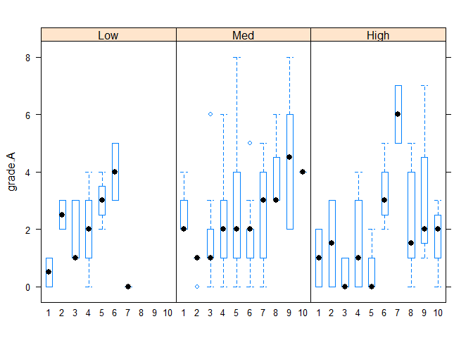
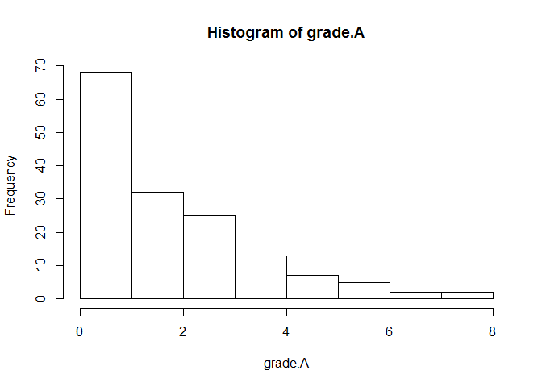
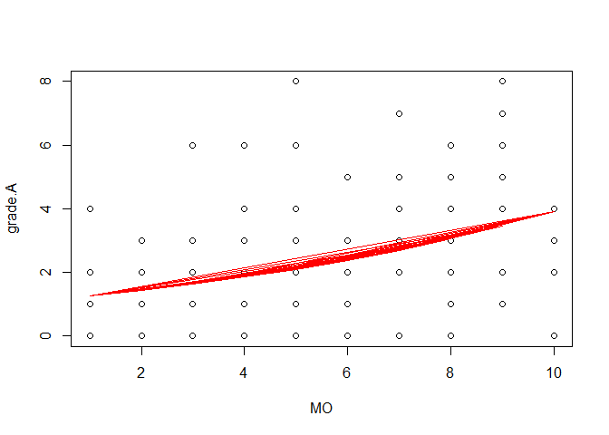

Mature oocytes, AMH, and Grade A embryo
================

``` r
location <- 'C:/Users/Choi Sung Wook/Desktop/Preprocessed.csv'
data <- read.csv(location, header=TRUE)
head(data)
```

    ##   class age cause  AMH Total.gonadotropin PO MO MO2 embryo.개수 grade.A
    ## 1     8  34                            NA 15 NA  NA           8       1
    ## 2     7  31       0.33               1650  1  0   1           1       0
    ## 3     8  31                            NA 20 NA  NA          12       2
    ## 4     1  39     3 1.25               1800  6  5   5           5       0
    ## 5     1  32     6  0.9               1950  9  7   8           4       0
    ## 6     8  32                            NA 19 NA  NA           9       1

데이터 전처리

``` r
df <- data[data$class <= 2, ]
str(df)
```

    ## 'data.frame':    214 obs. of  10 variables:
    ##  $ class             : int  1 1 1 1 1 1 1 1 1 1 ...
    ##  $ age               : Factor w/ 26 levels "","#REF!","23",..: 18 11 18 18 15 12 14 13 14 11 ...
    ##  $ cause             : Factor w/ 12 levels "","1","1,8","2",..: 5 10 12 10 7 7 7 7 7 2 ...
    ##  $ AMH               : Factor w/ 192 levels "","0.01","0.03",..: 63 52 55 49 99 102 132 167 179 147 ...
    ##  $ Total.gonadotropin: int  1800 1950 1500 1800 1800 1350 2700 1800 450 2100 ...
    ##  $ PO                : Factor w/ 30 levels "","0","1","10",..: 26 29 28 24 27 7 5 5 4 29 ...
    ##  $ MO                : int  5 7 3 1 6 5 7 3 8 7 ...
    ##  $ MO2               : int  5 8 5 3 6 7 8 7 8 9 ...
    ##  $ embryo.개수       : int  5 4 3 3 2 3 5 5 5 5 ...
    ##  $ grade.A           : int  0 0 0 0 0 0 0 0 0 0 ...

``` r
df_1 <- subset(df, !is.na(class))

df_1$age <- as.character(df_1$age)
df_1$age <- as.numeric(df_1$age)
```

    ## Warning: 강제형변환에 의해 생성된 NA 입니다

``` r
df_1$PO <- as.character(df_1$PO)
df_1$PO <- as.numeric(df_1$PO)
df_1$AMH <- as.character(df_1$AMH)
df_1$AMH <- as.numeric(df_1$AMH)

final <- subset(df_1, !is.na(AMH))
final$AMHgroup = cut(final$AMH, breaks=c(0,1,4,20),
                     labels=c("Low","Med","High"))
table(final$AMHgroup)
```

    ## 
    ##  Low  Med High 
    ##   27   85   42

``` r
str(final)
```

    ## 'data.frame':    154 obs. of  11 variables:
    ##  $ class             : int  1 1 1 1 1 1 1 1 1 1 ...
    ##  $ age               : num  39 32 39 39 36 33 35 34 35 32 ...
    ##  $ cause             : Factor w/ 12 levels "","1","1,8","2",..: 5 10 12 10 7 7 7 7 7 2 ...
    ##  $ AMH               : num  1.25 0.9 1.04 0.82 2.07 2.21 3.38 5.48 7.05 3.93 ...
    ##  $ Total.gonadotropin: int  1800 1950 1500 1800 1800 1350 2700 1800 450 2100 ...
    ##  $ PO                : num  6 9 8 4 7 13 11 11 10 9 ...
    ##  $ MO                : int  5 7 3 1 6 5 7 3 8 7 ...
    ##  $ MO2               : int  5 8 5 3 6 7 8 7 8 9 ...
    ##  $ embryo.개수       : int  5 4 3 3 2 3 5 5 5 5 ...
    ##  $ grade.A           : int  0 0 0 0 0 0 0 0 0 0 ...
    ##  $ AMHgroup          : Factor w/ 3 levels "Low","Med","High": 2 1 2 1 2 2 2 3 3 2 ...

``` r
head(final)
```

    ##    class age cause  AMH Total.gonadotropin PO MO MO2 embryo.개수 grade.A
    ## 4      1  39     3 1.25               1800  6  5   5           5       0
    ## 5      1  32     6 0.90               1950  9  7   8           4       0
    ## 9      1  39     8 1.04               1500  8  3   5           3       0
    ## 18     1  39     6 0.82               1800  4  1   3           3       0
    ## 20     1  36     4 2.07               1800  7  6   6           2       0
    ## 22     1  33     4 2.21               1350 13  5   7           3       0
    ##    AMHgroup
    ## 4       Med
    ## 5       Low
    ## 9       Med
    ## 18      Low
    ## 20      Med
    ## 22      Med

기술통계

``` r
attach(final)
library(lattice)
bwplot(grade.A ~ as.factor(MO)|AMHgroup, data=final)
```



``` r
library(doBy)
summaryBy(grade.A~AMHgroup, data=final, FUN=c(mean,sd))
```

    ##   AMHgroup grade.A.mean grade.A.sd
    ## 1      Low     1.888889   1.368136
    ## 2      Med     2.282353   1.855569
    ## 3     High     1.880952   1.940611

AMH group 에 따라 분산 차이 보이므로, 우선 변량계수모형으로 모델링

``` r
library(nlme)
final$AMHgroup <- as.numeric(final$AMHgroup)
model <- lme(grade.A ~ MO + AMHgroup + MO*AMHgroup,
             random=~1|AMHgroup, data=final, method="REML")
summary(model) # MO effect(sd), AMH effect(sd), each effects
```

    ## Linear mixed-effects model fit by REML
    ##  Data: final 
    ##        AIC      BIC    logLik
    ##   615.7478 633.8116 -301.8739
    ## 
    ## Random effects:
    ##  Formula: ~1 | AMHgroup
    ##          (Intercept) Residual
    ## StdDev: 0.0001182647 1.684035
    ## 
    ## Fixed effects: grade.A ~ MO + AMHgroup + MO * AMHgroup 
    ##                  Value Std.Error  DF    t-value p-value
    ## (Intercept)  0.4416880 1.0098813 149  0.4373662  0.6625
    ## MO           0.5169403 0.2218663 149  2.3299630  0.0212
    ## AMHgroup     0.0931454 0.4471460   1  0.2083109  0.8693
    ## MO:AMHgroup -0.0933650 0.0921978 149 -1.0126598  0.3129
    ##  Correlation: 
    ##             (Intr) MO     AMHgrp
    ## MO          -0.892              
    ## AMHgroup    -0.949  0.817       
    ## MO:AMHgroup  0.878 -0.962 -0.881
    ## 
    ## Standardized Within-Group Residuals:
    ##        Min         Q1        Med         Q3        Max 
    ## -2.0782592 -0.6938726 -0.1684733  0.6228450  3.3971804 
    ## 
    ## Number of Observations: 154
    ## Number of Groups: 3

``` r
random.effects(model) # AMH에 의한 차이의 크기
```

    ##     (Intercept)
    ## 1 -2.023891e-08
    ## 2  4.047783e-08
    ## 3 -2.023891e-08

``` r
anova(model) # AMH 의 변량절편(고정효과) 유의성 검정
```

    ##             numDF denDF   F-value p-value
    ## (Intercept)     1   149 240.36271  <.0001
    ## MO              1   149  22.59527  <.0001
    ## AMHgroup        1     1   2.09944  0.3846
    ## MO:AMHgroup     1   149   1.02548  0.3129

AMH 의 변량계수효과 없으므로, 일반화 선형 모형으로 적합

``` r
table(grade.A)
```

    ## grade.A
    ##  0  1  2  3  4  5  6  7  8 
    ## 30 38 32 25 13  7  5  2  2

``` r
hist(grade.A)
```



``` r
# 도수형 종속변수, 분포형태 고려 -> Poisson regression
library(qcc)
```

    ## Package 'qcc' version 2.7

    ## Type 'citation("qcc")' for citing this R package in publications.

``` r
qcc.overdispersion.test(grade.A, type="poisson")
```

    ##                    
    ## Overdispersion test Obs.Var/Theor.Var Statistic    p-value
    ##        poisson data          1.548132  236.8642 1.5968e-05

``` r
fit <- glm(grade.A~MO, data=final, family=quasipoisson)
summary(fit)
```

    ## 
    ## Call:
    ## glm(formula = grade.A ~ MO, family = quasipoisson, data = final)
    ## 
    ## Deviance Residuals: 
    ##     Min       1Q   Median       3Q      Max  
    ## -2.7964  -0.8491  -0.2510   0.7435   3.1001  
    ## 
    ## Coefficients:
    ##             Estimate Std. Error t value Pr(>|t|)    
    ## (Intercept)  0.11855    0.15453   0.767    0.444    
    ## MO           0.12450    0.02614   4.763 4.41e-06 ***
    ## ---
    ## Signif. codes:  0 '***' 0.001 '**' 0.01 '*' 0.05 '.' 0.1 ' ' 1
    ## 
    ## (Dispersion parameter for quasipoisson family taken to be 1.323084)
    ## 
    ##     Null deviance: 256.91  on 153  degrees of freedom
    ## Residual deviance: 227.82  on 152  degrees of freedom
    ## AIC: NA
    ## 
    ## Number of Fisher Scoring iterations: 5

grade.A = exp(0.11855 + 0.12450\*MO)

``` r
plot(MO, grade.A)
lines(MO, fit$fitted.values, col=2)
```



``` r
exp(0.1245) # 성숙난자가 1 증가할 때마다 고등급배아 13% 증가함
```

    ## [1] 1.132582

``` r
confint.default(fit)
```

    ##                   2.5 %    97.5 %
    ## (Intercept) -0.18431402 0.4214147
    ## MO           0.07326648 0.1757253

한편, 성숙난자가 아닌 총 난자로 적합시켜 보면..

``` r
fit_by_PO <- glm(grade.A~PO, data=final, family=quasipoisson)
summary(fit_by_PO)
```

    ## 
    ## Call:
    ## glm(formula = grade.A ~ PO, family = quasipoisson, data = final)
    ## 
    ## Deviance Residuals: 
    ##     Min       1Q   Median       3Q      Max  
    ## -2.4628  -0.8373  -0.1935   0.7077   2.9678  
    ## 
    ## Coefficients:
    ##             Estimate Std. Error t value Pr(>|t|)    
    ## (Intercept)  0.13606    0.19188   0.709 0.479333    
    ## PO           0.07487    0.02134   3.508 0.000593 ***
    ## ---
    ## Signif. codes:  0 '***' 0.001 '**' 0.01 '*' 0.05 '.' 0.1 ' ' 1
    ## 
    ## (Dispersion parameter for quasipoisson family taken to be 1.367928)
    ## 
    ##     Null deviance: 256.91  on 153  degrees of freedom
    ## Residual deviance: 240.26  on 152  degrees of freedom
    ## AIC: NA
    ## 
    ## Number of Fisher Scoring iterations: 5

모형 진단(Wald's test)

``` r
coef(summary(fit))
```

    ##              Estimate Std. Error   t value     Pr(>|t|)
    ## (Intercept) 0.1185503 0.15452547 0.7671896 4.441588e-01
    ## MO          0.1244959 0.02613793 4.7630350 4.413176e-06

``` r
coef <- coef(summary(fit))
1-pchisq((coef[2,1])^2/(coef[2,2])^2, 1)
```

    ## [1] 1.907027e-06
