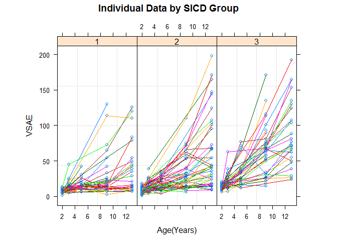
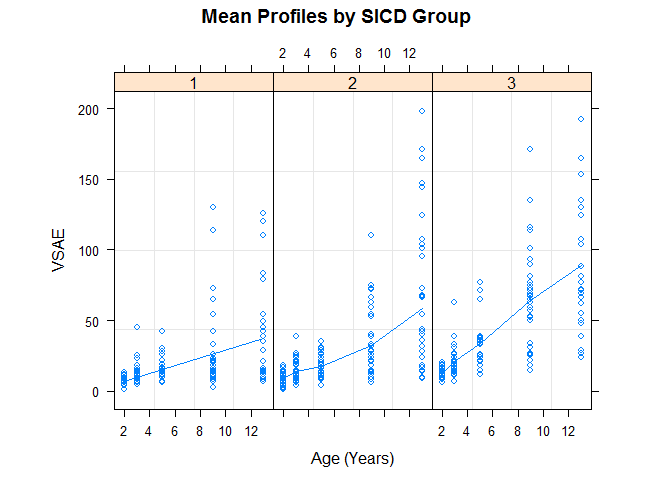
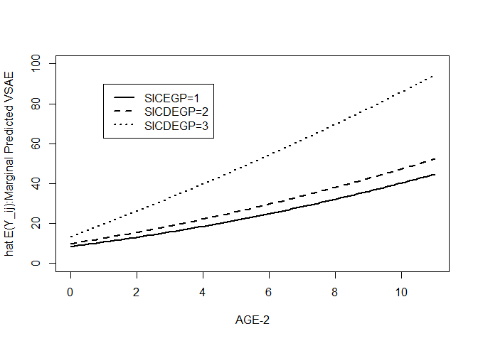
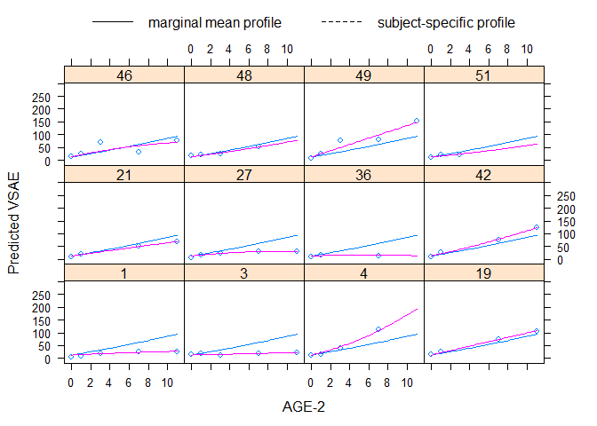
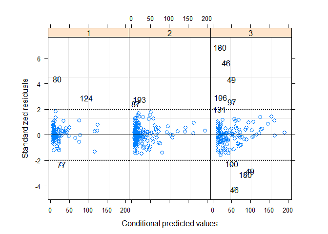
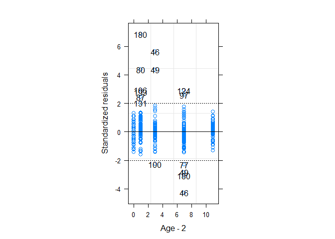
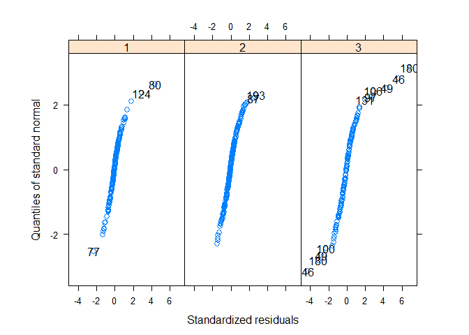
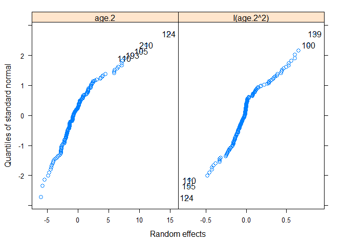
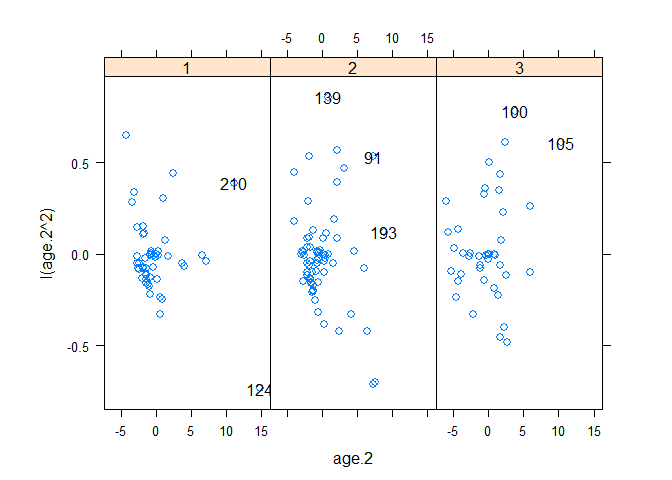
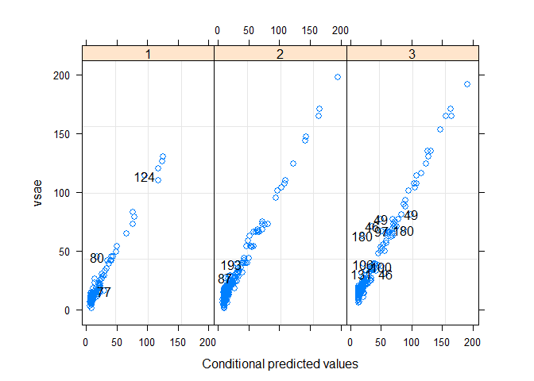

변량계수모형
================

``` r
autism <- read.csv("C:/Users/Choi Sung Wook/Desktop/autism.csv",
                   header=TRUE)
attach(autism)
head(autism)
```

    ##   age vsae sicdegp childid
    ## 1   2    6       3       1
    ## 2   3    7       3       1
    ## 3   5   18       3       1
    ## 4   9   25       3       1
    ## 5  13   27       3       1
    ## 6   2   17       3       3

기술통계

``` r
addmargins(table(sicdegp, age))
```

    ##        age
    ## sicdegp   2   3   5   9  13 Sum
    ##     1    50  48  29  37  28 192
    ##     2    66  64  36  48  41 255
    ##     3    40  38  26  35  26 165
    ##     Sum 156 150  91 120  95 612

``` r
library(Hmisc)
```

    ## Loading required package: lattice

    ## Loading required package: survival

    ## Loading required package: Formula

    ## Loading required package: ggplot2

    ## 
    ## Attaching package: 'Hmisc'

    ## The following objects are masked from 'package:base':
    ## 
    ##     format.pval, units

``` r
g <- function(x){c(N=length(x), MEAN=mean(x, na.rm=TRUE),
                   MEDIAN=median(x, na.rm=TRUE),
                   MIN=min(x, na.rm=TRUE),
                   Q=quantile(x, probs=c(0.25,0.75), na.rm=TRUE),
                   MAX=max(x, na.rm=TRUE), SD=sd(x, na.rm=TRUE),
                   options(digits=3))}

summarize(vsae, by=llist(sicdegp, age), g)
```

    ##    sicdegp age vsae  MEAN MEDIAN MIN Q.25. Q.75. MAX    SD digits
    ## 2        1   2   50  7.00    6.5   1   5.0   9.0  13  2.73      3
    ## 3        1   3   48 12.02   11.0   5   9.0  13.0  45  6.26      3
    ## 4        1   5   29 15.03   13.0   6  11.0  16.0  42  7.92      3
    ## 5        1   9   37 25.56   15.0   3  11.8  22.2 130 28.42      3
    ## 1        1  13   28 37.11   18.5   7  12.0  46.0 126 35.54      3
    ## 7        2   2   66  8.67    8.5   1   7.0  11.0  18  3.54      3
    ## 8        2   3   64 14.08   13.0   4  10.0  18.0  39  6.20      3
    ## 9        2   5   36 17.69   17.0   4  11.0  24.0  35  8.00      3
    ## 10       2   9   48 32.12   21.5   6  15.0  43.2 110 23.40      3
    ## 6        2  13   41 58.83   42.0   9  18.0  73.0 198 50.27      3
    ## 12       3   2   40 12.40   12.0   6  10.0  15.0  20  3.43      3
    ## 13       3   3   38 21.24   20.0   7  16.2  24.0  63  9.38      3
    ## 14       3   5   26 33.92   33.5  12  24.2  37.8  77 15.78      3
    ## 15       3   9   35 64.14   65.0  15  34.0  76.0 171 34.59      3
    ## 11       3  13   26 88.69   74.5  24  56.8 119.8 192 46.34      3

소통발달정도와 나이에 대한 범주형변수 생성

``` r
sicdegp.f <- factor(sicdegp)
age.f <- factor(age)
```

Add the new variables to a new data frame object.

``` r
autism.updated <- data.frame(autism, sicdegp.f, age.f)
library(lattice)
trellis.device(color=TRUE)
bwplot(vsae~age.f|sicdegp.f, aspect=2,
       data=autism.updated, na.rm=TRUE,
       ylab="VSAE", xlab="Age",
       main="Boxplots of VSAE for levels of SICDEGP by Age")
```

소통발달정도 수준별 나이에 따른 사회화정도 변화

``` r
library(nlme)
autism.g1 <- groupedData(vsae ~ age | childid,
                         outer = ~ sicdegp.f,
                         data = autism.updated)
plot(autism.g1, display = "childid", outer = TRUE,
     aspect=2, key=F, xlab="Age(Years)", ylab="VSAE",
     main = "Individual Data by SICD Group")
```



소통발달정도 각 수준에서 나이에 따른 사회화정도 평균 변화

``` r
autism.g2 <- groupedData(vsae ~ age | sicdegp.f,
                         order.groups=F, data=autism.updated)
plot(autism.g2, display="sicdegp", aspect=2, key= F,
     xlab="Age (Years)", ylab="VSAE",
     main="Mean Profiles by SICD Group")
```



최초모형 modeling

``` r
age.2 <- age - 2
autism.updated <- subset(data.frame(autism.updated, age.2),
                         !is.na(vsae))
```

변량계수 모형 자료준비

``` r
autism.grouped <- groupedData(vsae~age.2|childid,
                              data = autism.updated,
                              order.groups = F)
```

변량효과 구조 선택 model.1.fit &lt;- lme(vsae~age.2 + I(age.2^2) + sicdegp.f + age.2:sicdegp.f + I(age.2^2):sicdegp.f, random = ~1 + age.2 + I(age.2^2), method="REML", data=autism.grouped) Error message : estimation 안 된다 (convergence 안 돼서) 현재의 자료로 세 개의 random effect 있는 모형 못 세움. 따라서 세 변량효과 중 무엇인가를 제거해야 함 : 변량절편

``` r
model.2.fit <- lme(vsae ~ age.2 + I(age.2^2) + sicdegp.f +
                     age.2:sicdegp.f + I(age.2^2):sicdegp.f,
                   random = ~age.2 + I(age.2^2) -1,
                   method="REML", data=autism.grouped)
summary(model.2.fit)
```

    ## Linear mixed-effects model fit by REML
    ##  Data: autism.grouped 
    ##    AIC  BIC logLik
    ##   4641 4698  -2308
    ## 
    ## Random effects:
    ##  Formula: ~age.2 + I(age.2^2) - 1 | childid
    ##  Structure: General positive-definite, Log-Cholesky parametrization
    ##            StdDev Corr  
    ## age.2      3.830  age.2 
    ## I(age.2^2) 0.363  -0.317
    ## Residual   6.205        
    ## 
    ## Fixed effects: vsae ~ age.2 + I(age.2^2) + sicdegp.f + age.2:sicdegp.f + I(age.2^2):sicdegp.f 
    ##                       Value Std.Error  DF t-value p-value
    ## (Intercept)            8.35     0.735 446   11.36  0.0000
    ## age.2                  2.31     0.749 446    3.08  0.0022
    ## I(age.2^2)             0.07     0.079 446    0.88  0.3785
    ## sicdegp.f2             1.38     0.972 155    1.42  0.1582
    ## sicdegp.f3             5.42     1.093 155    4.95  0.0000
    ## age.2:sicdegp.f2       0.55     0.993 446    0.55  0.5800
    ## age.2:sicdegp.f3       3.30     1.092 446    3.02  0.0027
    ## I(age.2^2):sicdegp.f2  0.00     0.103 446    0.05  0.9621
    ## I(age.2^2):sicdegp.f3  0.13     0.113 446    1.19  0.2358
    ##  Correlation: 
    ##                       (Intr) age.2  I(g.2^2) scdg.2 scdg.3 a.2:.2 a.2:.3
    ## age.2                 -0.435                                            
    ## I(age.2^2)             0.326 -0.598                                     
    ## sicdegp.f2            -0.756  0.329 -0.246                              
    ## sicdegp.f3            -0.672  0.292 -0.219    0.509                     
    ## age.2:sicdegp.f2       0.328 -0.755  0.452   -0.435 -0.221              
    ## age.2:sicdegp.f3       0.299 -0.686  0.411   -0.226 -0.426  0.518       
    ## I(age.2^2):sicdegp.f2 -0.248  0.456 -0.762    0.325  0.167 -0.598 -0.313
    ## I(age.2^2):sicdegp.f3 -0.226  0.415 -0.694    0.171  0.321 -0.313 -0.592
    ##                       I(.2^2):.2
    ## age.2                           
    ## I(age.2^2)                      
    ## sicdegp.f2                      
    ## sicdegp.f3                      
    ## age.2:sicdegp.f2                
    ## age.2:sicdegp.f3                
    ## I(age.2^2):sicdegp.f2           
    ## I(age.2^2):sicdegp.f3  0.529    
    ## 
    ## Standardized Within-Group Residuals:
    ##     Min      Q1     Med      Q3     Max 
    ## -4.2235 -0.3794 -0.0501  0.2891  6.8864 
    ## 
    ## Number of Observations: 610
    ## Number of Groups: 158

age 에 대한 이차항을 없애보자

``` r
model.2a.fit <- update(model.2.fit, random=~age.2 - 1)
summary(model.2a.fit)
```

    ## Linear mixed-effects model fit by REML
    ##  Data: autism.grouped 
    ##    AIC  BIC logLik
    ##   4721 4770  -2350
    ## 
    ## Random effects:
    ##  Formula: ~age.2 - 1 | childid
    ##         age.2 Residual
    ## StdDev:  3.94     7.73
    ## 
    ## Fixed effects: vsae ~ age.2 + I(age.2^2) + sicdegp.f + age.2:sicdegp.f + I(age.2^2):sicdegp.f 
    ##                       Value Std.Error  DF t-value p-value
    ## (Intercept)            8.32     0.906 446    9.18  0.0000
    ## age.2                  2.35     0.811 446    2.90  0.0040
    ## I(age.2^2)             0.07     0.056 446    1.16  0.2477
    ## sicdegp.f2             1.44     1.199 155    1.20  0.2322
    ## sicdegp.f3             5.23     1.350 155    3.87  0.0002
    ## age.2:sicdegp.f2       0.31     1.074 446    0.29  0.7740
    ## age.2:sicdegp.f3       3.92     1.181 446    3.32  0.0010
    ## I(age.2^2):sicdegp.f2  0.04     0.074 446    0.55  0.5809
    ## I(age.2^2):sicdegp.f3  0.04     0.081 446    0.53  0.5973
    ##  Correlation: 
    ##                       (Intr) age.2  I(g.2^2) scdg.2 scdg.3 a.2:.2 a.2:.3
    ## age.2                 -0.466                                            
    ## I(age.2^2)             0.481 -0.653                                     
    ## sicdegp.f2            -0.756  0.352 -0.364                              
    ## sicdegp.f3            -0.671  0.313 -0.323    0.507                     
    ## age.2:sicdegp.f2       0.352 -0.755  0.493   -0.467 -0.236              
    ## age.2:sicdegp.f3       0.320 -0.687  0.449   -0.242 -0.461  0.519       
    ## I(age.2^2):sicdegp.f2 -0.368  0.499 -0.764    0.485  0.247 -0.654 -0.343
    ## I(age.2^2):sicdegp.f3 -0.337  0.458 -0.700    0.255  0.488 -0.346 -0.648
    ##                       I(.2^2):.2
    ## age.2                           
    ## I(age.2^2)                      
    ## sicdegp.f2                      
    ## sicdegp.f3                      
    ## age.2:sicdegp.f2                
    ## age.2:sicdegp.f3                
    ## I(age.2^2):sicdegp.f2           
    ## I(age.2^2):sicdegp.f3  0.535    
    ## 
    ## Standardized Within-Group Residuals:
    ##     Min      Q1     Med      Q3     Max 
    ## -3.6874 -0.3652 -0.0547  0.3170  5.5239 
    ## 
    ## Number of Observations: 610
    ## Number of Groups: 158

``` r
2*(-2308-(-2350))
```

    ## [1] 84

``` r
0.5*(1-pchisq(84,1)) + 0.5*(1-pchisq(84,2))
```

    ## [1] 0

p-value &lt; 0.001 이므로 age 이차항은 유지된다

고정효과 모형 선택 최고차항에 대한 유의성 검정부터 시작. age 의 이차항과 sicdegp 항 사이의 교호작용항

``` r
model.2.ml.fit <- update(model.2.fit, method="ML")
model.3.ml.fit <- update(model.2.ml.fit,
                         fixed= ~age.2+I(age.2^2)+sicdegp.f
                                + age.2:sicdegp.f)
anova(model.2.ml.fit, model.3.ml.fit)
```

    ##                Model df  AIC  BIC logLik   Test L.Ratio p-value
    ## model.2.ml.fit     1 13 4636 4694  -2305                       
    ## model.3.ml.fit     2 11 4634 4683  -2306 1 vs 2    1.87   0.393

p-value 0.393 이므로 간결성 원칙에 따라 H0(model3) 선택

한발 더 나아가서, age.2\*sicdegp 의 유의성도 검정

``` r
model.3a.ml.fit <- update(model.3.ml.fit,
                          fixed=~age.2+I(age.2^2)+sicdegp.f)
anova(model.3a.ml.fit, model.3.ml.fit)
```

    ##                 Model df  AIC  BIC logLik   Test L.Ratio p-value
    ## model.3a.ml.fit     1  9 4654 4693  -2318                       
    ## model.3.ml.fit      2 11 4634 4683  -2306 1 vs 2    23.4  <.0001

교호작용 age.2\*sicdegp 효과의 p-value &lt;0.0001 따라서 H1 채택, 즉 model.3 이 최종모형으로 선택됨

``` r
model.3.fit <- lme(vsae ~ age.2 + I(age.2^2) + sicdegp.f
                   + age.2:sicdegp.f, random=~age.2+I(age.2^2)-1,
                   method="REML", data=autism.grouped)
summary(model.3.fit)
```

    ## Linear mixed-effects model fit by REML
    ##  Data: autism.grouped 
    ##    AIC  BIC logLik
    ##   4634 4682  -2306
    ## 
    ## Random effects:
    ##  Formula: ~age.2 + I(age.2^2) - 1 | childid
    ##  Structure: General positive-definite, Log-Cholesky parametrization
    ##            StdDev Corr  
    ## age.2      3.811  age.2 
    ## I(age.2^2) 0.356  -0.306
    ## Residual   6.228        
    ## 
    ## Fixed effects: vsae ~ age.2 + I(age.2^2) + sicdegp.f + age.2:sicdegp.f 
    ##                  Value Std.Error  DF t-value p-value
    ## (Intercept)       8.48     0.709 448   11.95  0.0000
    ## age.2             2.08     0.648 448    3.21  0.0014
    ## I(age.2^2)        0.11     0.043 448    2.55  0.0112
    ## sicdegp.f2        1.36     0.922 155    1.48  0.1407
    ## sicdegp.f3        4.99     1.038 155    4.81  0.0000
    ## age.2:sicdegp.f2  0.57     0.796 448    0.72  0.4724
    ## age.2:sicdegp.f3  4.07     0.880 448    4.62  0.0000
    ##  Correlation: 
    ##                  (Intr) age.2  I(.2^2 scdg.2 scdg.3 a.2:.2
    ## age.2            -0.359                                   
    ## I(age.2^2)        0.188 -0.378                            
    ## sicdegp.f2       -0.742  0.221  0.002                     
    ## sicdegp.f3       -0.659  0.195  0.005  0.508              
    ## age.2:sicdegp.f2  0.234 -0.696 -0.006 -0.318 -0.161       
    ## age.2:sicdegp.f3  0.213 -0.632  0.000 -0.164 -0.309  0.514
    ## 
    ## Standardized Within-Group Residuals:
    ##     Min      Q1     Med      Q3     Max 
    ## -4.2652 -0.3975 -0.0545  0.2915  6.8467 
    ## 
    ## Number of Observations: 610
    ## Number of Groups: 158

``` r
intervals(model.3.fit)
```

    ## Approximate 95% confidence intervals
    ## 
    ##  Fixed effects:
    ##                    lower  est. upper
    ## (Intercept)       7.0816 8.476 9.870
    ## age.2             0.8068 2.081 3.355
    ## I(age.2^2)        0.0249 0.109 0.193
    ## sicdegp.f2       -0.4557 1.365 3.185
    ## sicdegp.f3        2.9374 4.988 7.038
    ## age.2:sicdegp.f2 -0.9919 0.573 2.137
    ## age.2:sicdegp.f3  2.3391 4.068 5.797
    ## attr(,"label")
    ## [1] "Fixed effects:"
    ## 
    ##  Random Effects:
    ##   Level: childid 
    ##                        lower   est.   upper
    ## sd(age.2)              3.195  3.811  4.5452
    ## sd(I(age.2^2))         0.289  0.356  0.4378
    ## cor(age.2,I(age.2^2)) -0.514 -0.306 -0.0649
    ## 
    ##  Within-group standard error:
    ## lower  est. upper 
    ##  5.77  6.23  6.72

``` r
curve(0.11*x^2 + 6.15*x + 13.47, 0, 11, xlab="AGE-2",
      ylab="hat E(Y_ij):Marginal Predicted VSAE",
      lty=3, ylim=c(0,100), lwd=2)
curve(0.11*x^2 + 2.65*x + 9.84, 0, 11,
      add=T, lty=2, lwd=2)
curve(0.11*x^2 + 2.08*x + 8.48, 0, 11,
      add=T, lty=1, lwd=2)
legend(1, 90, c("SICEGP=1", "SICDEGP=2", "SICDEGP=3"),
       lty=c(1,2,3), lwd=c(2,2,2))
```



주변부 공분산 행렬 Var(Yj) 의 추정치

``` r
getVarCov(model.3.fit, individual="1", type="marginal")
```

    ## childid 1 
    ## Marginal variance covariance matrix
    ##      1     2     3      4    5
    ## 1 38.8   0.0   0.0    0.0    0
    ## 2  0.0  52.6  39.7   84.6  120
    ## 3  0.0  39.7 157.3  273.6  425
    ## 4  0.0  84.6 273.6  769.4 1293
    ## 5  0.0 120.3 425.2 1293.0 2543
    ##   Standard Deviations: 6.23 7.25 12.5 27.7 50.4

개체별 예측 위해서는 변량효과 Uj 값을 알아야 함

``` r
random.effects(model.3.fit)
```

    ##       age.2 I(age.2^2)
    ## 1   -4.3551  -1.51e-01
    ## 2   -2.6515  -1.37e-02
    ## 3   -5.3824  -9.34e-02
    ## 4    2.3094   6.08e-01
    ## 6   -3.3757   2.84e-01
    ## 8   -0.2625  -9.68e-03
    ## 9    6.4407  -4.23e-01
    ## 10  -1.7842   1.05e-01
    ## 12  -2.7184   6.59e-03
    ## 13  -0.9110   8.65e-04
    ## 14  -2.0162   2.89e-01
    ## 15   0.2062  -9.95e-02
    ## 16   2.4741  -4.22e-01
    ## 17   0.1791   8.51e-02
    ## 18  -1.7708   3.62e-02
    ## 19   2.5256  -1.19e-01
    ## 21  -0.6661  -1.45e-01
    ## 22   1.7612  -1.50e-02
    ## 24   0.2103  -3.75e-02
    ## 27  -2.1671  -3.31e-01
    ## 28  -0.6580  -2.35e-02
    ## 30  -1.8087   5.33e-01
    ## 31   1.0135   3.07e-01
    ## 32  -0.8159  -5.28e-03
    ## 33  -1.4232  -2.09e-01
    ## 35  -0.6980   1.43e-02
    ## 36  -4.6616  -2.37e-01
    ## 37  -1.6028  -1.57e-01
    ## 38  -2.5363  -7.86e-02
    ## 39  -2.7185  -1.47e-01
    ## 40   4.1187  -3.31e-01
    ## 41   3.9922  -6.51e-02
    ## 42   1.7874   7.67e-02
    ## 43  -1.8807  -7.50e-02
    ## 44  -0.5371  -1.57e-01
    ## 45  -1.3544  -1.11e-01
    ## 46   2.2073  -4.03e-01
    ## 47  -0.2926   2.23e-02
    ## 48  -1.3378  -1.17e-02
    ## 49   5.9757  -1.02e-01
    ## 50  -3.1874   3.37e-01
    ## 51  -2.6985  -1.21e-02
    ## 55  -0.7902  -5.14e-02
    ## 57  -0.1781  -1.95e-02
    ## 58   1.6840   1.89e-01
    ## 59   0.6088  -3.29e-01
    ## 60  -4.2624   1.37e-01
    ## 61   0.0276  -7.42e-05
    ## 62  -0.0413  -2.92e-02
    ## 63  -1.3290   1.32e-01
    ## 64  -2.1028   8.72e-02
    ## 65  -2.2141  -5.27e-02
    ## 66  -1.3432  -1.38e-01
    ## 67  -1.6909  -1.34e-01
    ## 70  -1.9397  -1.32e-01
    ## 71   1.3006   7.58e-02
    ## 76   1.5363  -4.88e-02
    ## 77  -4.2721   6.49e-01
    ## 78  -4.8345   3.18e-02
    ## 80   7.1767  -4.26e-02
    ## 81  -1.8869   9.26e-02
    ## 82  -1.3700  -7.77e-02
    ## 85   0.8149  -2.19e-03
    ## 86  -0.6819   1.74e-03
    ## 87  -0.5317  -3.19e-01
    ## 88   0.3579  -7.32e-03
    ## 91   7.1937   5.33e-01
    ## 92  -3.0188  -1.60e-03
    ## 95   1.6757  -6.31e-02
    ## 96   2.0666   3.90e-01
    ## 97   1.6387  -4.58e-01
    ## 99  -1.3722  -1.17e-01
    ## 100  3.7290   7.82e-01
    ## 101  5.9325  -7.67e-02
    ## 104 -0.4539  -7.44e-02
    ## 105 10.3179   6.10e-01
    ## 106  1.0089  -4.94e-03
    ## 107  3.0550   4.67e-01
    ## 108  0.5262   1.12e-01
    ## 109 -2.7145  -5.25e-02
    ## 110  7.5304  -7.04e-01
    ## 111 -0.9373  -1.79e-01
    ## 112 -1.5470  -2.26e-02
    ## 113 -1.8837  -5.96e-02
    ## 114  0.0000   0.00e+00
    ## 115 -0.4842   3.56e-01
    ## 116 -1.6555  -1.59e-01
    ## 117 -1.1230  -1.64e-01
    ## 119 -2.1822   3.47e-02
    ## 120 -2.8135   1.27e-02
    ## 122  1.4417  -2.24e-01
    ## 123 -5.9941   2.85e-01
    ## 124 14.7972  -7.36e-01
    ## 126 -1.3068  -2.06e-01
    ## 128 -1.6623  -1.38e-01
    ## 129  0.3747  -7.67e-03
    ## 131 -1.2445  -7.76e-02
    ## 133 -2.6596   1.08e-03
    ## 134  0.5847  -2.36e-01
    ## 135 -2.6514   1.47e-01
    ## 136  5.8865   2.63e-01
    ## 139  0.8330   8.58e-01
    ## 141 -1.2597  -5.96e-02
    ## 142 -2.1548  -9.76e-02
    ## 143 -1.7716   1.51e-01
    ## 145 -1.6942  -4.13e-02
    ## 146 -0.8553  -9.35e-02
    ## 147 -2.1241  -9.89e-02
    ## 148 -1.3161  -1.70e-01
    ## 150  4.4966   1.74e-02
    ## 151  1.6915   4.34e-01
    ## 152 -2.6313  -8.04e-03
    ## 153  0.1396  -1.39e-01
    ## 154  0.7390   9.99e-04
    ## 155  7.2132  -7.12e-01
    ## 156  6.5348  -9.85e-03
    ## 158  0.8649  -1.86e-01
    ## 159 -0.7899   7.43e-03
    ## 161  3.6876  -4.95e-02
    ## 165 -1.4112  -9.94e-02
    ## 167 -0.7149   1.46e-02
    ## 168 -1.3514  -1.58e-01
    ## 169 -1.3011  -1.97e-01
    ## 170  0.3747  -7.67e-03
    ## 171  0.3001   1.44e-02
    ## 172 -1.8347  -7.97e-02
    ## 173 -0.4299   8.80e-03
    ## 174  2.0872   2.27e-01
    ## 175  0.3633  -2.28e-02
    ## 178  2.1602   8.41e-02
    ## 179 -2.4434  -8.52e-02
    ## 180  0.1379   4.99e-01
    ## 181  0.3247  -3.82e-01
    ## 182 -3.8539  -1.12e-01
    ## 183  2.7187  -4.80e-01
    ## 184 -0.8377  -1.28e-01
    ## 185 -1.6502   1.13e-01
    ## 186  0.8485  -2.47e-01
    ## 187  2.3679   4.41e-01
    ## 190 -0.5597   3.24e-01
    ## 191 -2.1648  -1.18e-01
    ## 193  8.8656   1.19e-01
    ## 194  0.1065  -2.18e-03
    ## 195 -0.3495  -6.04e-03
    ## 196 -1.0601  -2.51e-01
    ## 197 -0.8500  -2.18e-01
    ## 198 -3.6809   4.42e-03
    ## 200 -0.7149   1.46e-02
    ## 201  1.5383   3.48e-01
    ## 202 -2.3842  -5.08e-02
    ## 204 -0.7980  -3.36e-02
    ## 205 -4.0637   4.46e-01
    ## 207 -5.7362   1.21e-01
    ## 208  0.1065  -2.18e-03
    ## 209 -3.9410   1.79e-01
    ## 210 11.1175   3.87e-01
    ## 211  0.0000   0.00e+00
    ## 212  2.0885   5.65e-01

sicdegp=3 의 첫 12명에서 예측값 비교(파란선=예측값)

``` r
plot(augPred(model.3.fit, level=0:1), layout=c(4,3,1),
     xlab="AGE-2", ylab="Predicted VSAE",
     key=list(lines=list(lty=c(1,2), col=c(1,1), lwd=c(1,1)),
              text=list(c("marginal mean profile",
                          "subject-specific profile")),
              columns=2))
```



잔차진단 조건부 예측값 vs 표준화 조건부 잔차

``` r
plot(model.3.fit, resid(., type="p")~fitted(.)|factor(sicdegp),
     xlab="Conditional predicted values", layout=c(3,1),
     aspect=2, abline=c(0,2,-2), lty=c(1,3,3), id=0.05)
```



age.2 vs 표준화 조건부 잔차

``` r
plot(model.3.fit, resid(., type="p")~age.2,
     xlab="Age - 2", aspect=2,
     abline=c(0,2,-2), lty=c(1,3,3), id=0.05)
```



표준화 조건부 잔차에 대한 Normal Q-Q plots

``` r
qqnorm(model.3.fit, ~resid(., type="p")|factor(sicdegp),
       layout=c(3,1), aspect=2, id=0.05)
```



변량효과에 대한 진단 변량효과에 대한 Normal Q-Q plots

``` r
qqnorm(model.3.fit, ~ranef(.), id=0.05)
```



변량효과 예측값들 간의 산점도

``` r
pairs(model.3.fit, ~ranef(.)|factor(sicdegp),
      layout=c(3,1), aspect=2, id=0.05)
```



조건부 예측값 vs 관측값

``` r
plot(model.3.fit, vsae~fitted(.)|factor(sicdegp),
     xlab="Conditional predicted values",
     layout=c(3,1), aspect=2, id=0.05)
```



영향력 진단 46번, 124번, 180번 개체의 영향력 진단

``` r
autism.grouped2 <- autism.grouped[(autism.grouped$childid!=46
                                   & autism.grouped$childid!=124
                                   & autism.grouped$childid!=180),]
model.3.fit.out <- update(model.3.fit, data=autism.grouped2)
summary(model.3.fit.out)
```

    ## Linear mixed-effects model fit by REML
    ##  Data: autism.grouped2 
    ##    AIC  BIC logLik
    ##   4385 4433  -2181
    ## 
    ## Random effects:
    ##  Formula: ~age.2 + I(age.2^2) - 1 | childid
    ##  Structure: General positive-definite, Log-Cholesky parametrization
    ##            StdDev Corr  
    ## age.2      3.568  age.2 
    ## I(age.2^2) 0.366  -0.253
    ## Residual   5.122        
    ## 
    ## Fixed effects: vsae ~ age.2 + I(age.2^2) + sicdegp.f + age.2:sicdegp.f 
    ##                  Value Std.Error  DF t-value p-value
    ## (Intercept)       8.52     0.594 439   14.35  0.0000
    ## age.2             1.72     0.608 439    2.84  0.0048
    ## I(age.2^2)        0.12     0.041 439    2.78  0.0056
    ## sicdegp.f2        1.32     0.772 152    1.70  0.0906
    ## sicdegp.f3        4.20     0.881 152    4.77  0.0000
    ## age.2:sicdegp.f2  0.94     0.760 439    1.24  0.2144
    ## age.2:sicdegp.f3  4.41     0.852 439    5.18  0.0000
    ##  Correlation: 
    ##                  (Intr) age.2  I(.2^2 scdg.2 scdg.3 a.2:.2
    ## age.2            -0.349                                   
    ## I(age.2^2)        0.169 -0.322                            
    ## sicdegp.f2       -0.747  0.227  0.000                     
    ## sicdegp.f3       -0.654  0.198  0.003  0.504              
    ## age.2:sicdegp.f2  0.235 -0.716 -0.004 -0.317 -0.159       
    ## age.2:sicdegp.f3  0.211 -0.640  0.001 -0.162 -0.306  0.512
    ## 
    ## Standardized Within-Group Residuals:
    ##     Min      Q1     Med      Q3     Max 
    ## -3.5642 -0.4286 -0.0373  0.3336  5.2651 
    ## 
    ## Number of Observations: 598
    ## Number of Groups: 155

``` r
intervals(model.3.fit.out)
```

    ## Approximate 95% confidence intervals
    ## 
    ##  Fixed effects:
    ##                    lower  est. upper
    ## (Intercept)       7.3573 8.525 9.692
    ## age.2             0.5295 1.724 2.919
    ## I(age.2^2)        0.0339 0.115 0.197
    ## sicdegp.f2       -0.2105 1.315 2.841
    ## sicdegp.f3        2.4623 4.203 5.944
    ## age.2:sicdegp.f2 -0.5487 0.945 2.438
    ## age.2:sicdegp.f3  2.7338 4.407 6.081
    ## attr(,"label")
    ## [1] "Fixed effects:"
    ## 
    ##  Random Effects:
    ##   Level: childid 
    ##                        lower   est.   upper
    ## sd(age.2)              3.021  3.568  4.2135
    ## sd(I(age.2^2))         0.303  0.366  0.4427
    ## cor(age.2,I(age.2^2)) -0.454 -0.253 -0.0269
    ## 
    ##  Within-group standard error:
    ## lower  est. upper 
    ##  4.74  5.12  5.53
