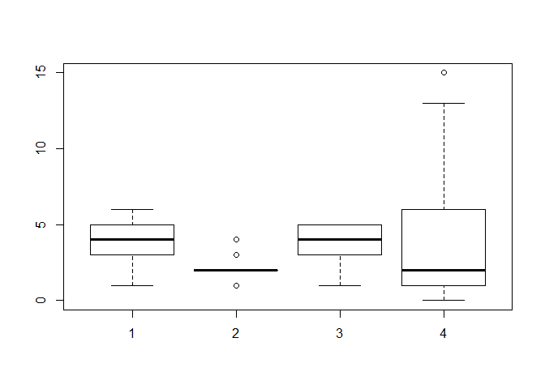
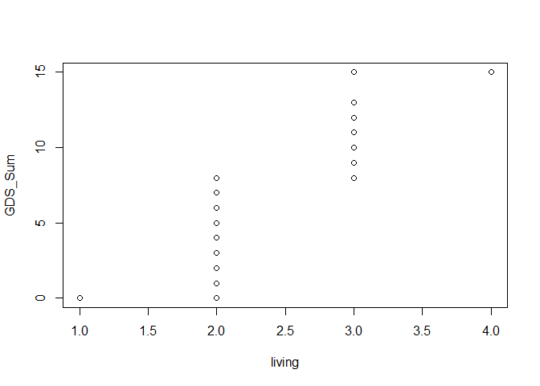
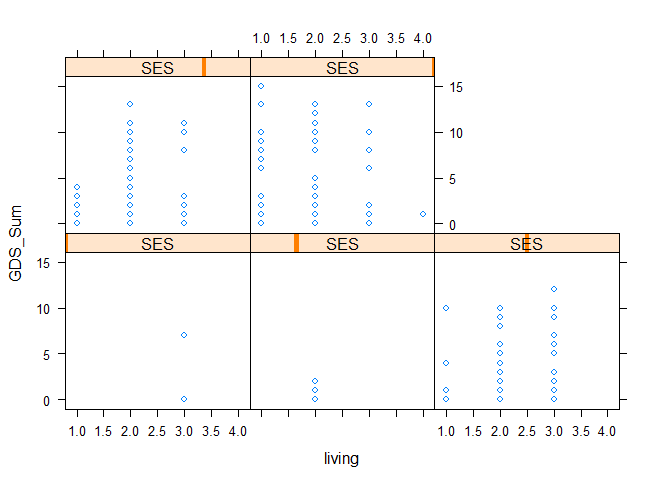
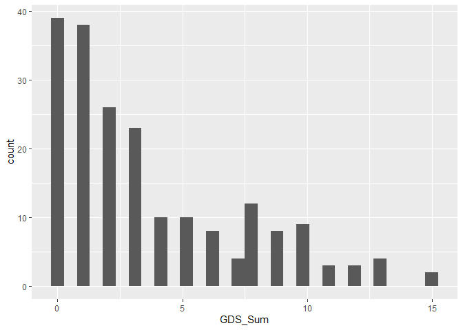
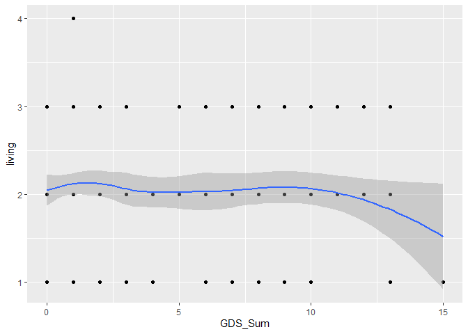
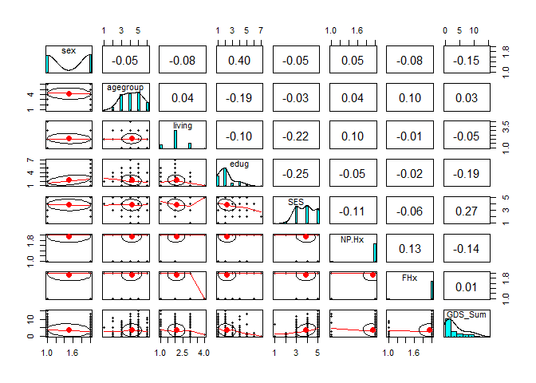

데이터 시각화
================

``` r
data <- read.csv("만성신체질환-2.csv", header=TRUE)
```

``` r
View(data)
```

``` r
attach(data)
```

``` r
str(data)
```

    ## 'data.frame':    199 obs. of  8 variables:
    ##  $ sex     : int  1 2 2 2 1 1 1 1 2 2 ...
    ##  $ agegroup: int  4 4 3 3 4 3 4 3 5 6 ...
    ##  $ living  : int  1 2 2 2 1 2 2 2 2 2 ...
    ##  $ edug    : int  1 4 4 4 1 1 5 3 1 2 ...
    ##  $ SES     : int  5 3 4 5 5 5 4 3 4 4 ...
    ##  $ NP.Hx   : int  2 2 2 2 2 2 1 2 2 2 ...
    ##  $ FHx     : int  1 2 2 2 2 2 2 2 1 2 ...
    ##  $ GDS_Sum : int  0 1 0 2 9 5 13 4 9 0 ...

``` r
boxplot(agegroup, living, SES, GDS_Sum)
```



``` r
qqplot(living, GDS_Sum)
```



``` r
library(lattice)
```

``` r
xyplot(GDS_Sum ~ living|SES)
```



``` r
library(ggplot2)
```

``` r
ggplot(data=data) + geom_histogram(mapping=aes(x=GDS_Sum))
```

    ## `stat_bin()` using `bins = 30`. Pick better value with `binwidth`.



``` r
ggplot(data=data, mapping=aes(x=GDS_Sum, y=living)) + geom_point() + geom_smooth()
```

    ## `geom_smooth()` using method = 'loess' and formula 'y ~ x'



``` r
library(psych)
```

    ## Warning: package 'psych' was built under R version 3.6.2

    ## 
    ## Attaching package: 'psych'

    ## The following objects are masked from 'package:ggplot2':
    ## 
    ##     %+%, alpha

``` r
pairs.panels(data)
```


