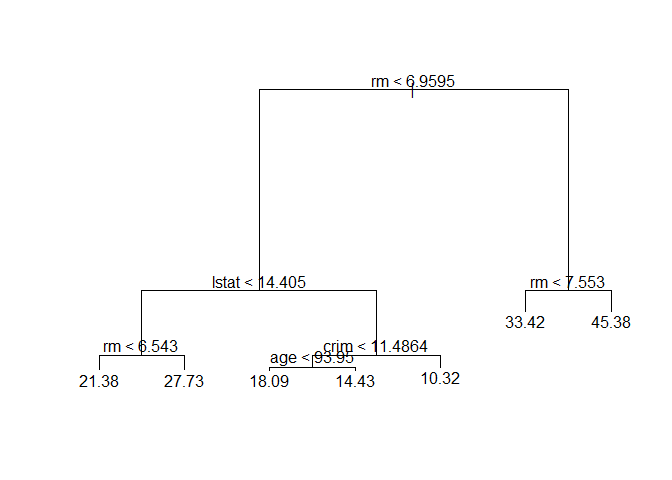
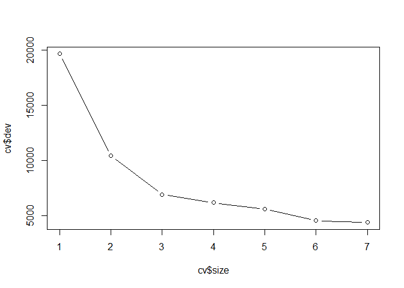
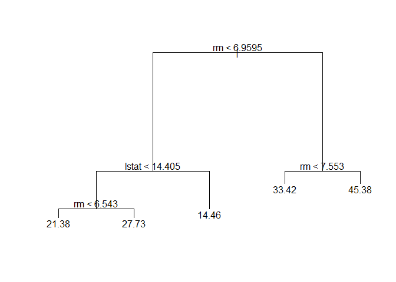
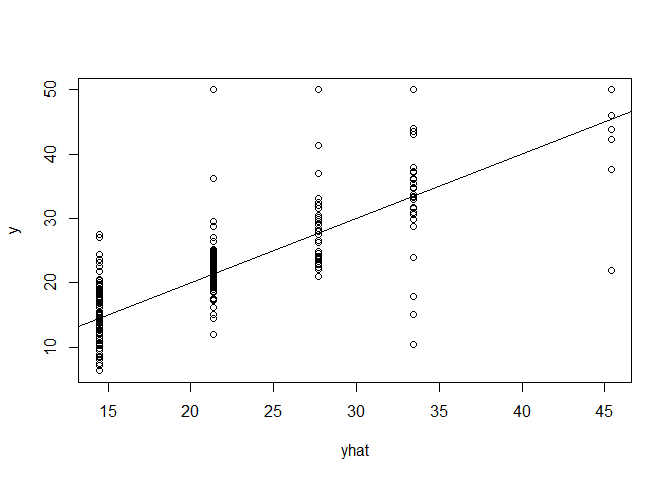
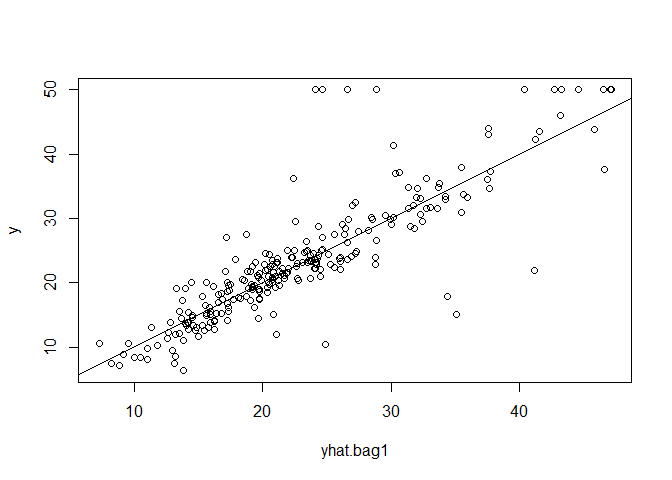
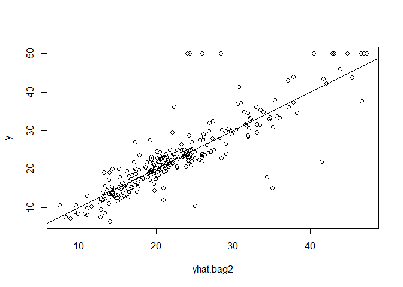
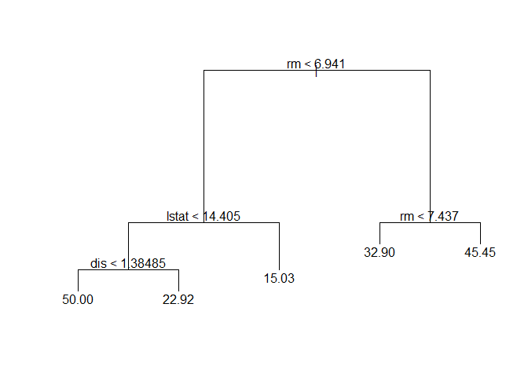
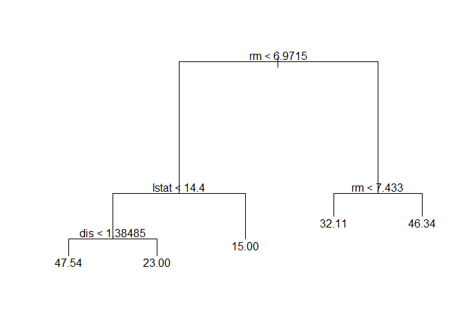

Regression tree - Bootstraping & Pruning
================

``` r
library(MASS)
data(Boston)
head(Boston)
```

    ##      crim zn indus chas   nox    rm  age    dis rad tax ptratio  black lstat
    ## 1 0.00632 18  2.31    0 0.538 6.575 65.2 4.0900   1 296    15.3 396.90  4.98
    ## 2 0.02731  0  7.07    0 0.469 6.421 78.9 4.9671   2 242    17.8 396.90  9.14
    ## 3 0.02729  0  7.07    0 0.469 7.185 61.1 4.9671   2 242    17.8 392.83  4.03
    ## 4 0.03237  0  2.18    0 0.458 6.998 45.8 6.0622   3 222    18.7 394.63  2.94
    ## 5 0.06905  0  2.18    0 0.458 7.147 54.2 6.0622   3 222    18.7 396.90  5.33
    ## 6 0.02985  0  2.18    0 0.458 6.430 58.7 6.0622   3 222    18.7 394.12  5.21
    ##   medv
    ## 1 24.0
    ## 2 21.6
    ## 3 34.7
    ## 4 33.4
    ## 5 36.2
    ## 6 28.7

``` r
str(Boston)
```

    ## 'data.frame':    506 obs. of  14 variables:
    ##  $ crim   : num  0.00632 0.02731 0.02729 0.03237 0.06905 ...
    ##  $ zn     : num  18 0 0 0 0 0 12.5 12.5 12.5 12.5 ...
    ##  $ indus  : num  2.31 7.07 7.07 2.18 2.18 2.18 7.87 7.87 7.87 7.87 ...
    ##  $ chas   : int  0 0 0 0 0 0 0 0 0 0 ...
    ##  $ nox    : num  0.538 0.469 0.469 0.458 0.458 0.458 0.524 0.524 0.524 0.524 ...
    ##  $ rm     : num  6.58 6.42 7.18 7 7.15 ...
    ##  $ age    : num  65.2 78.9 61.1 45.8 54.2 58.7 66.6 96.1 100 85.9 ...
    ##  $ dis    : num  4.09 4.97 4.97 6.06 6.06 ...
    ##  $ rad    : int  1 2 2 3 3 3 5 5 5 5 ...
    ##  $ tax    : num  296 242 242 222 222 222 311 311 311 311 ...
    ##  $ ptratio: num  15.3 17.8 17.8 18.7 18.7 18.7 15.2 15.2 15.2 15.2 ...
    ##  $ black  : num  397 397 393 395 397 ...
    ##  $ lstat  : num  4.98 9.14 4.03 2.94 5.33 ...
    ##  $ medv   : num  24 21.6 34.7 33.4 36.2 28.7 22.9 27.1 16.5 18.9 ...

``` r
set.seed(1)
train <- sample(1:nrow(Boston), nrow(Boston)/2)

library(tree)
tree <- tree(medv~., Boston, subset=train)

plot(tree)
text(tree)
```



``` r
cv <- cv.tree(tree)
plot(cv$size, cv$dev, type='b')
```



``` r
prune <- prune.tree(tree, best=5)
plot(prune)
text(prune)
```



``` r
yhat <- predict(prune, newdata=Boston[-train,])
y <- Boston[-train,"medv"]
plot(yhat, y)
abline(0,1)
```



``` r
mean((yhat-y)^2)
```

    ## [1] 35.90102

``` r
library(randomForest)
```

    ## randomForest 4.6-14

    ## Type rfNews() to see new features/changes/bug fixes.

``` r
set.seed(123)
bag1 <- randomForest(medv~., data=Boston, subset=train,
                     mtry=13, importance=TRUE)
bag1
```

    ## 
    ## Call:
    ##  randomForest(formula = medv ~ ., data = Boston, mtry = 13, importance = TRUE,      subset = train) 
    ##                Type of random forest: regression
    ##                      Number of trees: 500
    ## No. of variables tried at each split: 13
    ## 
    ##           Mean of squared residuals: 11.16606
    ##                     % Var explained: 85.47

``` r
yhat.bag1 <- predict(bag1, newdata=Boston[-train,])
plot(yhat.bag1, y)
abline(0,1)
```



``` r
mean((yhat.bag1-y)^2)
```

    ## [1] 23.3266

``` r
set.seed(1234)
bag2 <- randomForest(medv~., data=Boston, subset=train,
                     mtry=13, importance=TRUE)
bag2
```

    ## 
    ## Call:
    ##  randomForest(formula = medv ~ ., data = Boston, mtry = 13, importance = TRUE,      subset = train) 
    ##                Type of random forest: regression
    ##                      Number of trees: 500
    ## No. of variables tried at each split: 13
    ## 
    ##           Mean of squared residuals: 11.50754
    ##                     % Var explained: 85.03

``` r
yhat.bag2 <- predict(bag2, newdata=Boston[-train,])
plot(yhat.bag2, y)
abline(0,1)
```



``` r
mean((yhat.bag2-y)^2)
```

    ## [1] 23.5938

``` r
set.seed(12)
library(dplyr)
```

    ## 
    ## Attaching package: 'dplyr'

    ## The following object is masked from 'package:randomForest':
    ## 
    ##     combine

    ## The following object is masked from 'package:MASS':
    ## 
    ##     select

    ## The following objects are masked from 'package:stats':
    ## 
    ##     filter, lag

    ## The following objects are masked from 'package:base':
    ## 
    ##     intersect, setdiff, setequal, union

``` r
boot1 <- sample_n(Boston, 1000, replace=TRUE)
head(boot1)
```

    ##      crim zn indus chas   nox    rm  age    dis rad tax ptratio  black lstat
    ## 1 7.52601  0 18.10    0 0.713 6.417 98.3 2.1850  24 666    20.2 304.21 19.31
    ## 2 0.03113  0  4.39    0 0.442 6.014 48.5 8.0136   3 352    18.8 385.64 10.53
    ## 3 0.03961  0  5.19    0 0.515 6.037 34.5 5.9853   5 224    20.2 396.90  8.01
    ## 4 0.33983 22  5.86    0 0.431 6.108 34.9 8.0555   7 330    19.1 390.18  9.16
    ## 5 0.06162  0  4.39    0 0.442 5.898 52.3 8.0136   3 352    18.8 364.61 12.67
    ## 6 0.09178  0  4.05    0 0.510 6.416 84.1 2.6463   5 296    16.6 395.50  9.04
    ##   medv
    ## 1 13.0
    ## 2 17.5
    ## 3 21.1
    ## 4 24.3
    ## 5 17.2
    ## 6 23.6

``` r
bagging1 <- tree(medv~., boot1)
prune1 <- prune.tree(bagging1, best=5)
plot(prune1)
text(prune1)
```



``` r
summary(prune1, data=Boston)
```

    ## 
    ## Regression tree:
    ## snip.tree(tree = bagging1, nodes = c(7L, 6L, 5L, 9L))
    ## Variables actually used in tree construction:
    ## [1] "rm"    "lstat" "dis"  
    ## Number of terminal nodes:  5 
    ## Residual mean deviance:  19.44 = 19340 / 995 
    ## Distribution of residuals:
    ##      Min.   1st Qu.    Median      Mean   3rd Qu.      Max. 
    ## -23.55000  -2.51600  -0.01551   0.00000   2.50300  17.10000

``` r
set.seed(12345)
boot2 <- sample_n(Boston, 1000, replace=TRUE)
```

``` r
bagging2 <- tree(medv~., boot2)
prune2 <- prune.tree(bagging2, best=5)
plot(prune2)
text(prune2)
```



``` r
summary(prune2, data=Boston)
```

    ## 
    ## Regression tree:
    ## snip.tree(tree = bagging2, nodes = c(5L, 9L))
    ## Variables actually used in tree construction:
    ## [1] "rm"    "lstat" "dis"  
    ## Number of terminal nodes:  5 
    ## Residual mean deviance:  17.73 = 17640 / 995 
    ## Distribution of residuals:
    ##     Min.  1st Qu.   Median     Mean  3rd Qu.     Max. 
    ## -19.6400  -2.4040  -0.1043   0.0000   2.4580  18.3000
