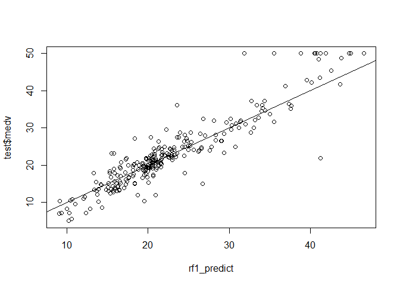
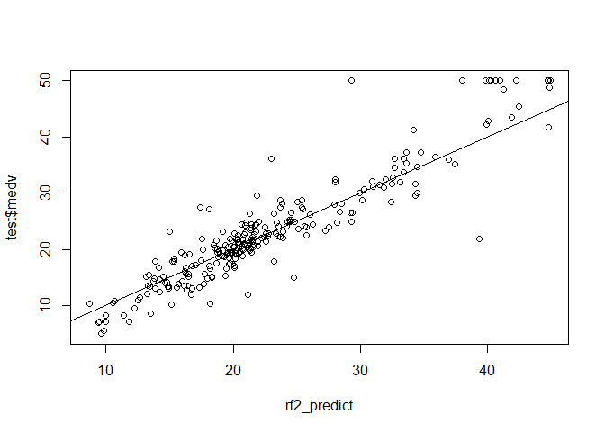

Big data analysis hw 7
================

``` r
library(MASS)
data(Boston)
head(Boston)
```

    ##      crim zn indus chas   nox    rm  age    dis rad tax ptratio  black lstat
    ## 1 0.00632 18  2.31    0 0.538 6.575 65.2 4.0900   1 296    15.3 396.90  4.98
    ## 2 0.02731  0  7.07    0 0.469 6.421 78.9 4.9671   2 242    17.8 396.90  9.14
    ## 3 0.02729  0  7.07    0 0.469 7.185 61.1 4.9671   2 242    17.8 392.83  4.03
    ## 4 0.03237  0  2.18    0 0.458 6.998 45.8 6.0622   3 222    18.7 394.63  2.94
    ## 5 0.06905  0  2.18    0 0.458 7.147 54.2 6.0622   3 222    18.7 396.90  5.33
    ## 6 0.02985  0  2.18    0 0.458 6.430 58.7 6.0622   3 222    18.7 394.12  5.21
    ##   medv
    ## 1 24.0
    ## 2 21.6
    ## 3 34.7
    ## 4 33.4
    ## 5 36.2
    ## 6 28.7

``` r
train <- sample(1:nrow(Boston), nrow(Boston)/2)
test <- Boston[-train,]

library(randomForest)
```

    ## randomForest 4.6-14

    ## Type rfNews() to see new features/changes/bug fixes.

``` r
rf1 <- randomForest(medv~., data=Boston, subset=train,
                    mtry=6, ntree=25, importance=TRUE)
rf1
```

    ## 
    ## Call:
    ##  randomForest(formula = medv ~ ., data = Boston, mtry = 6, ntree = 25,      importance = TRUE, subset = train) 
    ##                Type of random forest: regression
    ##                      Number of trees: 25
    ## No. of variables tried at each split: 6
    ## 
    ##           Mean of squared residuals: 13.45816
    ##                     % Var explained: 82.64

``` r
rf2 <- randomForest(medv~., data=Boston, subset=train,
                    mtry=6, ntree=500, importance=TRUE)
rf2
```

    ## 
    ## Call:
    ##  randomForest(formula = medv ~ ., data = Boston, mtry = 6, ntree = 500,      importance = TRUE, subset = train) 
    ##                Type of random forest: regression
    ##                      Number of trees: 500
    ## No. of variables tried at each split: 6
    ## 
    ##           Mean of squared residuals: 12.21821
    ##                     % Var explained: 84.24

``` r
rf1_predict <- predict(rf1, newdata=test)
plot(rf1_predict, test$medv)
abline(0,1)
```



``` r
rf2_predict <- predict(rf2, newdata=test)
plot(rf2_predict, test$medv)
abline(0,1)
```



``` r
mean((rf1_predict - test$medv)^2)
```

    ## [1] 14.15296

``` r
mean((rf2_predict - test$medv)^2)
```

    ## [1] 13.69235
