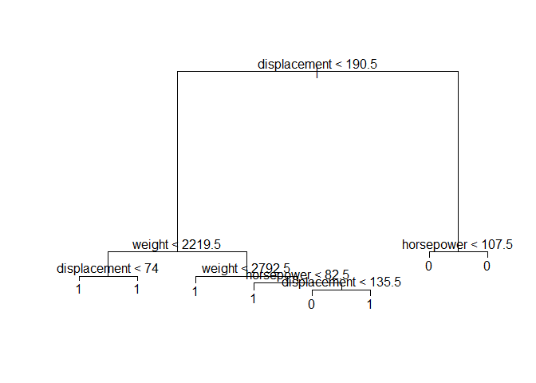
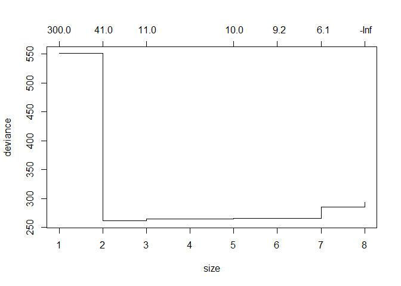

auto MPG data analysis using CART algorithm
================

``` r
auto <- read.table("auto.txt", sep=",", header=TRUE)
head(auto)
```

    ##   mpg cylinders displacement horsepower weight acceleration model.year
    ## 1  18         8          307        130   3504         12.0         70
    ## 2  15         8          350        165   3693         11.5         70
    ## 3  18         8          318        150   3436         11.0         70
    ## 4  16         8          304        150   3433         12.0         70
    ## 5  17         8          302        140   3449         10.5         70
    ## 6  15         8          429        198   4341         10.0         70

``` r
auto <- na.omit(auto)
str(auto)
```

    ## 'data.frame':    396 obs. of  7 variables:
    ##  $ mpg         : num  18 15 18 16 17 15 14 14 14 15 ...
    ##  $ cylinders   : int  8 8 8 8 8 8 8 8 8 8 ...
    ##  $ displacement: num  307 350 318 304 302 429 454 440 455 390 ...
    ##  $ horsepower  : int  130 165 150 150 140 198 220 215 225 190 ...
    ##  $ weight      : int  3504 3693 3436 3433 3449 4341 4354 4312 4425 3850 ...
    ##  $ acceleration: num  12 11.5 11 12 10.5 10 9 8.5 10 8.5 ...
    ##  $ model.year  : int  70 70 70 70 70 70 70 70 70 70 ...
    ##  - attr(*, "na.action")= 'omit' Named int [1:2] 33 127
    ##   ..- attr(*, "names")= chr [1:2] "33" "127"

``` r
fit <- lm(mpg ~ cylinders+displacement 
          +horsepower+weight, data=auto)
summary(fit)
```

    ## 
    ## Call:
    ## lm(formula = mpg ~ cylinders + displacement + horsepower + weight, 
    ##     data = auto)
    ## 
    ## Residuals:
    ##      Min       1Q   Median       3Q      Max 
    ## -11.5744  -2.8195  -0.3566   2.2906  16.2448 
    ## 
    ## Coefficients:
    ##                Estimate Std. Error t value Pr(>|t|)    
    ## (Intercept)  45.8813989  1.5233166  30.119  < 2e-16 ***
    ## cylinders    -0.3457043  0.4084736  -0.846  0.39789    
    ## displacement -0.0002446  0.0090369  -0.027  0.97842    
    ## horsepower   -0.0421937  0.0129007  -3.271  0.00117 ** 
    ## weight       -0.0053933  0.0007145  -7.548 3.13e-13 ***
    ## ---
    ## Signif. codes:  0 '***' 0.001 '**' 0.01 '*' 0.05 '.' 0.1 ' ' 1
    ## 
    ## Residual standard error: 4.257 on 391 degrees of freedom
    ## Multiple R-squared:  0.7077, Adjusted R-squared:  0.7047 
    ## F-statistic: 236.7 on 4 and 391 DF,  p-value: < 2.2e-16

``` r
median(auto$mpg)
```

    ## [1] 23

``` r
auto$mpg01 <- ifelse(auto$mpg>23, 1, 0)
head(auto,20)
```

    ##    mpg cylinders displacement horsepower weight acceleration model.year mpg01
    ## 1   18         8          307        130   3504         12.0         70     0
    ## 2   15         8          350        165   3693         11.5         70     0
    ## 3   18         8          318        150   3436         11.0         70     0
    ## 4   16         8          304        150   3433         12.0         70     0
    ## 5   17         8          302        140   3449         10.5         70     0
    ## 6   15         8          429        198   4341         10.0         70     0
    ## 7   14         8          454        220   4354          9.0         70     0
    ## 8   14         8          440        215   4312          8.5         70     0
    ## 9   14         8          455        225   4425         10.0         70     0
    ## 10  15         8          390        190   3850          8.5         70     0
    ## 11  15         8          383        170   3563         10.0         70     0
    ## 12  14         8          340        160   3609          8.0         70     0
    ## 13  15         8          400        150   3761          9.5         70     0
    ## 14  14         8          455        225   3086         10.0         70     0
    ## 15  24         4          113         95   2372         15.0         70     1
    ## 16  22         6          198         95   2833         15.5         70     0
    ## 17  18         6          199         97   2774         15.5         70     0
    ## 18  21         6          200         85   2587         16.0         70     0
    ## 19  27         4           97         88   2130         14.5         70     1
    ## 20  26         4           97         46   1835         20.5         70     1

``` r
logistic <- glm(mpg01 ~ cylinders+displacement 
          +horsepower+weight, family="binomial",
          data=auto)
summary(logistic)
```

    ## 
    ## Call:
    ## glm(formula = mpg01 ~ cylinders + displacement + horsepower + 
    ##     weight, family = "binomial", data = auto)
    ## 
    ## Deviance Residuals: 
    ##      Min        1Q    Median        3Q       Max  
    ## -2.64405  -0.25516  -0.00501   0.37980   3.12862  
    ## 
    ## Coefficients:
    ##                Estimate Std. Error z value Pr(>|z|)    
    ## (Intercept)  11.0989206  1.6463103   6.742 1.57e-11 ***
    ## cylinders     0.0744609  0.3399877   0.219  0.82664    
    ## displacement -0.0151252  0.0083263  -1.817  0.06928 .  
    ## horsepower   -0.0382862  0.0136547  -2.804  0.00505 ** 
    ## weight       -0.0019510  0.0006799  -2.869  0.00411 ** 
    ## ---
    ## Signif. codes:  0 '***' 0.001 '**' 0.01 '*' 0.05 '.' 0.1 ' ' 1
    ## 
    ## (Dispersion parameter for binomial family taken to be 1)
    ## 
    ##     Null deviance: 548.33  on 395  degrees of freedom
    ## Residual deviance: 218.41  on 391  degrees of freedom
    ## AIC: 228.41
    ## 
    ## Number of Fisher Scoring iterations: 7

``` r
auto$predicted <-ifelse(logistic$fitted.values>0.5, 1, 0)
table(auto$predicted, auto$mpg01)
```

    ##    
    ##       0   1
    ##   0 177  18
    ##   1  29 172

``` r
error_rate = (29+18)/nrow(auto)
error_rate
```

    ## [1] 0.1186869

``` r
library(tree)
```

``` r
auto$mpg01 <- factor(auto$mpg01)

tree <- tree(mpg01~cylinders+displacement+horsepower+weight , auto)
plot(tree)
text(tree)
```



``` r
cvtree <- cv.tree(tree, FUN=prune.tree)
plot(cvtree)
```



``` r
best <- prune.tree(tree, best=5)
plot(best)
text(best)
```


``` r
summary(best, data=auto)
```

    ## 
    ## Classification tree:
    ## snip.tree(tree = tree, nodes = c(4L, 3L, 23L))
    ## Variables actually used in tree construction:
    ## [1] "displacement" "weight"       "horsepower"  
    ## Number of terminal nodes:  5 
    ## Residual mean deviance:  0.4754 = 185.9 / 391 
    ## Misclassification error rate: 0.09091 = 36 / 396

``` r
# tree 모형의 오분류율 0.091 로, 로지스틱 회귀모형의  0.119 보다 낮음
```
