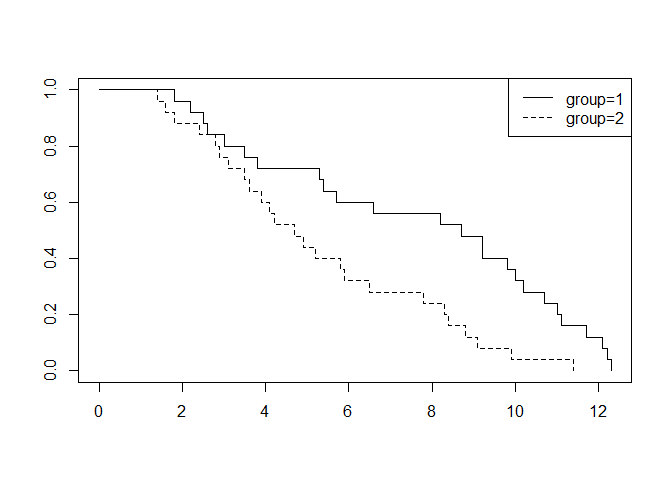

Survival analysis 1
================

``` r
data1 <- c(12.3, 5.4, 8.2, 12.2, 11.7, 10.0, 5.7, 9.8, 2.6, 11.0, 9.2, 12.1, 6.6, 2.2, 1.8, 10.2, 10.7, 11.1, 5.3, 3.5, 9.2, 2.5, 8.7, 3.8, 3.0)
data2 <- c(5.8, 2.9, 8.4, 8.3, 9.1, 4.2, 4.1, 1.8, 3.1, 11.4, 2.4, 1.4, 5.9, 1.6, 2.8, 4.9, 3.5, 6.5, 9.9, 3.6, 5.2, 8.8, 7.8, 4.7, 3.9)
data <- c(data1, data2)
```

``` r
group <- c(rep(1,25), rep(2,25))
df <- data.frame(data, group)
str(df)
```

    ## 'data.frame':    50 obs. of  2 variables:
    ##  $ data : num  12.3 5.4 8.2 12.2 11.7 10 5.7 9.8 2.6 11 ...
    ##  $ group: num  1 1 1 1 1 1 1 1 1 1 ...

``` r
library(survival)
survfit <- survfit(Surv(data)~group, data=df)
survfit
```

    ## Call: survfit(formula = Surv(data) ~ group, data = df)
    ## 
    ##          n events median 0.95LCL 0.95UCL
    ## group=1 25     25    8.7     5.4    10.7
    ## group=2 25     25    4.7     3.6     7.8

``` r
T_1 <- sum(data1)/length(data1)
T_2 <- sum(data2)/length(data2)
T_1
```

    ## [1] 7.552

``` r
T_2
```

    ## [1] 5.28

``` r
h_1 <- (25-3)/sum(data1)
h_2 <- 25/sum(data2)
h_1
```

    ## [1] 0.1165254

``` r
h_2
```

    ## [1] 0.1893939

``` r
K <- length(survfit$strata)
LEGEND <- attr(survfit$strata, "names")
plot(survfit, lty=1:K)
legend("topright", LEGEND, lty=1:K)
```



``` r
test <- survdiff(Surv(data)~group, data=df)
test
```

    ## Call:
    ## survdiff(formula = Surv(data) ~ group, data = df)
    ## 
    ##          N Observed Expected (O-E)^2/E (O-E)^2/V
    ## group=1 25       25     33.8      2.28      7.99
    ## group=2 25       25     16.2      4.76      7.99
    ## 
    ##  Chisq= 8  on 1 degrees of freedom, p= 0.005

``` r
# hazard rate 및 생존분석 결과로 볼 때, group1 이 더 양호한 예후를 보임.
# 생존곡선을 이용하면, 원 자료를 시간경과에 따른 생존수로 도시하여 생존이 차이나는 구간을 알 수 있음.
```
