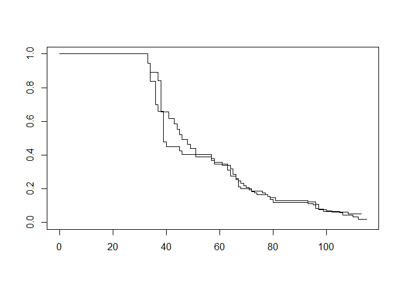

Survival anlysis hw 12
================

A.

``` r
library(survival)
library(foreign)
bladder <- read.dta("bladder.dta")
head(bladder)
```

    ##   id event interval start stop tx num size
    ## 1  1     0        1     0    0  0   1    1
    ## 2  2     0        1     0    1  0   1    3
    ## 3  3     0        1     0    4  0   2    1
    ## 4  4     0        1     0    7  0   1    1
    ## 5  5     0        1     0   10  0   5    1
    ## 6  6     1        1     0    6  0   4    1

``` r
Y <- Surv(bladder$start, bladder$stop, bladder$event==1)
```

    ## Warning in Surv(bladder$start, bladder$stop, bladder$event == 1): Stop time must
    ## be > start time, NA created

``` r
coxph(Y~ tx+num+size+frailty(id, distribution="gamma"),
      data=bladder)
```

    ## Call:
    ## coxph(formula = Y ~ tx + num + size + frailty(id, distribution = "gamma"), 
    ##     data = bladder)
    ## 
    ##                              coef se(coef)     se2   Chisq   DF     p
    ## tx                        -0.4605   0.2759  0.2100  2.7862  1.0 0.095
    ## num                        0.1886   0.0749  0.0536  6.3493  1.0 0.012
    ## size                      -0.0320   0.0939  0.0710  0.1160  1.0 0.733
    ## frailty(id, distribution                           48.2782 32.4 0.036
    ## 
    ## Iterations: 7 outer, 26 Newton-Raphson
    ##      Variance of random effect= 0.567   I-likelihood = -451.8 
    ## Degrees of freedom for terms=  0.6  0.5  0.6 32.4 
    ## Likelihood ratio test=93.4  on 34 df, p=2e-07
    ## n= 190, number of events= 112 
    ##    (1 observation deleted due to missingness)

B.

``` r
defib <- read.csv("defib.csv")
str(defib)
```

    ## 'data.frame':    108 obs. of  6 variables:
    ##  $ id     : int  1 1 1 2 2 2 3 3 3 4 ...
    ##  $ event  : int  1 1 1 1 1 1 1 1 1 1 ...
    ##  $ start  : int  0 39 66 0 34 65 0 36 67 0 ...
    ##  $ stop   : int  39 66 97 34 65 100 36 67 96 40 ...
    ##  $ tx     : int  0 0 0 0 0 0 0 0 0 0 ...
    ##  $ smoking: int  0 0 0 1 1 1 0 0 0 0 ...

``` r
fit_CP <- coxph(Surv(start,stop,event)~tx, cluster=id, data=defib)
fit_CP
```

    ## Call:
    ## coxph(formula = Surv(start, stop, event) ~ tx, data = defib, 
    ##     cluster = id)
    ## 
    ##       coef exp(coef) se(coef) robust se     z    p
    ## tx 0.05217   1.05355  0.20805   0.10526 0.496 0.62
    ## 
    ## Likelihood ratio test=0.06  on 1 df, p=0.8019
    ## n= 106, number of events= 93 
    ##    (2 observations deleted due to missingness)

``` r
stratified_CP <- coxph(Surv(start,stop,event)~tx+strata(smoking),
                         cluster=id, data=defib)
stratified_CP
```

    ## Call:
    ## coxph(formula = Surv(start, stop, event) ~ tx + strata(smoking), 
    ##     data = defib, cluster = id)
    ## 
    ##       coef exp(coef) se(coef) robust se     z     p
    ## tx 0.03934   1.04012  0.20949   0.10159 0.387 0.699
    ## 
    ## Likelihood ratio test=0.04  on 1 df, p=0.851
    ## n= 106, number of events= 93 
    ##    (2 observations deleted due to missingness)

``` r
s = survfit(Surv(start,stop,event)~tx, data=defib)
plot(s, conf.int=FALSE)
```


