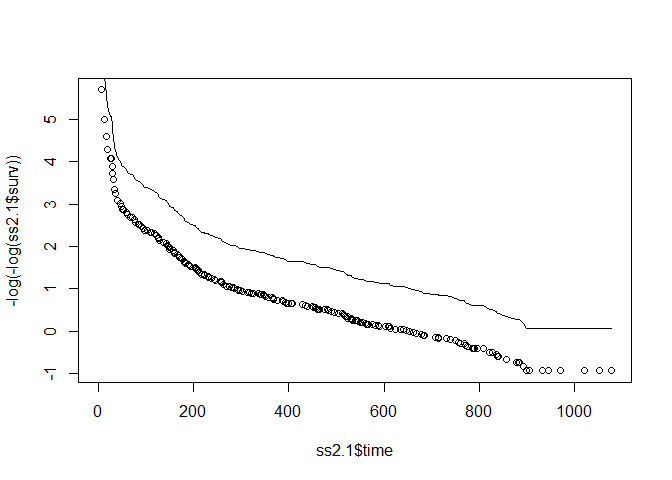
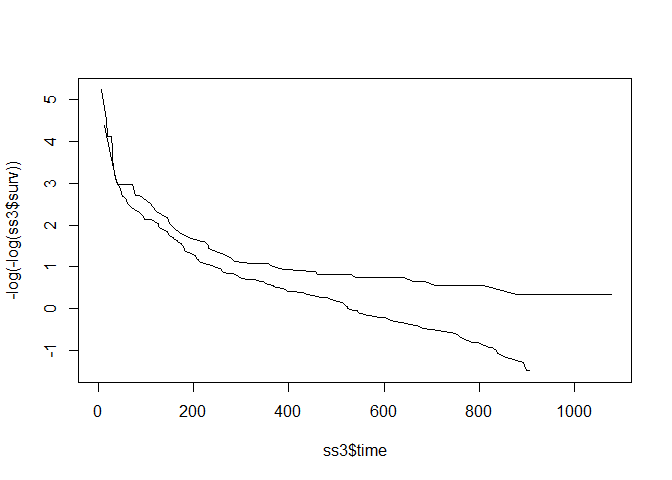
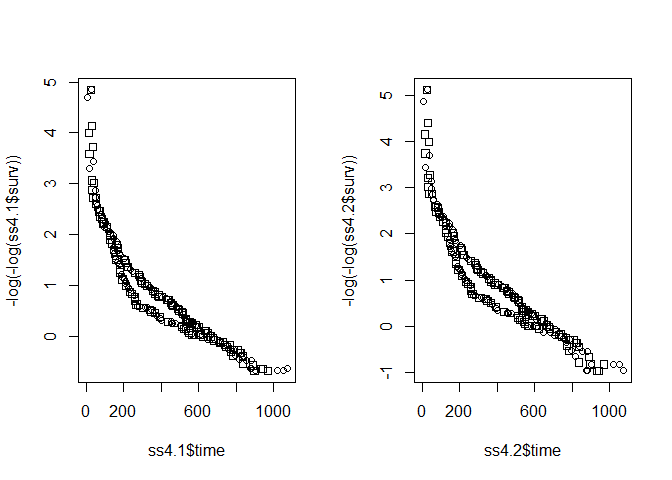
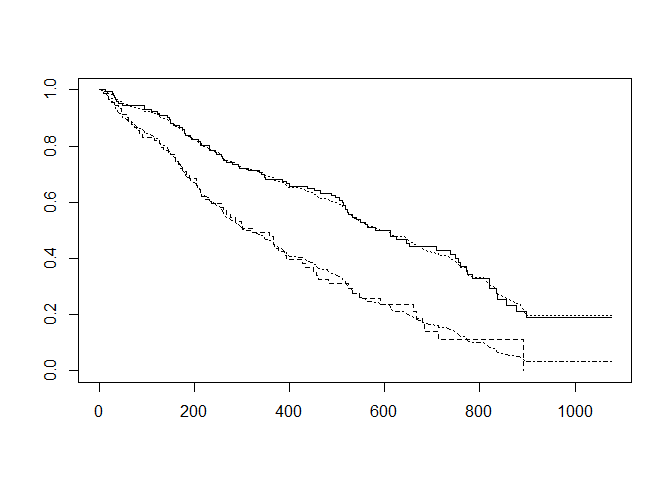

Survival analysis homework 5
================

``` r
data <- read.table("addicts.txt", header=TRUE)
head(data)
```

    ##   ID Clinic Status Time Prison Methadone
    ## 1  1      1      1  428      0        50
    ## 2  2      1      1  275      1        55
    ## 3  3      1      1  262      0        55
    ## 4  4      1      1  183      0        30
    ## 5  5      1      1  259      1        65
    ## 6  6      1      1  714      0        55

``` r
library(survival)
# Q 1.2
coxph1 <- coxph(Surv(Time,Status) ~
               Clinic + Prison + Methadone,
               data=data)
summary(coxph1)
```

    ## Call:
    ## coxph(formula = Surv(Time, Status) ~ Clinic + Prison + Methadone, 
    ##     data = data)
    ## 
    ##   n= 238, number of events= 150 
    ## 
    ##                coef exp(coef)  se(coef)      z Pr(>|z|)    
    ## Clinic    -1.009896  0.364257  0.214889 -4.700 2.61e-06 ***
    ## Prison     0.326555  1.386184  0.167225  1.953   0.0508 .  
    ## Methadone -0.035369  0.965249  0.006379 -5.545 2.94e-08 ***
    ## ---
    ## Signif. codes:  0 '***' 0.001 '**' 0.01 '*' 0.05 '.' 0.1 ' ' 1
    ## 
    ##           exp(coef) exp(-coef) lower .95 upper .95
    ## Clinic       0.3643     2.7453    0.2391    0.5550
    ## Prison       1.3862     0.7214    0.9988    1.9238
    ## Methadone    0.9652     1.0360    0.9533    0.9774
    ## 
    ## Concordance= 0.665  (se = 0.025 )
    ## Likelihood ratio test= 64.56  on 3 df,   p=6e-14
    ## Wald test            = 54.12  on 3 df,   p=1e-11
    ## Score (logrank) test = 56.32  on 3 df,   p=4e-12

``` r
# Q 1.1 : Clinic 변수의 p-value<0.05 : PH 가정 위배
# 나머지 두 변수는 PH assumption 만족
```

``` r
# Q 2.1 평행한 것으로 보이므로 Cox PH 가정 만족. 그러나 그 이유는 Clinic 변수가 모델에 포함되었기 때문이며, 포함되지 않고 층화되었다면 평행하지 않을 있 ㅇ음.
```

``` r
# Q 2.2
  
ss2.1 <- survfit(coxph1)

plot(ss2.1$time, -log(-log(ss2.1$surv)))
lines(ss2.1$time, -log(-log(ss2.1$surv)*0.3643))
```



``` r
# Q 3.1 : 평행하지 않고 초기에 두 곡선이 교차하며 후기로 갈수록 점점 멀어지는 경향을 보여 PH 가정에 위배도
coxph3 <- coxph(Surv(Time,Status) ~
               strata(Clinic) + Prison + Methadone,
               data=data)
coxph3
```

    ## Call:
    ## coxph(formula = Surv(Time, Status) ~ strata(Clinic) + Prison + 
    ##     Methadone, data = data)
    ## 
    ##                coef exp(coef)  se(coef)      z        p
    ## Prison     0.389605  1.476397  0.168930  2.306   0.0211
    ## Methadone -0.035115  0.965495  0.006465 -5.432 5.59e-08
    ## 
    ## Likelihood ratio test=33.91  on 2 df, p=4.322e-08
    ## n= 238, number of events= 150

``` r
# Q 3.2
ss3 <- survfit(coxph3)
plot(ss3$time, -log(-log(ss3$surv)), type="l")
```



``` r
# Q 4.1 두 그래프 모두 교차-발산-교차 보여 PH 가정 위배. 그러나 각 그래프가 인접해 있어서 랜덤 변동을 고려하면 두 그래프는 동일한 것으로 간주하여 PH 가정 만족하는 것으로 해석할 있음
```

``` r
# Q 4.2 

coxph4.1 <- coxph(Surv(Time,Status) ~ strata(Prison),
                 data=data)
coxph4.2 <- coxph(Surv(Time,Status) ~
                  strata(Prison) + Clinic + Methadone,
                  data=data)

ss4.1 <- survfit(coxph4.1)
ss4.2 <- survfit(coxph4.2)

par(mfrow=c(1,2))
plot(ss4.1$time, -log(-log(ss4.1$surv)),
     pch=data$Prison)
plot(ss4.2$time, -log(-log(ss4.2$surv)), 
     pch=data$Prison)
```



``` r
# Q 5.  각 그래프가 인접해 있어서 랜덤 변동을 고려하면 두 그래프는 동일한 것으로 간주하여 PH 가정 만족하는 것으로 해석하는 것이 적 적절함
```

``` r
# Q 6.1 observed vs expected plot 이 가까우면 PH 가정 만족하는 것으로 간주.
```

``` r
# Q 6.2 
Dose <- ifelse(data$Methadone >= median(data$Methadone),
               "High", "Low")
df <- data.frame(data, Dose)

KMcurve <- survfit(Surv(Time,Status)~Dose, data=df)
coxph6 <- coxph(Surv(Time,Status)~Dose, data=df)
coxph6
```

    ## Call:
    ## coxph(formula = Surv(Time, Status) ~ Dose, data = df)
    ## 
    ##          coef exp(coef) se(coef)     z        p
    ## DoseLow 0.739     2.094    0.169 4.372 1.23e-05
    ## 
    ## Likelihood ratio test=18.27  on 1 df, p=1.915e-05
    ## n= 238, number of events= 150

``` r
baseha = basehaz(coxph6, centered=FALSE)
basesur = exp(-baseha[,1])

plot(KMcurve, lty=1:2)
lines(baseha[,2], basesur^1, lty=3)
lines(baseha[,2], basesur^(2.094), lty=4)
```



``` r
# 예측/관측 두 그래프가 상당히 인접하므로 PH 가정 만족.
```

``` r
# Q 7.1) h(t,X) = h0(t)exp[b1*clinic + b2*prison + b3*dose  + d1(clinic*g(t)) + d2(prison*g(t)) + d3(dose*g(t))]
# g(t) : function of time
# LR = 2 [ln L(full) - ln L(reduced)]
# reduced model : d1=d2=d3=0
# Under H0 : LR ~ chi-square with 3 degree of freedom
```

``` r
# Q 7.2
coxph7 <- coxph(Surv(Time,Status)~ Clinic + Prison + 
                Methadone + Clinic:Time + Prison:Time +
                Methadone:Time, data=data)
coxph7
```

    ## Call:
    ## coxph(formula = Surv(Time, Status) ~ Clinic + Prison + Methadone + 
    ##     Clinic:Time + Prison:Time + Methadone:Time, data = data)
    ## 
    ##                      coef  exp(coef)   se(coef)      z        p
    ## Clinic          3.054e+00  2.120e+01  4.117e-01  7.418 1.18e-13
    ## Prison         -6.966e-01  4.983e-01  3.440e-01 -2.025   0.0429
    ## Methadone       9.662e-02  1.101e+00  1.205e-02  8.017 1.08e-15
    ## Clinic:Time    -1.502e-02  9.851e-01  2.024e-03 -7.420 1.17e-13
    ## Prison:Time     1.492e-03  1.001e+00  8.616e-04  1.732   0.0833
    ## Methadone:Time -3.038e-04  9.997e-01  3.403e-05 -8.927  < 2e-16
    ## 
    ## Likelihood ratio test=644.1  on 6 df, p=< 2.2e-16
    ## n= 238, number of events= 150

``` r
# According to result of the analysis, PH assumption violated for Clinic:Time and Methadone:Time variables.
```

``` r
# Q 8. Not always clear how to specify g(t); different choices may give different conclusions
```

``` r
# Q 9.1 h(t,X) = h0(t)exp[b1*clinic + b2*prison + b3*dose + d1(clinic*g(t))] where g(t) is some function of time.
# H0 : d1 = 0
# LR statistic = 2 [ln L(full) - ln L(reduced)]
# reduced model : d1=0
# Under H0, LR ~ chi square with 1 degree of freedom
```

``` r
# Q 9.2
coxph9 <- coxph(Surv(Time,Status)~ Clinic + Prison + 
                Methadone + Clinic:Time, data=data)
coxph9
```

    ## Call:
    ## coxph(formula = Surv(Time, Status) ~ Clinic + Prison + Methadone + 
    ##     Clinic:Time, data = data)
    ## 
    ##                  coef exp(coef)  se(coef)       z      p
    ## Clinic       4.341768 76.843252  0.400785  10.833 <2e-16
    ## Prison      -0.060348  0.941437  0.178361  -0.338  0.735
    ## Methadone   -0.002834  0.997170  0.007196  -0.394  0.694
    ## Clinic:Time -0.022932  0.977329  0.001890 -12.136 <2e-16
    ## 
    ## Likelihood ratio test=548.6  on 4 df, p=< 2.2e-16
    ## n= 238, number of events= 150

``` r
# According to result of the analysis, PH assumption violated for Clinic and Clinic:Time variables.
```

``` r
# Q 10.1
# t > 365 days : HR = exp[b1 + d1]
# t <=365 days : HR = exp[b1]

# If d1 is not equal to zero, the model violates the PH assumption for the clinic variable. Then the model assumes that the hazard ratio is not constant over time by giving a different hazard ratio depending on t
```

``` r
# Q 10.2
# data_365 <- survSplit(data, cut=365, end="Time", 
#                      event="Status")
# data$hv1 = data$Clinic*(data$Time<365)
# data$hv2 = data$Clinic*(data$Time>=365)

# Y365=Surv(data_365$Time, data_365$Status)
# coxph(Y365~ Prison + Methadone + hv1 + hv2, data=data_365)
```
